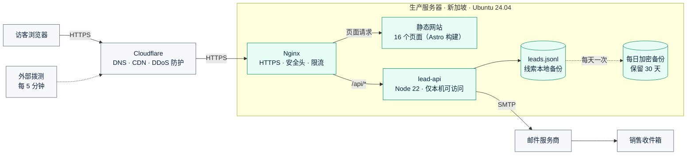
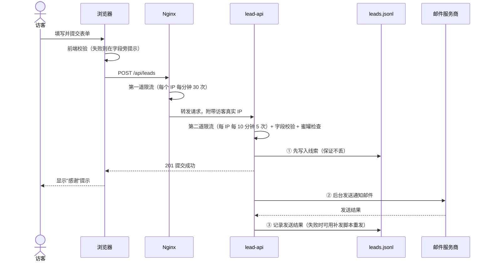
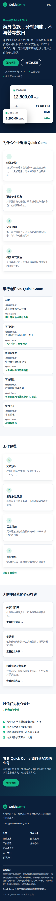
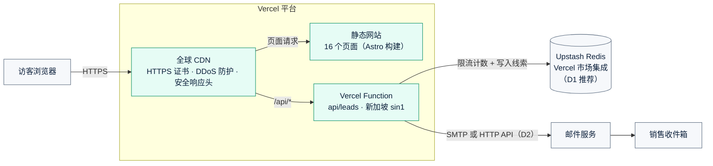
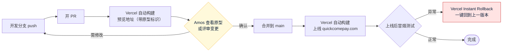
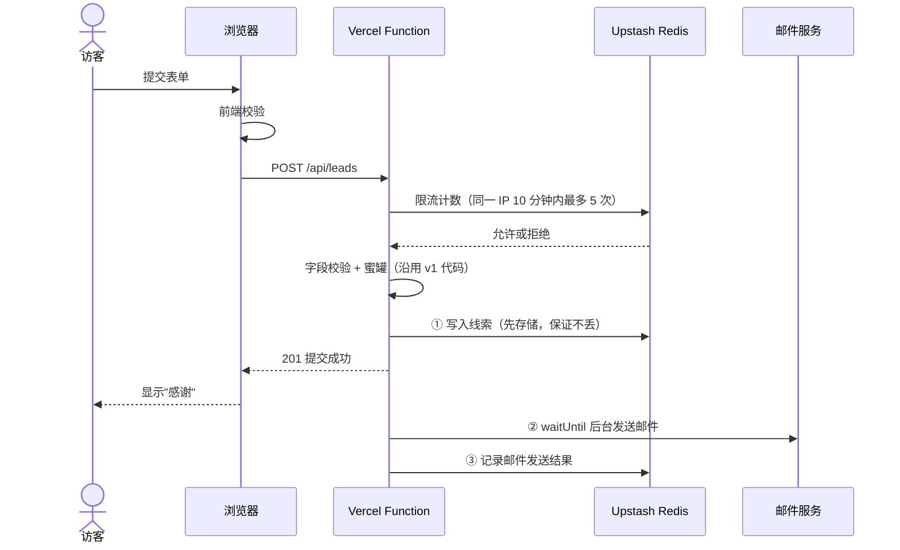

# 《系统架构方案》v1：Quick Come 官网
- 版本：v1
- 产出角色：PM（第 1 节，业务视角，并负责全文整合）、研发（第 2 节，技术视角）、运维（第 3 节，基础设施建议）
- 状态：✅ Amos 已于 2026-09-27 审核通过（Q1 到 Q6 全部按默认建议）
- 输入：`需求文档/v1-需求说明书.md`
- 变更历史：
  - v1（2026-09-27）首次创建
  - v1.1（2026-09-27）记录 Amos 的审核结论，只改了状态，内容没有变
  - v1.2（2026-09-27）按 agents v0.2 的可视化规范补图：新增"一图看懂"一节，正文没有改动

---

## 一图看懂
**图 1：系统架构。** 访客的请求如何到达网站；表单线索存放在哪里、最后怎样送到销售手里。



**图 2：表单提交时序。** 一次"预约演示"提交经过的每一步。线索先落盘，再发邮件，所以邮件发送失败也不会丢线索。



**图 3：视觉效果图。** 截图来自实际构建的网站。

| 桌面端首页首屏 | 手机端中文首页（节选） |
|---|---|
|  |  |

更多效果图（行业方案、工作原理、联系页、表单状态、深色模式）见 `assets/v1/` 目录和《交付说明》。

---

## 1. 业务视角（PM）
| 业务模块 | 对应需求 | 说明 |
|---|---|---|
| 内容展示 | F1、F2、F4 | 8 类页面，每类都有中英两版，共 16 个页面；以静态内容为主，改动频率低 |
| 线索收集 | F3 | 唯一需要服务端处理的功能，流量很小（预计每天少于 100 次提交） |
| SEO 与分享 | F5 | 静态生成，天然有利于搜索引擎收录 |
| 合规展示 | F2、AC8、AC9 | 全站统一的页脚组件，保证每页都有风险提示和相关声明 |

**业务侧的架构约束：**
- 文案修改走代码发版。v1 不做 CMS，所以架构要保证改文案成本低：所有文案集中放在中英两个语言文件里，不散落在页面代码中。
- 线索数据包含个人信息，属于敏感数据，必须满足第 3 节的安全要求。

## 2. 技术视角（研发）

### 2.1 总体架构
```
  访客浏览器
      │ HTTPS
      ▼
  ┌───────────────── 生产服务器（Ubuntu 24.04）──────────────────┐
  │ Nginx                                                         │
  │  ├─ /、/zh/…    → 静态文件  /var/www/quickcome/current         │
  │  └─ /api/*      → 反向代理 → lead-api（Node 22，127.0.0.1:3001）│
  │                                  ├─ 校验、限流、机器人陷阱        │
  │                                  ├─ 写入本地备份：JSONL 文件      │
  │                                  └─ SMTP 发邮件 → 指定收件邮箱    │
  └───────────────────────────────────────────────────────────────┘
```

### 2.2 技术选型
| 部分 | 选型 | 理由 | 放弃的备选及原因 |
|---|---|---|---|
| 网站框架 | **Astro 7**，输出纯静态文件 | 原生支持多语言路由，组件化复用页头页脚；默认不向浏览器下发 JavaScript，容易满足 AC10 的性能要求；生成的就是纯 HTML | Next.js：需要常驻 Node 服务，对这个需求太重；手写 HTML：16 个页面难以复用，改文案容易漏改 |
| 样式 | 原生 CSS，用 CSS 变量定义色系，支持深色模式 | 不需要引入额外的构建依赖 | Tailwind：可以用，但对这个规模收益不大 |
| 字体 | 使用系统字体 | 不向 Google 等第三方发请求，隐私合规更简单，速度也更快 | 自托管 Inter 字体：会增加约 100KB，可以作为后续迭代 |
| 表单服务 | **lead-api**：用 Node 22 原生 http 模块实现，只依赖 nodemailer | 功能只有一个接口，代码量小，依赖少，攻击面也小 | Express 或 Fastify：没必要；第三方表单服务（如 Formspree）：线索数据会经过第三方，不符合"本地备份"的要求 |
| 线索存储 | 追加写入 JSONL 文件（`/var/lib/quickcome/leads.jsonl`） | 流量极小，一行一条，便于备份，不需要维护数据库 | SQLite 或 PostgreSQL：v1 不做线索管理界面，暂时用不上 |
| 测试工具 | Node 自带测试框架（lead-api 单元测试）、Playwright（端到端测试）、Lighthouse（性能评分） | 容器里已预装 Chromium，测试可以真实运行 | — |

### 2.3 仓库目录结构（amos111）
```
amos111/
  00-架构方案.md
  需求文档/  技术方案/  测试报告/  部署方案/  交付记录/   ← 各角色的文档
  site/                  Astro 网站源码
    src/i18n/en.json     英文文案（集中管理）
    src/i18n/zh.json     中文文案（集中管理）
    src/components/      页头、页脚、表单、行动按钮等组件
    src/pages/           英文页面放根路径，中文页面放 /zh/ 下
    public/              Logo 等 SVG、favicon、robots.txt
  lead-api/              表单服务源码和测试
  deploy/                Nginx 配置、systemd 服务文件、发布与回滚脚本（由运维维护）
  e2e/                   Playwright 端到端测试（由测试维护）
```

### 2.4 关键技术决策
1. **URL 规则：** 英文页面放根路径（如 `/solutions/`），中文页面放在 `/zh/` 下（如 `/zh/solutions/`）。语言切换只替换路径前缀，从而满足 AC2。访问根路径时不根据浏览器语言自动跳转，避免影响 SEO 收录。
2. **表单接口 `POST /api/leads`：**
   - 前端做基础校验，后端再做一遍完整校验，满足 AC5。
   - 防垃圾提交：在表单里放一个隐藏的"蜜罐"字段；按 IP 限流，同一 IP 10 分钟内最多 5 次（放在内存里计数），满足 AC7。
   - 处理顺序：先写入本地备份，再发送邮件。邮件发送失败不影响用户看到"提交成功"，但会写入错误日志，并在备份记录里标记为"未发送"。
3. **健康检查接口：** `GET /api/health`，供运维监控使用。
4. **配置：** 所有配置通过环境变量注入，包括 SMTP 账号、收件邮箱、端口、备份路径。敏感信息不进代码仓库。

### 2.5 风险与技术债（主动标注）
| # | 风险 / 技术债 | 影响 | 应对 |
|---|---|---|---|
| R1 | 限流计数放在内存里，服务重启后清零 | 重启后短时间内限流失效，影响很低 | v1 接受；如果以后部署多台服务器，改用 Redis |
| R2 | 邮件发送失败后没有自动重发 | 线索不会丢（已写入本地备份），但销售可能收不到通知 | 日志告警，并提供一个手动补发脚本；v2 考虑加入重发队列 |
| R3 | 域名和 SMTP 账号尚未准备好 | 生产环境的 AC6、AC12 暂时无法验证 | 开发和测试阶段先用本地模拟的 SMTP，上线前替换成真实账号 |
| R4 | 品牌名是否调整还没确定（见需求说明书第 4.5 节） | 如果改名，需要改 Logo 和文案 | 品牌名集中配置，改名成本低 |

## 3. 基础设施建议（运维）

### 3.1 服务器
| 项目 | 建议 |
|---|---|
| 规格 | 1 核 CPU、1 到 2GB 内存、20GB 以上 SSD；静态网站加一个轻量服务，这个配置足够 |
| 系统 | Ubuntu 24.04 LTS |
| 地域 | 新加坡或香港（兼顾东南亚、中东和欧洲的访问速度）；需要 Amos 按主要客户所在地确认 |
| 前置 CDN | **建议使用 Cloudflare 免费版**，负责 DNS、CDN 加速、DDoS 防护，并隐藏服务器真实 IP；是否使用由 Amos 决定 |

### 3.2 网络与安全
- **防火墙：** 只开放 22、80、443 三个端口。如果使用 Cloudflare，80 和 443 只允许 Cloudflare 的 IP 段访问。
- **SSH：** 只允许密钥登录，禁用密码登录，禁止 root 直接登录，并启用 fail2ban 防暴力破解。
- **系统更新：** 开启 unattended-upgrades，自动安装安全更新。
- **HTTPS 证书：** 用 certbot 申请 Let's Encrypt 证书并自动续期，HTTP 强制跳转到 HTTPS（满足 AC12）。Nginx 配置安全响应头，包括 HSTS、CSP、X-Frame-Options。
- **lead-api 运行方式：**
  - 以一个专用的低权限系统账号运行，由 systemd 托管，崩溃后自动重启。
  - 只监听本机地址 127.0.0.1，外部无法直接访问。
- **线索数据保护：**
  - 备份文件权限设为 600，只有服务账号能读写。
  - 每天做一次加密备份，保留 30 天。
  - 备份存放位置请 Amos 指定：另一台服务器，或者对象存储。

### 3.3 发布与回滚
- **发布：**
  - 每次发布生成一个新的版本目录 `releases/<时间戳>/`，把 `current` 软链接切换过去，整个过程不停机。
  - lead-api 同样按版本目录发布，然后重启服务，中断时间在 1 秒以内。
- **回滚：** 把软链接切回上一个版本目录，再重启服务即可，预计 1 分钟内完成。回滚脚本放在 `deploy/` 目录。
- 详细的部署步骤和部署后验证步骤，会在开发完成后写进 `部署方案/v1-部署方案.md`。

### 3.4 监控、日志与告警
- 用 UptimeRobot 等外部拨测服务，每 5 分钟检查一次首页和 `/api/health`，出现异常时发邮件告警。
- Nginx 日志和 lead-api 日志按天轮转，保留 14 天。
- 在 lead-api 日志中记录邮件发送失败，作为技术债 R2 的补偿措施。

### 3.5 需要 Amos 提供的资源（上线前）
1. 服务器：公网 IP，以及一个有 sudo 权限的普通用户。部署时 SSH 私钥怎么交给我，到时再商量。
2. 域名：购买后，提供 DNS 管理权限，或者按我们的要求自行添加解析记录。
3. **发件邮箱的 SMTP 账号。** 推荐用企业邮箱，或者 Amazon SES、Postmark 这类发信服务。
4. **接收线索的邮箱地址。**

## 4. 跨角色反馈 / 分歧记录
> 按协作总则：发现别人职责范围内的问题，只反馈，不修改；意见不一致，上报 Amos。

| # | 提出方 → 接收方 | 内容 | 状态 |
|---|---|---|---|
| FB1 | 运维 → PM | 需求写的是"排除中国大陆"，但没说明是否要**技术上屏蔽大陆访问**（地理封锁）。这会影响 Nginx 和 Cloudflare 的配置。 | PM 无法自行决定，**转 Amos**（见第 5 节 Q3） |
| FB2 | 研发 → PM | 中文版使用简体还是繁体，需求里没有写明。面向海外华人，也常用繁体。 | PM 建议使用简体，**转 Amos 确认**（见第 5 节 Q4） |
| FB3 | 研发 → PM | AC6"指定邮箱收到邮件"在测试环境里无法验证真实投递到达，已经写明测试环境以"SMTP 调用成功"为准；真实投递在生产环境验收时再确认。 | PM 已接受，写入 AC6 |
| — | 角色之间的分歧 | 本阶段**没有**未解决的分歧 | — |

## 5. Amos 审核结论（全部按默认）
| # | 问题 | 默认建议 |
|---|---|---|
| Q1 | 整体架构是否可行：Astro 静态网站 + lead-api 表单服务 + Nginx，单台服务器 | 可行 |
| Q2 | 品牌名风险（需求说明书第 4.5 节）：选 (a)、(b) 还是 (c)？品牌色系、Logo 方向、域名 quickcomepay.com 是否认可？ | (a)；认可 |
| Q3 | 是否要在技术上屏蔽中国大陆访问？ | 不屏蔽，只在页面上写"不面向中国大陆"的声明 |
| Q4 | 中文版用简体还是繁体？ | 简体 |
| Q5 | 服务器放在哪个地域？是否使用 Cloudflare？ | 新加坡；使用 Cloudflare |
| Q6 | 线索备份存放在哪里？ | v1 先存在本机，同时做一份每天的本地加密备份；异地备份等 Amos 指定位置后再加 |

**确认之后的下一步：**
1. PM 拆解任务清单：文案、Logo、网站开发、lead-api、测试、部署配置。
2. 研发实现。
3. 测试做实际执行的测试（不只是看代码）。
4. PM 写交付说明。
5. 等 Amos 提供服务器后，运维部署上线。
6. Amos 验收。

## 附：流程磨合观察（供 agents v0.2 修订参考，暂不改动 agents 目录）
1. 协作总则里**没有设计师或品牌角色**。Logo 和色系这次由 PM 提方向、研发实现，今后是否需要明确归属？
2. 在架构方案阶段，**测试角色没有参与**。验收标准能不能测，要到测试阶段才会被检验。建议在需求说明书定稿前，让测试先审一遍验收标准能否测试。
3. 协作总则第三节里的文件夹结构，已按 Amos 的决定调整为以 amos111 根目录作为项目根目录。agents 目录里的文件需要同步修改。
4. 部署顺序：Amos 的流程是先写交付说明，再部署，再验收。协作总则里的写法与此不一致，需要同步修改。

---
---

# 《系统架构方案》v2：改为 Vercel 部署（架构性变更）
- 版本：v2
- 产出角色：PM（业务视角与整合）、研发（技术视角）、运维（平台建议）
- 状态：✅ **Amos 已于 2026-09-27 审核通过**：D1 到 D6 全部按建议；Vercel 已经是 Pro 套餐；高保真原型已确认，同意继续开发
- 输入：`需求文档/v2-需求说明书.md`
- 变更历史：v2（2026-09-27）首次创建。v1 的内容保留在本文件上方，作为历史记录。
  - v2.1（2026-09-27）记录审核结论：D1 Upstash Redis；D2 同时支持 SMTP 和 Resend，由环境变量决定用哪一种；D3 已经是 Pro；D4 DNS 继续放在 Cloudflare，设为仅 DNS；D5 预览地址保持需要登录；D6 删除 `deploy/`

## 一图看懂

**图 1：v2 系统架构。** 静态页面由 Vercel 全球 CDN 提供；表单提交交给新加坡地域的 Vercel Function 处理；线索写入云端存储，同时发邮件通知销售。



**图 2：代码到上线的流程（Vercel Git 集成）。** 开发在分支上进行；PR 自动生成预览地址，也就是原型；只有合并到 `main` 才会上线生产。



**图 3：v2 表单提交时序。** 和 v1 相比，存储和限流改为云端实现。Serverless 函数返回响应后就会被冻结，所以邮件改用 `waitUntil` 在后台继续发送。



## 1. 业务视角（PM）
- 用户可见的部分完全不变：页面、文案、表单、SEO、合规都与 v1 一致。
- 业务上的好处有三点：
  - 上线不再依赖运维登录服务器，合并即上线。
  - 每次改动都有预览地址，Amos 可以先看再决定。
  - 平台自带 HTTPS、CDN 和 DDoS 防护。

## 2. 技术视角（研发）
| 部分 | v1 | v2 | 说明 |
|---|---|---|---|
| 静态页面 | Nginx 提供 | **Vercel CDN** | 构建配置写在 `vercel.json`，已经加好，原型用的就是这份配置 |
| 表单接口 | 常驻 Node 服务 `lead-api` | **Vercel Function `api/leads.js`** | 沿用 v1 的 `validate.js`（校验）和 `mailer.js`（邮件格式）；拆掉 http 服务器的外壳 |
| 线索存储 | 本地 JSONL 文件 | **Upstash Redis**（D1） | Vercel 运行环境不保留本地文件 |
| 限流 | 进程内存计数 | **Upstash 限流**（与存储共用一个服务） | 多个函数实例之间共享计数；v1 的技术债 R1 随之消除 |
| 邮件 | 后台发送 | **`waitUntil` 后台发送**（D2） | 函数返回后仍能完成发送 |
| 安全响应头 | Nginx 配置 | **`vercel.json` 的 headers** | 严格的 CSP 只对生产域名生效，避免拦截 Vercel 预览工具栏 |
| 原型模式 | — | **`VERCEL_ENV=preview` 时自动开启** | 顶部显示原型标识，表单模拟提交；生产环境不会开启 |

**风险与技术债：**
- **R5（新）平台依赖：** 依赖 Vercel 和 Upstash 两个第三方平台。缓解：两者都是主流托管服务；代码只依赖标准的 Node API 和 Redis，迁移成本低。
- **R6（新）数据位置：** 线索数据存放在 Upstash。创建数据库时选新加坡（ap-southeast-1）地域，与函数地域保持一致。
- **R2（v1 遗留，保持不变）：** 邮件发送失败后没有自动重发。v2 改为：把发送失败记录在 Redis 里，可以用补发脚本重发。

## 3. 平台建议（运维）
- **Vercel 项目：**
  - 使用现有的 amos111 项目和它的 Git 集成，不需要新建项目。
  - 函数地域设为 `sin1`（新加坡）。
  - 生产环境变量（SMTP、存储凭据）只在 Vercel 后台配置，不进代码仓库。
- **域名：**
  - 在 Vercel 项目里添加 `quickcomepay.com`，`getquickcome.com` 做 301 跳转。
  - DNS 可以继续放在 Cloudflare，但要设为"仅 DNS"（灰色云朵），不经过 Cloudflare 代理。Vercel 官方不建议在前面再套一层代理。
- **环境隔离：** 预览环境和生产环境使用**不同的存储实例**，预览环境不能连接生产数据。
- **监控与回滚：**
  - 部署记录、函数日志：看 Vercel 后台。
  - 外部拨测：沿用 v1 的建议。
  - 回滚：使用 Vercel Instant Rollback。
- **不再使用的内容：** `deploy/` 目录（Nginx、systemd、服务器脚本）；处理方式见 D6。

## 4. 跨角色反馈 / 分歧记录
| # | 提出方 → 接收方 | 内容 | 状态 |
|---|---|---|---|
| FB-v2-1 | 运维 → Amos | **Vercel 免费版（Hobby）按条款只能用于个人、非商业用途。** Quick Come 是商业网站，需要 Pro 套餐（按成员数计费）。请确认 amos111 所在的 Vercel 团队现在是什么套餐。 | 已关闭：Amos 确认已经是 Pro |
| FB-v2-2 | 测试 → PM | 预审结论：AC13 和 AC14 都能测。AC14 的"5 分钟内上线"，以 Vercel 部署记录里的时间为准；Instant Rollback 需要 Amos 在 Vercel 后台操作一次，或者授权运维操作。 | 已采纳，写进 AC14 |
| FB-v2-3 | 测试 → 研发 | v1 的端到端测试依赖 Nginx。v2 需要一个本地测试环境：静态文件加上函数处理器，存储用内存版替代。另外，在预览环境做一次真实存储的冒烟测试。 | 已采纳，纳入 v2 任务 |
| FB-v2-4 | 运维 → Amos | 现在 `main` 每次合并都会触发 Vercel 生产部署。**原型 PR 在正式开发完成前不要合并**，否则生产环境会上线一个表单无法提交的网站。 | 转 Amos（知悉） |

## 5. 决定事项（✅ 已全部按建议确认）
| # | 事项 | 可选方案 | 建议 |
|---|---|---|---|
| D1 | 线索存哪里 | (a) **Upstash Redis**：通过 Vercel 市场一键开通，有免费额度，存储和限流用同一个服务<br/>(b) Neon Postgres：关系型数据库，比较重<br/>(c) 不存储，只发邮件：违反 AC6，不建议 | **(a)** |
| D2 | 邮件怎么发 | (a) 沿用 SMTP：用企业邮箱或 SES 的 SMTP 账号<br/>(b) Resend 的 HTTP API：对 Vercel 更友好，需要验证发件域名 | 已经有企业邮箱 SMTP 就选 (a)，否则选 (b) |
| D3 | Vercel 套餐 | 商业用途需要 **Pro** | 升级到 Pro，或者确认已经是 Pro |
| D4 | DNS 放在哪里 | (a) 继续放在 Cloudflare，设为"仅 DNS"<br/>(b) 迁到 Vercel DNS | (a) |
| D5 | Vercel 预览地址要不要登录才能访问 | Vercel 默认开启"部署保护"，只有团队成员登录后才能看 | 保持开启：原型只给内部看 |
| D6 | `deploy/` 目录（v1 的服务器方案）怎么处理 | (a) 删除：git 历史里仍然能找回<br/>(b) 保留，并标注"已停用" | (a) |

**审核通过后的下一步：**
1. 按 `需求文档/v2-任务清单.md`（草案）开发。
2. 测试回归，并在预览环境做冒烟测试。
3. 合并 PR 后，Vercel 自动上线。
4. 在生产环境验收 AC12 到 AC14，再交 Amos 验收。
