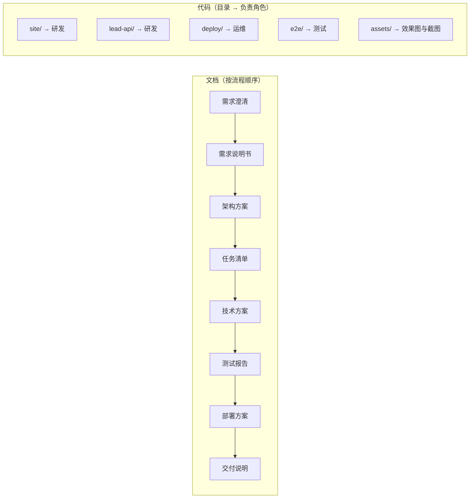
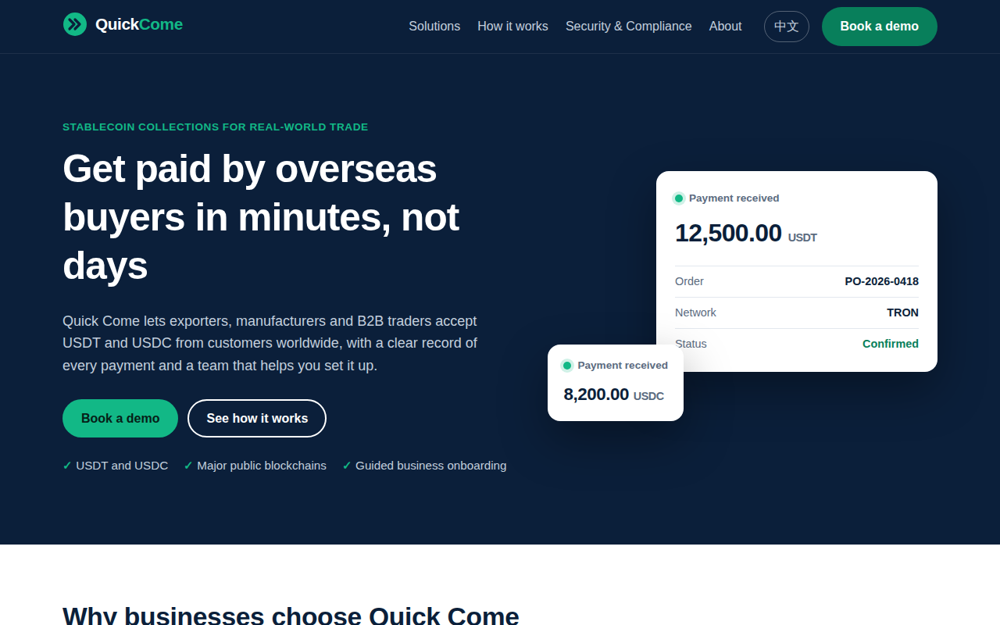

# amos111：Quick Come 官网项目
本仓库由四个角色协作产出：产品经理、研发工程师、测试工程师、运维工程师。角色和协作规则见 `agents` 仓库。

## 一图看懂
**本仓库的文档怎么读，代码目录各由谁负责。** 建议从《交付说明》开始读，里面有全景图和最终效果截图。

## 文档（按流程顺序）
| 阶段 | 文件 |
|---|---|
| 需求 | `需求文档/v1-需求澄清问题.md` → `需求文档/v1-需求说明书.md` → `需求文档/v1-任务清单.md` |
| 架构 | `00-架构方案.md` |
| 技术 | `技术方案/v1-技术方案.md` |
| 测试 | `测试报告/v1-测试报告.md` |
| 部署 | `部署方案/v1-部署方案.md` |
| 交付 | `交付记录/v1-交付说明.md` |
| **v2 变更（⏸ 待审核）** | `需求文档/v2-需求说明书.md` → `00-架构方案.md`（文末的 v2 部分）→ `技术方案/v2-原型说明.md` → `需求文档/v2-任务清单.md`（草案） |

## 代码
| 目录 | 内容 | 常用命令 |
|---|---|---|
| `site/` | 官网，Astro 静态站点 | `npm ci && npm run build` |
| `lead-api/` | 表单服务 | `npm ci && npm test` |
| `deploy/` | 部署配置和脚本 | 用法见《部署方案》 |
| `e2e/` | 验收测试 | 先构建 `site/`，再执行 `npm ci && npx playwright test`；Lighthouse 检测用 `node lighthouse.mjs`（需要 Nginx） |
