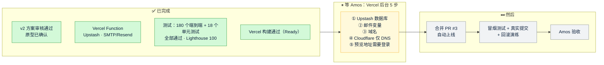

# 《交付说明》v2：Quick Come 官网，改为 Vercel 部署（上线前版本）
- 版本：v2
- 产出角色：产品经理（汇总研发、测试、运维的产出）
- 状态：⏸ **开发和测试已完成，等 Amos 在 Vercel 后台完成配置**（《部署方案 v2》§2）→ 合并 PR #3 自动上线 → 上线后验证 → 交 Amos 验收
- 变更历史：v2（2026-09-27）首次创建

## 一图看懂

## 1. 本次交付（相对 v1 的变化）
| 类别 | 内容 |
|---|---|
| 用户可见 | **没有变化**：页面、文案、表单与 v1.2 一致。界面截图见 `assets/v1/`。 |
| 表单后端 | 改为 Vercel Function `api/leads`（新加坡），线索存储在 Upstash Redis，邮件支持 SMTP 或 Resend |
| 上线方式 | 合并到 `main` 自动上线；每个 PR 自动生成原型预览；可以一键回滚 |
| 删除 | `deploy/`（v1 的服务器方案，D6） |
| 文档 | 需求说明书 v2、架构方案 v2、原型说明、任务清单 v2、技术方案 v2、测试报告 v2、部署方案 v2、本交付说明 |

## 2. 质量结论（来自《测试报告 v2》）
- AC1 到 AC11、AC13 在模拟 Vercel 的本地环境里**实际执行，全部通过**。
- AC6 和 AC7 的真实存储部分、AC12、AC14 要等上线后验证，验证方法已经写好。
- 本轮没有发现缺陷。

## 3. ⚠️ 需要 Amos 做的事
1. **按《部署方案 v2》§2 完成 Vercel 后台的 5 步配置。**请先确定 D2 用哪种发邮件方式：有企业邮箱就填 SMTP，没有就注册 Resend。
2. 配置完成后回复"可以合并"，我来合并 PR #3，并执行上线后验证。

## 4. 已知限制与技术债
| # | 内容 |
|---|---|
| R2 | 邮件发送失败后不会自动重发，需要手动执行补发脚本（与 v1 相同） |
| R5 | 依赖 Vercel 和 Upstash 两个平台 |
| R7 | 本地测试环境只模拟了部分 `vercel.json` 功能，由上线后的冒烟测试弥补 |

## 5. 跨角色反馈 / 分歧记录
本阶段无。

---

## 附：流程磨合观察（第 2 轮，供 agents 后续修订参考，暂不改动）
| # | 观察 |
|---|---|
| O11 | 部署平台（Vercel）的后台只有 Amos 有权限，所以运维的"部署"一步，实际上变成了"写好操作清单，由 Amos 执行"。是否需要给 AI 一个权限受限的 Vercel 访问方式（例如团队里的受限成员，或者临时令牌），值得讨论。 |
| O12 | 预览地址需要登录，测试无法访问，这是 D5 的设计。所以原型确认和预览冒烟测试只能由 Amos 来做；测试只能确认"构建成功"。可以考虑使用 Vercel 的 Protection Bypass for Automation 令牌，但需要评估令牌泄露的风险。 |
| O13 | 在 Vercel 模式下，"合并即上线"。原来的"合并节点 ②：验收通过后合并"需要改成"上线前的配置确认后合并 → 上线 → 验收"，协作总则需要相应调整。 |
