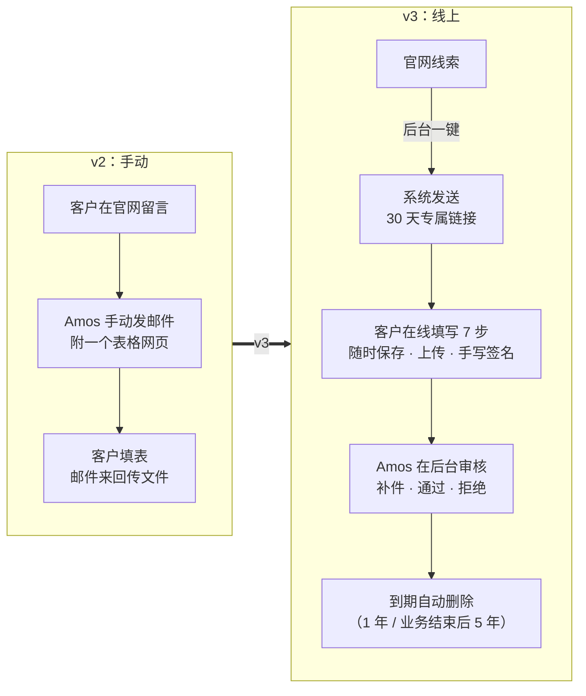
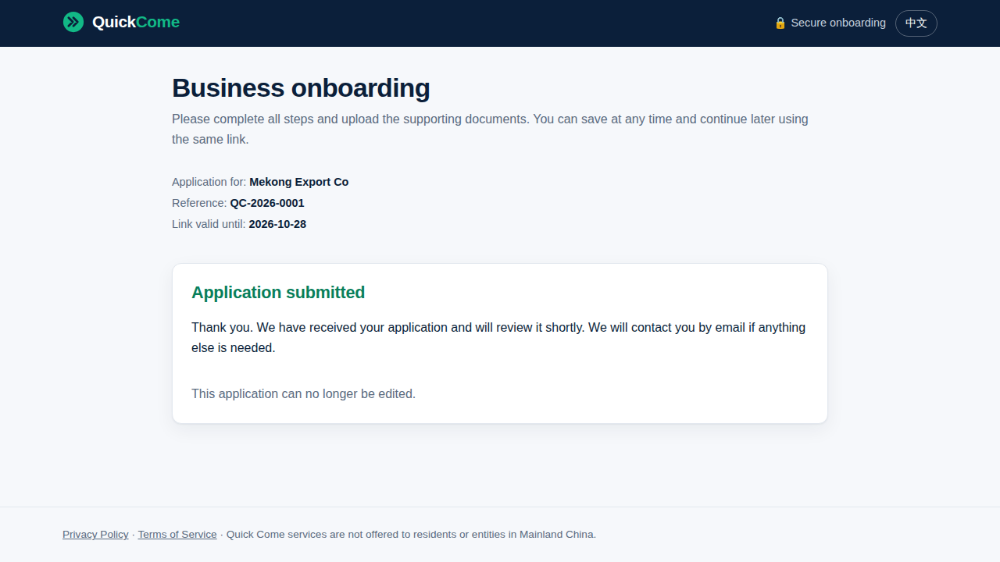
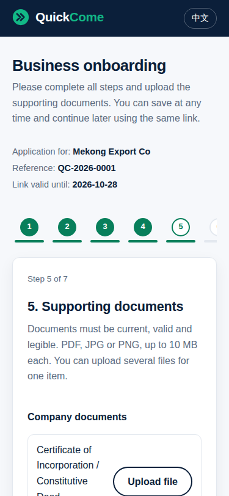
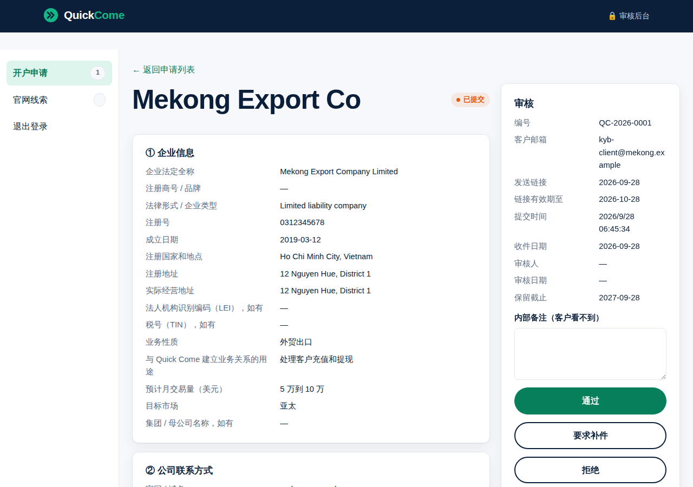
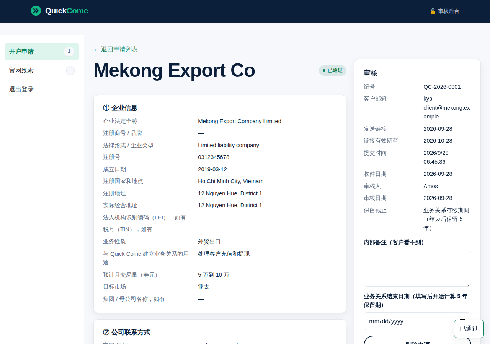

# 《交付说明》v3：Quick Come 线上 KYB 开户（上线前版本）
- 版本：v3
- 产出角色：产品经理（汇总研发、测试、运维的产出）
- 状态：⏸ **开发和测试已完成，等 Amos 完成 Vercel 配置后上线**
- 变更历史：v3（2026-09-28）上线前版本。上线结果会追加在 §2.5。

## 一图看懂

| 客户：提交成功 | 客户：补件时直接打开被开放的步骤（手机） |
|---|---|
|  |  |

| 后台：已提交的申请详情 | 后台：通过之后 |
|---|---|
|  |  |

以上截图都来自**正式构建和真实接口**（本地测试环境，数据是虚构的），不是原型。

## 1. 本次交付（相对 v2 的变化）
- **客户开户页**（中英双语）：7 个步骤、随时保存、中途离开可以继续、文件直传私有存储、手写签名。补件时只能修改被开放的部分。
- **审核后台 `/admin/`**（中文）：
  - 登录：密码加手机验证器。
  - 功能：申请列表和状态筛选、官网线索一键发送链接、详情和文件下载、补件、通过、拒绝、重新发送、内部备注、删除。
- **安全：**
  - 敏感信息加密存储，文件放在私有存储里。
  - 链接令牌 256 位，数据库里只存它的 HMAC。
  - 同一个动态码不能重复使用；跨站请求会被拒绝。
- **自动清理：**每天运行一次，按保留期删除申请和全部文件。
- **隐私政策：**中英两版新增"企业开户资料（KYB）"一节。
- **文档：**任务清单、技术方案、测试报告、部署方案、本说明，全部附图。

## 2. 质量结论（来自《测试报告 v3》）
- 单元测试 32 / 32，端到端测试 206 / 206（其中 v3 新增 25 个），全部通过；`npm audit` 没有漏洞。
- Lighthouse 可访问性：开户页和后台都是 100 分。
- 本轮发现 5 个缺陷，全部修复并回归通过（测试报告 §4）。
- 需要上线后才能验证的部分：真实邮件、真实的文件直传、定时任务，见测试报告 §3。

## 2.5 上线结果
（上线后追加）

## 3. ⚠️ 需要 Amos 做的事
| # | 事项 | 说明 |
|---|---|---|
| 1 | **Vercel 配置**（5 步） | 见《部署方案 v3》§2。我会在对话里一次一步地带你操作 |
| 2 | **备份 `APP_SECRET`** | 丢失后，开户数据全部无法解密 |
| 3 | 回复"可以合并" | 配置完成、我核对完变量名以后 |
| 4 | 上线后：初始化后台，用另一个邮箱走一遍完整流程 | 见《部署方案 v3》§4 |
| 5 | 验收 | 通过后回复"验收通过" |

**需要确认属实的内容（事实性描述）：**
| # | 位置 | 内容 | 请确认 |
|---|---|---|---|
| F1 | 隐私政策 KYB 一节 | 数据存放在 Vercel、Upstash 的新加坡区域；只有授权工作人员可以查看；保留期为未通过 1 年、业务关系结束后 5 年 | 属实吗？**需法务审核**（RK3） |
| F2 | 开户邀请邮件 | "这是 Quick Come 的开户邀请"，发件人是你的邮箱 | 措辞可以吗？ |
| F3 | 第 ⑥ 步钱包授权声明 | 沿用附录 B 原文，由企业授权代表填写 | **需合规确认措辞是否适用于企业**（RK4） |

## 4. 已知限制与技术债
| # | 内容 |
|---|---|
| R8 | `APP_SECRET` 不能丢，也不能更换 |
| R9 | 文件没有做应用层加密（依赖私有存储和平台的静态加密） |
| R12 | 后台列表不分页（每月几十个申请没有问题） |
| R13 | 登录锁定是全局的，别人故意输错可以锁住后台 15 分钟 |
| RK1、RK2 | 发件人用的是个人邮箱；买域名后再换成品牌邮箱和发信服务 |

## 5. 跨角色反馈 / 分歧记录
| # | 提出方 → 接收方 | 内容 | 状态 |
|---|---|---|---|
| FB-v3-5 | 测试 → 研发 | 签名切换步骤后丢失（BUG-K1）、切换语言丢失未保存的内容（BUG-K2） | 已修复 |
| FB-v3-6 | 测试 → PM | 隐私政策缺少 KYB 一节（BUG-K3，AC-K14） | PM 起草了中英文案，研发写入；已修复，需法务审核 |
| FB-v3-7 | 研发 → 测试 | Playwright 的 `request` 接口在 http 本地地址上不带 Secure Cookie，不是产品缺陷（TF1） | 测试采纳，改为在浏览器里下载 |
| FB-v3-8 | 研发 → Amos | 比架构方案更严格的 4 处实现（HMAC 令牌、邮箱也加密、动态码防重放、切换语言自动保存） | 知悉即可，没有偏离已审核的决定 |

没有需要 Amos 裁决的分歧。

## 附：流程磨合观察（第 3 轮，供 agents 后续修订参考，暂不改动）
| # | 观察 | 可能的改进 |
|---|---|---|
| O1 | Amos 要求原型链接给完整地址，已经作为 v0.4.1 直接写进 agents（研发工程师 3.5）。这类"一句话规则"走轻量流程很顺畅 | 保持 |
| O2 | 测试时发现隐私政策漏做（AC-K14），说明研发按任务开发时容易漏掉"文案类"的验收项 | 任务清单里，每条验收标准都要对应到至少一个任务；PM 在拆任务时自查 |
| O3 | 3 处测试用例本身的问题（TF1 到 TF3）差点被当成产品缺陷，或者让测试形同虚设（TF3 其实一直只查第 ① 步） | 测试工程师的自检里增加一条："确认用例真的走到了要检查的状态"（先断言状态，再断言结果） |
| O4 | 本轮的配置步骤比 v2 多（9 个变量），而且有一个不可回滚的密钥 | 部署方案里单独标出"不可回滚的操作"，这次已经这样做了，可以写进运维规范 |
