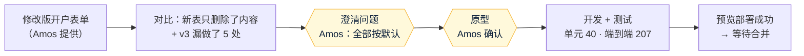

# 《交付说明》v4：按修改版开户表单调整系统（上线前版本）
- 版本：v4
- 产出角色：产品经理（汇总研发、测试、运维的产出）
- 状态：✅ **已上线（PR #12），Amos 于 2026-09-28 验收通过**
- 变更历史：v4（2026-09-28）上线前版本

## 一图看懂

| 客户：第 ① 步新字段 | 后台：制裁标记 |
|---|---|
|  |  |

## 1. 本次交付（相对 v3）
- **客户页面：**
  - 新增：币种和数字资产；受制裁国家或人员的声明（选"是"要写说明）；UBO 的持股比例和投票权比例。
  - 修改：业务用途改为 4 个选项、多选；月交易量选"50 万以上"时要填写大约金额。
  - 删除：证明文件里的第 11、12 项（资金来源类证明）。
- **后台：**
  - 显示全部新字段。
  - 制裁声明选"是"的申请，在列表和详情里用红色标出。
  - v3 的旧申请显示"（v3 提交，没有此项）"；旧的第 11、12 项文件标注"（旧版文件项）"，照常可以下载。
- **不需要在 Vercel 后台做任何操作**，没有新的环境变量。

## 2. 质量结论（来自《测试报告 v4》）
- 单元测试 40 / 40，端到端测试 207 / 207，全部通过；可访问性 100 分。
- 本轮没有发现新缺陷。

## 3. ⚠️ 需要 Amos 做的事
| # | 事项 | 说明 |
|---|---|---|
| 1 | 回复"可以合并" | 合并后自动上线，我会检查线上的健康检查、页面和接口 |
| 2 | 上线后用测试邮箱走一遍 | 填写时制裁选"是"，确认后台出现红色标记 |
| 3 | 清理测试数据（可选） | 后台里 QC-2026-0001、0002 两条"sdfasf"测试申请，可以在详情页删除 |

## 4. 已知限制
- 制裁声明只是客户的自我声明，没有对接筛查服务（按需求不做）。
- 附录 B 的措辞是否适用于企业，仍然等待合规确认（RK4）。

## 5. 跨角色反馈
| # | 提出方 → 接收方 | 内容 | 状态 |
|---|---|---|---|
| FB-v4-1 | PM → Amos | 新表开头仍然写着"按附录 A 提交文件"，但附录 A 已经删除 | Amos 按默认处理：保留文件上传，去掉第 11、12 项 |
| FB-v4-2 | PM → Amos | v3 漏做了 5 处新旧表都有的内容 | 本轮补上。原因见下面的流程磨合观察 |

## 附：流程磨合观察（第 4 轮，供 agents 后续修订参考）
| # | 观察 | 可能的改进 |
|---|---|---|
| O7 | v3 的字段清单是 PM 从表单"还原"出来的，漏了 5 处（币种、制裁、持股比例、业务用途的选项、50 万以上的金额），v3 验收时也没有发现。这次对比新旧表时才发现 | PM：从文档还原字段时，附一张"原文逐行 → 系统字段"的对照表，交测试预审时逐行核对 |
| O8 | 按 v0.5.1 C32，原型里提前加了空状态（`?empty=1`），这次在原型阶段就能看到空状态的样子 | 保持 |
