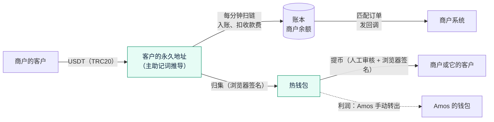

# 《交付说明》v6：稳定币收付款
- 版本：v6（需求 v6.2）
- 产出角色：产品经理（汇总运维、研发、测试的产出）
- 状态：✅ **已上线**（2026-09-30，PR #41 上线，#44 修复概览）。Amos 在测试环境（Nile）验收通过；生产已验证开通商户和收款，**提币和归集等热钱包充值 TRX 后补做一次**（§3）
- 输入：《需求说明书 v6.2》《架构方案 v6》《实现说明 v6》《测试报告 v6》《部署方案 v6》

## 一图看懂：一笔钱怎么走

## 1. 本次交付
| 项目 | 内容 |
|---|---|
| 商户后台 | https://amos111.vercel.app/merchant/ ：概览、客户、订单、交易、提币、API 设置、回调记录 |
| 付款页面 | `https://amos111.vercel.app/pay/<订单号>/`（中英文） |
| 开发者文档 | https://amos111.vercel.app/docs/ ：签名方法、15 个接口的参数和返回字段、回调、错误码；**字段说明由测试逐个对照接口，保证一致** |
| 运营后台 | https://amos111.vercel.app/admin/ ：**概览**（登录后默认）、商户、客户、归集、提币审核、异常到账、对账、钱包设置、系统状态 |
| 链上监控 | cron-job.org 每分钟调用 `/api/tick/`；GitHub Actions `tick-watch` 每 15 分钟检查一次，停了会发邮件 |
| 生产配置 | Supabase `quickcome-prod`（新加坡）；TRON 主网；热钱包 `TJwzqVh6n9XyMrrAdubTzkyUKMyQJwu7oL`；冷钱包暂不配置 |
| 私钥 | **系统不保存私钥**：主助记词和热钱包的密钥只在 Amos 的浏览器里签名时使用，签名后立即清除 |

## 2. 质量结论
- 单元测试 105 个（v6 新增 63 个），在内嵌 Postgres 和**真实 Postgres 16** 上各跑一遍；端到端测试 224 个（v6 新增 10 个）。全部通过。
- 测试环境（Nile）：Amos 按《测试报告》§4 走通了初始化、开户开通、收款、先建单后到账、先到账后建单、提币、归集。
- 验收中发现并修复 BUG-P4 到 P22，详见《测试报告 v6》§3。影响最大的几个：
  - **P11**：后台多处金额放大 100 万倍 → 端到端测试记录所有接口的返回，任何没转换的金额都会失败。
  - **P12**：最低收款费大于到账金额时扫链会停住 → 手续费最多等于到账金额；一笔出错不影响其他。
  - **P5、P22**：线上数据库的驱动和本地不同（jsonb 多编码、并发查询经过连接池卡住）→ 测试都可以在真实 Postgres 上跑；数据库层限制并发查询。
  - **P21**：没激活的新地址查不到 USDT，无法归集 → 直接查合约余额。
  - **P15**：回调地址的内网检查可以绕过 → 完整解析 IPv6，连接时再检查一次。
- 生产上线后：健康检查正常（数据库、主网、TronGrid Key、链上监控）；冒烟检查 24 项全部通过。

## 3. 已知限制和待办
| # | 内容 | 处理 |
|---|---|---|
| L1 | 生产热钱包还没有 TRX，**生产上的提币和归集还没走过一次** | Amos 充值约 100 TRX 后，用 1 USDT 走一遍提币和归集（AC-P16 的剩余部分）。逻辑已在测试环境验证 |
| L2 | 冷钱包暂不配置：归集只能归集到热钱包 | 热钱包 USDT 多时由 Amos 手动转出；以后配置冷钱包只需要把地址发给研发（R18） |
| L3 | 不提供沙箱 | 试用阶段在生产用小金额联调（需求 v6.1） |
| L4 | 签名前再输入验证码暂不要求两步验证（Q-v6-5） | 风险 R24，Amos 在必要时开启 Vercel 和 GitHub 的两步验证 |
| L5 | 每个 API Key 的限流在函数实例内计数（D5） | 迁移到云服务器后改为集中限流 |
| L6 | 客户搜索按邮箱时，在服务器上解密最近的 5000 个客户再比对 | 客户很多时改为保存邮箱的检索用哈希 |
| L7 | 其他代币的检查每天一次，最多 1,000 个地址（D7）；没激活的地址查不到其他代币 | 够用；需要时改为按转账记录检查 |

## 4. 跨角色反馈
| # | 提出方 → 接收方 | 内容 | 状态 |
|---|---|---|---|
| FB-v6-2 | Amos → 产品 | 异常到账不结算给商户，不给商户显示 | 已完成（需求 v6.2） |
| FB-v6-3 | Amos → 产品 | 运营后台需要汇总页：代收、欠商户、利润、待处理 | 已完成（概览） |
| FB-v6-4 | Amos → 研发 | 创建订单时的客户选择：模糊搜索、带出资料、可以新建 | 已完成 |
| FB-v6-5 | Amos → 研发 | 开发者文档缺每个接口的字段说明 | 已完成，并用测试保证和接口一致 |
| FB-v6-6 | Amos → 研发 | 签名时只有助记词，没有 64 位私钥 | 热钱包一栏可以直接填助记词 |
| FB-v6-7 | 研发 → Amos | 生产热钱包最初填的是测试钱包的地址 | Amos 采纳建议，新建了生产热钱包 |

## 附：流程磨合观察
| # | 观察 | 可能的改进 |
|---|---|---|
| O11 | 本地测试全部通过，但线上连续出现"驱动行为不同"的问题（jsonb 多编码、并发查询卡住）、"平台行为不同"的问题（Vercel 改写规则不接受结尾的 /、TronGrid 对没激活的地址不返回） | 数据库测试同时在真实 Postgres 上跑；平台的改写规则用 `vercel build` 的路由表确认；外部接口的边界情况（没激活的地址）用真实网络验证。**已写进 agents v0.7（C37、C39）** |
| O12 | 金额"整数存储、字符串返回"靠一份字段名单，漏了就放大 100 万倍 | 用端到端测试扫描所有接口的返回，漏了就失败。**已写进 agents v0.7（C38）** |
| O13 | 测试环境的验收发现了 18 个问题，没有一个带到生产 | 保持"先测试环境、再生产" |
| O14 | Amos 在验收中提出的体验问题（弹窗滚动、导航数字、客户选择），都是原型阶段用示例数据看不出来的 | 原型评审时，加一轮"用真实数据操作一遍"的检查。**已写进 agents v0.7（C40）** |
| O15 | 验收中的页面问题都是 Amos 发现的；按清单做页面走查后，又发现 11 个问题（《测试报告》§3.2） | 测试的页面走查（C42～C45、C50、C51）、研发的页面开发自检（C46～C49、C52），**已写进 agents v0.7** |
