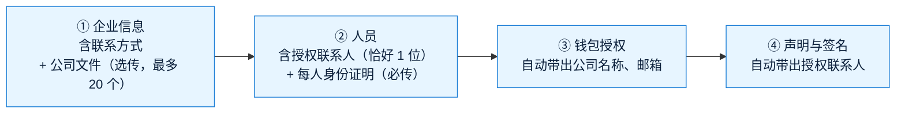

# 《交付说明》v7：开户表单精简 + 集中限流 + 邮箱哈希检索
- 版本：v7
- 产出角色：产品经理（汇总研发、测试、运维的产出）
- 状态：⏸ 部署到测试环境，等待 Amos 验收（验收清单见《测试报告 v7》§4）
- 输入：《需求说明书 v7》《原型说明 v7》《实现说明 v7》《测试报告 v7》《任务清单 v7》

## 一图看懂：开户 7 步 → 4 步

## 1. 本次交付
| 项目 | 内容 |
|---|---|
| 开户页 | `/onboarding/?t=<令牌>`：4 步；删除"证明文件"一步、地址证明、钱包所有权证明；公司文件选传；每位人员上传护照或身份证（1～3 个文件）；证件类型可选护照或身份证 |
| 审核后台 | 开户详情按新结构显示（企业信息、公司文件、每位人员和身份证明、钱包、声明）；**旧申请照常显示全部原有内容和文件**；要求补件时可以勾选 3 个步骤 |
| 开通收付款 | "待开通"列表的邮箱改为授权联系人的邮箱（旧申请仍取原来第 ③ 步的邮箱） |
| L5 | 开放 API 限流改为所有服务器实例共享计数（每个 API Key 每秒 20 次）；限流服务故障时不挡收款 |
| L6 | 按完整邮箱搜索客户改为哈希精确查找，客户再多也能找到；数据库里仍然没有明文邮箱 |

## 2. 上线需要做的事
- **不需要新的环境变量、平台设置或手工步骤**。数据库新列在上线后第一次请求时自动添加，已有客户的邮箱哈希同时自动补算。
- 上线前已经在填写中的申请：客户再次打开时自动整理到新的 4 步，已填内容不丢；需要补传身份证明（原来上传的护照算作身份证明）和补填新增的必填项后才能提交。

## 3. 已知限制和待办
| # | 内容 | 状态 |
|---|---|---|
| L7-1 | 公司文件改为选传后，审核时资料可能不全，用"要求补件"让企业补交 | Amos 已接受（FB-v7-1） |
| L7-2 | 限流每个请求多 1～2 条 Upstash 命令；商户调用量大时免费额度可能不够，到时先告诉 Amos | 观察 |
| L7-3 | 部分邮箱的模糊搜索仍然只在最近 5000 个客户里比对（完整邮箱不受限制） | 按需求保留 |
| v6 遗留 | 生产的提币和归集冒烟检查：等热钱包 `TJwzqVh6n9XyMrrAdubTzkyUKMyQJwu7oL` 充值约 100 TRX 后补做；冷钱包暂不配置；商用前升级 Vercel Pro（Amos 决定） | 待 Amos |
| 已关闭 | v6 的 L5（限流只在单个实例内计数）、L6（按邮箱搜索只查最近 5000 个） | ✅ 本次解决 |

## 4. PM 自检
- [x] 验收标准 AC-7-1～14 都有对应的测试（《测试报告 v7》§2）
- [x] 写明了上线要做的事（无）和已在填写中的申请怎么处理
- [x] 项目地图、项目索引已更新
