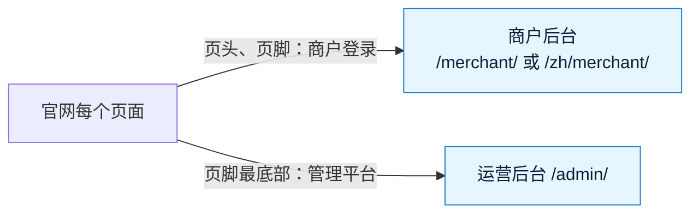

# 《交付说明》v7.1：官网的商户登录和管理平台入口
- 版本：v7.1
- 产出角色：产品经理（汇总研发、测试的产出）
- 状态：⏸ 部署到测试环境，等待 Amos 验收（验收清单见《测试报告 v7.1》§3）
- 输入：《需求说明书 v7.1》《原型说明 v7.1》《测试报告 v7.1》

## 一图看懂

## 1. 本次交付
| 项目 | 内容 |
|---|---|
| 页头 | 导航加"商户登录"（英文 Merchant login），跟随当前语言；手机菜单里也有。1100 像素以下改用菜单 |
| 页脚 | "公司"一栏加"商户登录"；最底部版权右侧加淡色小字"管理平台"（英文 Admin），不进搜索引擎 |
| 一起上线（测试环境已有、只改文档和测试） | v7 文档状态"已上线"、TC-P10 测试修复、冷启动检查后补充的项目地图和索引 |

## 2. 上线需要做的事
- 不需要新的环境变量、平台设置或手工步骤。

## 3. 已知限制和待办
- 无新增。v6、v7 的遗留事项见《交付说明 v7》§3（生产的提币和归集检查等热钱包充值 TRX、商用前升级 Vercel Pro）。

## 4. PM 自检
- [x] 验收标准 AC-7.1-1～5 都有对应的测试
- [x] 项目地图、项目索引已更新
