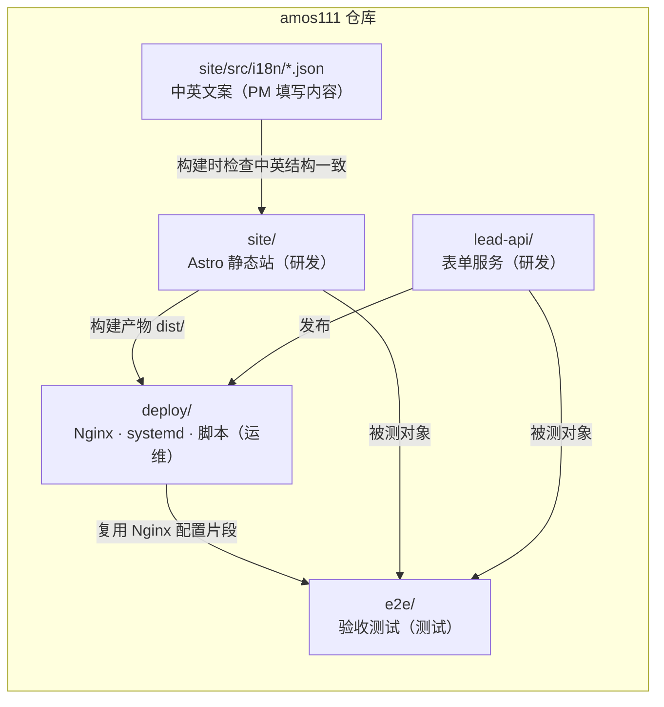
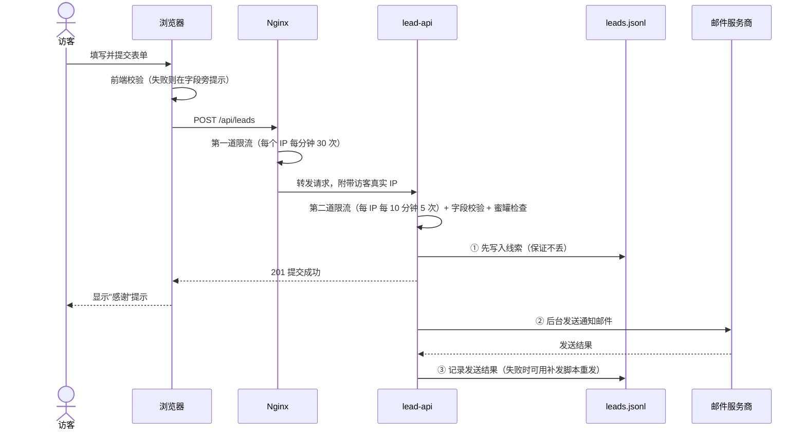

# 《技术方案》v1：Quick Come 官网
- 版本：v1
- 产出角色：研发工程师
- 输入：《v1-需求说明书》《00-架构方案》（已审核通过）《v1-任务清单》
- 变更历史：
  - v1（2026-09-27）首次创建
  - v1.2（2026-09-27）按 agents v0.2 的可视化规范补图：新增"一图看懂"一节，正文没有改动
- 说明：本方案是对已审核通过的架构方案做实现层面的细化，没有引入任何新的架构决策，因此不再单独提交 Amos 审核。如果实现过程中需要偏离架构方案，会停下来反馈。

## 1. 网站（site/）
- **框架：** Astro 7，`output: 'static'`。
- **路由：** 用一个动态路由 `src/pages/[...lang]/<页面>.astro` 同时生成英文（根路径）和中文（`/zh/`）两版，每类页面只写一份模板。
  - 页面路径：`/`、`/solutions/`、`/how-it-works/`、`/security/`、`/about/`、`/contact/`、`/privacy/`、`/terms/`。
  - 以上每个路径都有对应的 `/zh/` 版本，共 16 页。
- **文案：**
  - 所有文案集中放在 `src/i18n/en.json` 和 `src/i18n/zh.json` 两个文件里。研发定义键名结构，PM 填写文案内容。
  - 构建时，脚本会检查两个语言文件的键名结构是否完全一致；不一致就构建失败，防止漏翻。
- **组件：**
  - `Layout`：页面头信息，包括 SEO、语言互指标注、分享卡片。
  - `Header`：导航，包括语言切换和"预约演示"按钮。
  - `Footer`：放风险提示和相关声明。
  - `CtaBand`：页面底部的行动引导区。
  - `Logo`：内联 SVG。
  - `ContactForm`：联系表单。
- **样式：** 原生 CSS。色系用 CSS 变量定义，深色模式跟随浏览器的 `prefers-color-scheme` 设置，使用系统字体。
- **脚本：** 全站只有两段脚本：表单提交，以及移动端的菜单开关。两段都打包成外部文件，不写成内联脚本，这样安全策略（CSP）可以禁止一切内联脚本。
- **SEO：** 每页有独立的标题和描述；有 `link rel=alternate hreflang` 标注（en、zh-Hans、x-default）和 canonical 标注；有 Open Graph 分享卡片；构建时自动生成 `sitemap.xml`；`robots.txt` 放在 public 目录。

## 2. 表单服务（lead-api/）
- **运行环境：** Node 22 原生 http 模块，唯一的运行时依赖是 `nodemailer`。
- **接口：**
  - `GET /api/health`：返回 `{ok:true}`。
  - `POST /api/leads`：只接受 JSON 格式，请求体最大 16KB。
  - 返回码：
    - `201`：提交成功
    - `400`：字段校验失败，附字段错误信息
    - `413`：请求体过大
    - `415`：不是 JSON 格式
    - `429`：提交过于频繁
- **字段规则：**

  | 字段 | 必填 | 规则 |
  |---|---|---|
  | name | 是 | 1 到 100 字符 |
  | company | 是 | 1 到 150 字符 |
  | email | 是 | 邮箱格式，最长 254 字符 |
  | country | 是 | 2 到 100 字符 |
  | industry | 是 | 只能是 export、manufacturing、b2b、other 之一 |
  | volume | 否 | 只能是 lt50k、50k-250k、250k-1m、gt1m 之一 |
  | phone | 否 | 最长 40 字符，只允许数字、空格、`+`、`-`、`()` |
  | message | 否 | 最长 2000 字符 |
  | consent | 是 | 必须为 true |
  | lang | 否 | en 或 zh |
  | website | — | 蜜罐字段，必须为空；不为空时返回假的成功结果，但不保存 |

- **限流：** 按 IP 计数，固定时间窗口：同一 IP 每 10 分钟最多 5 次提交，数值可以通过配置修改。
  - IP 的来源：在 `TRUST_PROXY=1` 时，取 Nginx 传过来的 `X-Real-IP`；否则取直接连接的地址。
  - 计数放在内存里，并定期清理过期记录。
- **存储：** 追加写入 `DATA_DIR/leads.jsonl`，文件权限 600。有两种记录：
  - `{"type":"lead", id, receivedAt, ip, userAgent, data}`：一条线索。
  - `{"type":"mail", id, ok, error?, at}`：这条线索的邮件发送结果。
- **邮件：**
  - 先写入线索记录，再立即返回 201，然后在后台发送邮件，并把发送结果追加写入存储文件。
  - 邮件是纯文本格式，回复地址设为访客填写的邮箱。
  - `scripts/resend-failed.js` 会补发所有"没有成功发送记录"的线索，用来应对风险 R2。
- **配置（环境变量）：**
  - 服务：`PORT`、`HOST`（默认 127.0.0.1）、`DATA_DIR`、`TRUST_PROXY`
  - 限流：`RATE_LIMIT_MAX`、`RATE_LIMIT_WINDOW_MS`
  - 邮件：`SMTP_HOST`、`SMTP_PORT`、`SMTP_SECURE`、`SMTP_USER`、`SMTP_PASS`、`MAIL_FROM`、`MAIL_TO`
- **可测试性：** 用 `createServer({config, store, sendMail})` 的方式把存储和发信作为参数传进去，单元测试时可以替换成测试用的实现。

## 3. 交给运维的部署需求
- **运行环境：** Node 22 LTS；Nginx 1.24 或更高版本。
- **网站：** 在本地或 CI 里执行构建，产物是 `site/dist/`，纯静态文件。
- **lead-api：**
  - 部署时执行 `npm ci --omit=dev`，启动命令是 `node src/index.js`，服务监听 127.0.0.1:3001。
  - 需要一个可写的数据目录，用来存放 `leads.jsonl`。
- **需要配置的环境变量：** 见第 2 节"配置"，模板文件是 `lead-api/.env.example`。
- **Nginx：**
  - 把 `/api/` 代理到 lead-api，并传递 `X-Real-IP`。
  - 其余路径由 Nginx 直接提供静态文件，找不到页面时返回 `404.html`。

## 4. 交给测试的内容
- **功能说明：** 以本方案第 1、2 节为准。
- **已知的边界情况：**
  - 蜜罐字段被填写时，接口返回 201，但数据不保存。
  - 限流按 IP 计数，服务重启后计数清零。
  - 邮件发送失败不影响返回 201。
  - 前端校验依赖浏览器原生的表单校验，并额外做了自定义提示；服务端校验是最终依据。

---

## 一图看懂
**图 1：代码目录与归属角色。** 每个目录由哪个角色负责，以及目录之间的依赖关系。

**图 2：表单提交时序。** 与《00-架构方案》图 2 相同，放在这里方便对照代码阅读。

---

## 5. 实现说明（研发，开发完成后补充）
- 变更历史：v1.1（2026-09-27）补充本节

### 5.1 做了什么
| 任务 | 代码位置 | 说明 |
|---|---|---|
| T3 品牌资产 | `site/public/brand/`、`favicon.*`、`og-image.png`、`apple-touch-icon.png` | 包含 SVG 标志、SVG 横版 Logo（浅色背景版和深色背景版）和 PNG 图标。PNG 由 `npm run brand:render` 生成，源文件在 `site/brand-src/` |
| T4 站点框架 | `site/src/layouts/`、`site/src/components/`、`site/src/styles/global.css` | 包含页头（带移动端菜单）、页脚（带风险提示和"不面向中国大陆"声明）、页面底部行动引导区，支持深色模式 |
| T5 页面 | `site/src/pages/[...lang]/*.astro` | 8 类页面各写一份模板，同时生成中英两版，共 16 页；另有 404 页面 |
| T6 表单前端 | `site/src/components/ContactForm.astro` | 前端校验，并把服务端返回的字段错误显示到对应字段旁；处理 429 限流、网络失败、服务端错误三种情况；包含蜜罐字段 |
| T7 表单服务 | `lead-api/` | 按技术方案第 2 节实现，附 17 个单元测试（`npm test`），全部通过 |
| T8 SEO | `Layout.astro`、`src/pages/sitemap.xml.ts`、`robots.txt.ts` | 每页有 canonical、hreflang（en、zh-Hans、x-default）、Open Graph 标注；sitemap 自动生成 |

### 5.2 为什么这么做（和技术方案不同的地方）
- **nodemailer 用 v10，没有用 v7。** 安装 v7 时，`npm audit` 报告了高危漏洞（多个 SMTP 头注入类问题）。v10 目前没有已知漏洞。
- **手机上的"电汇对比"表格改为按卡片堆叠显示。** 研发自测截图时发现，表格在 375px 宽度下要横向滑动才能看到 Quick Come 那一列。
- **robots.txt 改为构建时生成。** 这样它引用的 sitemap 地址会跟着 SITE_URL 变化，不会写死。

### 5.3 已知限制和技术债
- R1 到 R4 同第 2.5 节。
- **首页的示意卡片**（"已收到付款 12,500.00 USDT"）只是装饰，不代表真实数据。已设为 `aria-hidden`，读屏软件不会读出。
- **手机端没有常驻的"预约演示"按钮。** 手机端的按钮在"菜单"里，另外每个页面底部也有一个。是否满足 AC4，由测试判断。
- **构建会检查中英文案的字段结构，但不会检查译文的质量。**

### 5.4 交给测试
- 按第 4 节的已知边界情况测试。
- **本地运行：**
  - 网站：`cd site && npm ci && npm run build`，产物在 `dist/`
  - 表单服务：`cd lead-api && npm ci && npm start`
  - Nginx 配置在 `deploy/nginx/`
