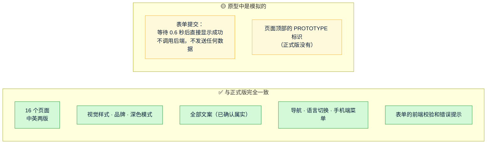

# 《高保真原型说明》v2：Quick Come 官网
- 版本：v2
- 产出角色：研发工程师（PM 已走查）
- 状态：⏸ **等 Amos 确认原型**，确认后才正式开发（agents v0.3 第 4.5 步）
- 变更历史：v2（2026-09-27）首次创建

## 一图看懂：原型里哪些是真的，哪些是模拟的

## 1. 在哪里看
- **预览地址：** PR 页面上 Vercel 机器人的评论里有 "Preview" 链接，打开即可。
  - 需要用有 Vercel 团队权限的账号登录，这是 Vercel 默认的部署保护。
- **截图版：** 见 `assets/v1/`。v2 的界面与 v1 相同。

## 2. 建议的查看路线（约 5 分钟）
| 步骤 | 操作 | 需要确认什么 |
|---|---|---|
| 1 | 打开首页，从上往下浏览 | 整体视觉、价值主张、电汇对比表是否符合预期 |
| 2 | 点击右上角的"中文 / EN"切换语言 | 中文版的表达是否合适 |
| 3 | 依次打开"行业方案"、"工作原理"、"安全与合规" | 内容是否完整，法币部分是否都写了"联系销售" |
| 4 | 点击"预约演示"，先不填直接提交，再填写完整后提交 | 校验提示和成功提示是否合适（提交是模拟的） |
| 5 | 用手机打开同一个地址，再看一遍首页和联系页 | 手机端的效果 |
| 6 | 把手机或电脑切换到深色模式 | 深色模式的效果 |

## 3. 请 Amos 选择
- **确认继续：** 按架构方案 v2 开始正式开发（改为 Vercel Function、接入存储和邮件）。
- **修改后再看：** 请指出要改的页面或内容，研发修改后会更新同一个预览地址。
- **暂停或放弃。**

## 4. PM 走查结果
| 检查项 | 结果 |
|---|---|
| 页面是否齐全（8 类页面，每类中英两版，共 16 页） | ✅ |
| 文案是否与已确认的版本一致 | ✅ 与 v1.2 一致 |
| 原型标识是否醒目，是否说明了表单是模拟的 | ✅ 顶部黄色条纹标识，中英两版 |
| 正式构建会不会带上原型标识和模拟提交 | ✅ 不会。已验证：正常构建的产物里没有原型相关的标记，161 个回归用例全部通过 |
