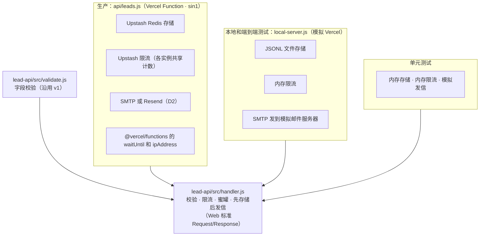

# 《技术方案》v2：Vercel Function 实现说明
- 版本：v2
- 产出角色：研发工程师
- 输入：《需求说明书 v2》、《架构方案 v2》（已审核通过）、《原型说明 v2》（已确认）
- 变更历史：v2（2026-09-27）首次创建
- 说明：严格按已审核通过的架构方案 v2 实现，没有偏离的地方。
- v2.3（2026-09-27）：修复 BUG-05。前端接口地址改为带尾斜杠的版本；`local-server.js` 补上 Vercel 的 `trailingSlash` 行为。这说明 R7（本地环境只模拟了部分 Vercel 行为）的风险确实存在，也说明上线后的冒烟测试有必要。

## 一图看懂：代码结构
**图：一份处理逻辑，三种运行方式。** `handler.js` 不依赖任何平台；存储、限流、发信都通过参数传入。生产环境、本地测试环境和单元测试，只是传入的实现不同。

## 1. 改动的影响范围
| 位置 | 改动 | 是否破坏性变更 |
|---|---|---|
| `api/leads.js`、`api/health.js`、`api/_lib.js` | 新增 Vercel Function；`_lib.js` 是公共初始化代码，文件名以 `_` 开头，Vercel 不会把它当作接口 | 否 |
| `lead-api/src/handler.js` | 新增：从 v1 的 `server.js` 抽出处理逻辑，改成 Web 标准写法 | — |
| `lead-api/src/store.js`、`rateLimit.js`、`mailer.js`、`config.js` | 新增 Redis 存储和 Upstash 限流；新增 Resend 发信；配置改为 Vercel 的环境变量 | 是：接口都改成了异步方法（仓库内部接口，对外无影响） |
| `lead-api/src/local-server.js` | 新增：模拟 Vercel，替代 v1 测试环境里的 Nginx | — |
| `lead-api/src/index.js`、`server.js`、`lead-api/package.json` | 删除：函数依赖统一放在根目录的 `package.json` | 是：不再有常驻的 Node 服务 |
| `deploy/` | 删除（D6） | 是：不再支持自建服务器部署。需要时可以从 git 历史恢复 |
| `vercel.json` | 安装命令改为同时安装函数依赖；函数地域 `sin1`；函数最长运行 10 秒 | 否 |
| `site/` | 页面没有改动；原型模式在原型阶段已经加好 | 否 |

## 2. 关键实现
- **IP 来源：** 使用 `@vercel/functions` 的 `ipAddress()` 读取 Vercel 平台写入的访客 IP。本地服务器模仿同样的行为：用 TCP 连接的真实地址覆盖请求头。所以访客自己伪造 `x-real-ip` 请求头绕不过限流，测试 TC-18 专门验证了这一点。
- **先存储后发信：** 线索写入 Redis 后才返回 201；邮件通过 `waitUntil` 在响应返回后继续发送，发送结果追加写入 `qc:mail` 列表。
- **存储结构：** 两个只追加的 Redis 列表：`qc:leads`（线索）和 `qc:mail`（发送结果），结构与 v1 的 JSONL 一一对应。`lead-api/scripts/resend-failed.js` 可以补发发送失败的线索。
- **安全失败：**
  - 没有配置存储时，`/api/leads` 返回 500，但不泄露任何配置信息。
  - `/api/health` 返回 503，并说明是存储还是邮件没有配置，不返回任何配置的值。
- **依赖安全：** `npm audit` 没有发现漏洞。依赖：`nodemailer` 10、`@upstash/redis` 1、`@upstash/ratelimit` 2、`@vercel/functions` 3。

## 3. 技术债与风险
- **R1（v1）：**已消除。限流计数改放在 Upstash，多个函数实例共享。
- **R2：**保持不变。邮件发送失败后不会自动重发，需要手动执行补发脚本。
- **R5（新）：**依赖 Vercel 和 Upstash 两个平台。
- **R7（新）：**`local-server.js` 只模拟了本项目用到的 `vercel.json` 功能，比如 `/(.*)` 这种通配写法和 host 条件，不能完全替代真实的 Vercel 环境。所以测试报告要求上线后执行一次在线冒烟测试。

## 4. 研发自检
- [x] 技术方案已确认，原型已确认，才开始正式开发
- [x] 写明了影响范围，并标注了破坏性变更
- [x] 标注了技术债和风险
- [x] 单元测试 18 个，全部通过
- [x] `npm audit` 没有高危漏洞
- [x] 页面没有改动，界面截图沿用 `assets/v1/`
- [x] 附了结构图

## 5. 交给测试 / 运维
- **交给测试：**
  - 本地运行：`npm ci && (cd site && npm ci && npm run build) && npm run dev:local`
  - 边界情况同 v1。新增"伪造 IP 请求头不能绕过限流"、"原型构建与正式构建的差异"两项。
- **交给运维：**需要配置的环境变量清单见 `lead-api/.env.example`。
