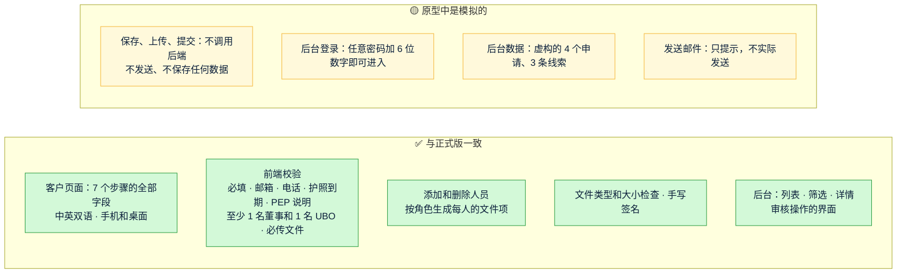

# 《高保真原型说明》v3：线上 KYB 开户资料收集
- 版本：v3
- 产出角色：研发工程师（PM 已走查，见 §4）
- 状态：✅ **Amos 已于 2026-09-28 确认原型，同意继续开发**
- 变更历史：v3（2026-09-28）首次创建；v3.1（2026-09-28）按 Amos 的要求改为完整链接；Amos 已确认原型，同意继续开发

## 一图看懂：原型里哪些是真的，哪些是模拟的

## 1. 在哪里看（完整链接，可以直接复制打开；需要登录 Vercel）
| 页面 | 完整链接 |
|---|---|
| 客户填写页面（中文） | https://amos111-git-claude-four-agent-0e9459-jeffzhaifei-3827s-projects.vercel.app/zh/onboarding/?t=demo |
| 客户填写页面（英文） | https://amos111-git-claude-four-agent-0e9459-jeffzhaifei-3827s-projects.vercel.app/onboarding/?t=demo |
| 审核后台 | https://amos111-git-claude-four-agent-0e9459-jeffzhaifei-3827s-projects.vercel.app/admin/ （任意密码，动态码填任意 6 位数字） |

## 2. 建议的查看路线（约 10 分钟）
| 步骤 | 操作 | 需要确认什么 |
|---|---|---|
| 1 | 打开中文填写页，**什么都不填**，直接点"保存并继续" | 校验提示是否清楚 |
| 2 | 按提示填完第 ① 到 ③ 步 | 字段是否齐全，与你的开户表是否一致 |
| 3 | 第 ④ 步：给人员 1 勾选"董事"，再添加一个人勾选"UBO"；给其中一人的 PEP 选"是" | 多人、多角色、PEP 说明框的交互是否合理 |
| 4 | 第 ⑤ 步：上传几个 PDF 或图片，也试试上传一个超过 10MB 的文件 | 文件清单是否对，每人的护照和地址证明是否按人员生成 |
| 5 | 第 ⑥ 步：钱包声明 | 附录 B 的内容是否正确（措辞待法务确认，见 RK4） |
| 6 | 第 ⑦ 步：签名，然后提交 | 签名和提交后的页面 |
| 7 | 用手机打开同一个地址，再走一遍 | 手机端的体验 |
| 8 | 打开 `/admin/`，登录，点"Acme Export Ltd"查看详情；试试"要求补件"；再切换到"官网线索"，点"发送开户链接" | 后台信息是否够你做审核，操作是否顺手 |

## 3. 请 Amos 选择
- **确认继续：**开始正式开发后端（按架构方案 v3）。
- **修改后再看：**请指出要改的页面或字段，研发修改后会更新同一个预览地址。
- **暂停或放弃。**

## 4. PM 走查结果
| 检查项 | 结果 |
|---|---|
| 开户表第 1 到 5 部分和附录 A、B 的字段是否全部覆盖 | ✅ 全部覆盖，另外补了"授权联系人姓名"（FB-v3-1） |
| 第 6 部分"内部使用"是否只出现在后台 | ✅ |
| Paypaz 是否都替换成了 Quick Come | ✅ |
| 原型标识是否醒目 | ✅ 顶部黄色条纹，中英两版 |
| 正式构建会不会带上原型标识和模拟数据 | ✅ 不会。正式构建下，填写页面显示"链接无效"，后台显示"尚未启用"，这是正式开发前的占位状态；官网 181 个回归用例全部通过 |

## 5. 研发自检
- [x] 手机（390）和桌面（1280）截图自查。已修复 3 个问题：手机页头换行、人员文件的"必填"标记、小文件的大小显示。
- [x] 在带严格 CSP 的本地环境里运行原型，控制台没有报错。
- [x] 构建产物里没有内联脚本和内联样式（TC-08b 通过）。
