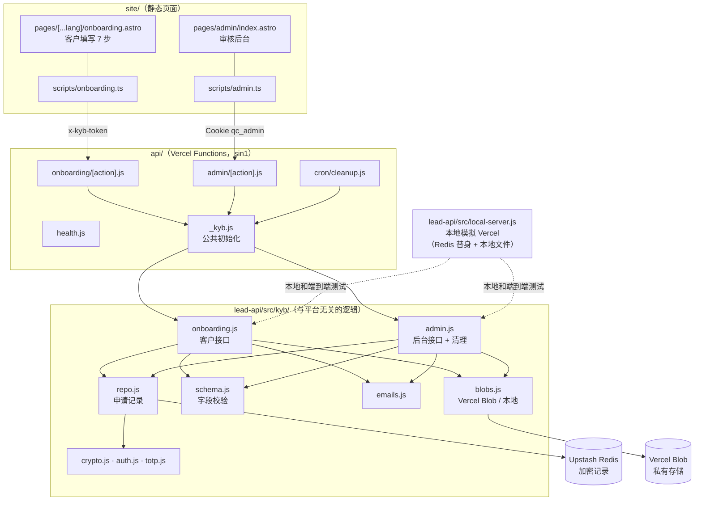
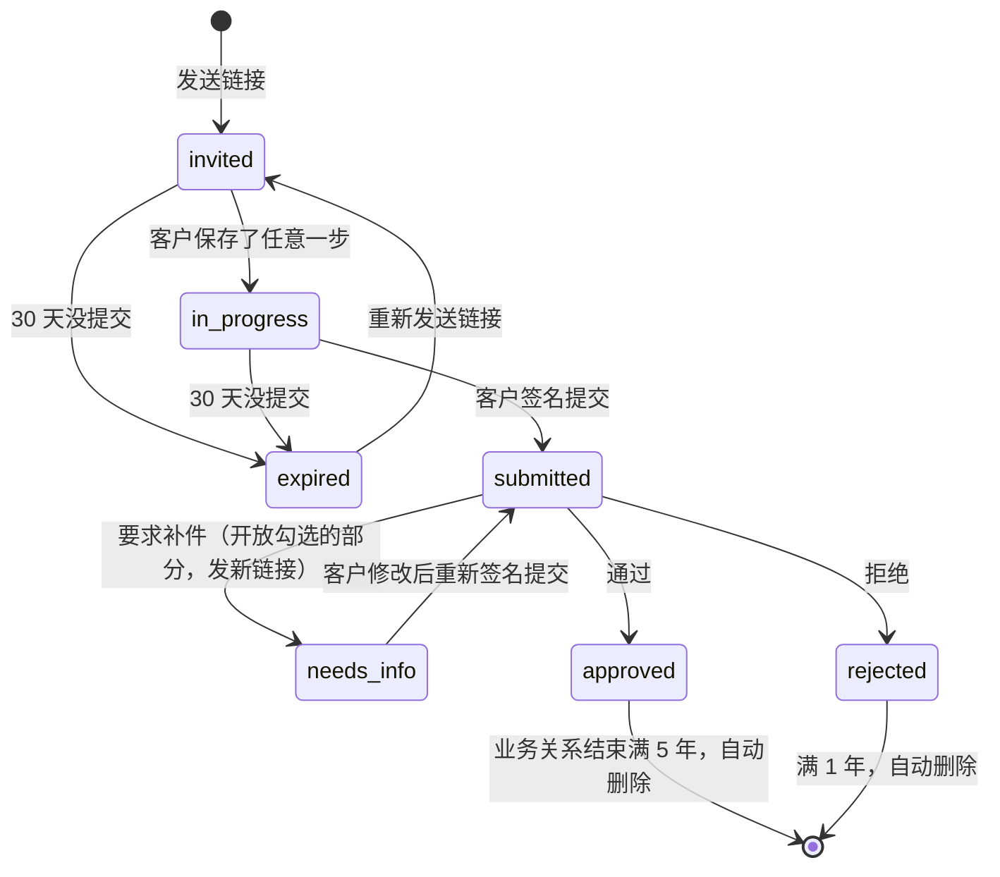
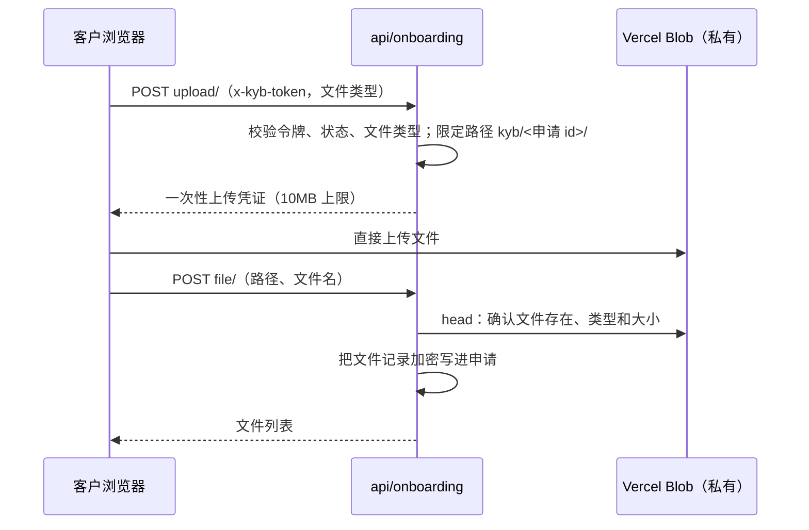

# 《技术方案》v3：线上 KYB 开户实现说明
- 版本：v3
- 产出角色：研发工程师
- 输入：《需求说明书 v3》（已审核）、《架构方案》v3 部分（已审核）、原型（Amos 已确认）
- 变更历史：v3（2026-09-28）首次创建。实现过程中的细化见 §3，都没有偏离已审核的决定。

## 一图看懂：代码结构

**申请状态：**

**文件上传（生产环境，浏览器直传）：**

## 1. 改动的影响范围
| 模块 | 文件 | 说明 |
|---|---|---|
| 新增：开户核心逻辑 | `lead-api/src/kyb/*.js`（10 个文件） | 与平台无关，本地和 Vercel 共用 |
| 新增：接口入口 | `api/_kyb.js`、`api/onboarding/[action].js`、`api/admin/[action].js`、`api/cron/cleanup.js` | 薄封装，初始化失败时返回 503，不泄露配置 |
| 修改 | `api/health.js` | 新增 `secret`、`blob`、`cron`、`mailMode` 四项（只返回是否配置好） |
| 修改 | `lead-api/src/config.js`、`mailer.js` | 新增 v3 的环境变量；新增通用发信函数 `createRawSender` |
| 修改 | `lead-api/src/local-server.js` | 本地路由开户接口；Redis 替身和本地文件存储 |
| 修改 | `vercel.json` | 函数最长 30 秒；每天 19:15（UTC，新加坡时间 03:15）执行清理；CSP 放行 Blob 上传地址 |
| 修改 | `site/`：开户页、后台、`app.css`、隐私政策文案 | 从模拟数据切换到真实接口；原型模式保留 |
| 依赖 | 新增 `@vercel/blob`、`qrcode` | `npm audit` 没有漏洞 |

**破坏性变更：**没有。官网 v2 的全部功能不变（端到端回归通过）。
**注意：**上线后，`/api/health` 在 v3 的变量配置齐全之前会返回 503。所以要先完成配置，再合并。

## 2. 关键实现
- **加密：**`APP_SECRET` 经过 HKDF 派生出三把独立的密钥，分别用于数据加密、会话签名和令牌哈希。每个申请的敏感部分整体用 AES-256-GCM 加密。`APP_SECRET` 少于 32 个字符时拒绝启动。
- **客户令牌：**32 字节随机数（256 位）。Redis 里只存它的 HMAC，30 天自动过期。重新发送或要求补件时换发新令牌，旧令牌立即删除。
- **服务端校验：**`schema.js` 定义全部字段。保存时只校验格式，提交时严格校验：必填、护照没过期、至少 1 名董事和 1 名 UBO、选了 PEP 必须写说明、选了"其他"必须注明、必传文件齐全、签名是真实的 PNG。前端校验只是为了体验，以服务端为准。
- **补件：**只开放勾选的部分和"声明与签名"。未开放的部分，前端显示为只读，服务端也拒绝修改（403）。
- **后台：**
  - 密码用 scrypt 哈希，TOTP 按 RFC 6238，允许前后各 30 秒误差。
  - 会话是签名 Cookie（HttpOnly、Secure、SameSite=Strict），8 小时有效；退出登录后，所有会话都失效。
  - 所有 POST 请求都检查 Origin，防止跨站请求。
- **通知邮件：**发给 Amos 的通知只有编号、企业名称和后台地址，不包含任何人员字段。
- **审计：**每个动作都记一条（时间、动作），不记录字段内容。
- **定时清理：**Vercel Cron 带着 `CRON_SECRET` 调用。按每个申请的保留截止日删除记录和全部文件。

## 3. 实现中的细化（比架构方案更严格，没有偏离已审核的决定）
| # | 架构方案里的写法 | 实际实现 | 原因 |
|---|---|---|---|
| X1 | 令牌存 SHA-256 哈希 | 存 **HMAC-SHA256**（密钥由 `APP_SECRET` 派生） | 即使数据库泄露，也无法离线核对令牌 |
| X2 | 客户邮箱和文件记录是明文 | **一起加密**；明文只剩编号、状态、企业名称和时间 | 减少明文个人信息 |
| X3 | 没有提到 | **动态码防重放**：同一个 6 位码只能登录一次 | 防止动态码被偷看后立即重用 |
| X4 | 没有提到 | 切换语言前**自动保存**当前步骤，并回到原来的步骤 | 满足 AC-K11"切换语言不丢数据"（测试时发现，见测试报告 BUG-K2） |

## 4. 技术债与风险
| # | 内容 | 应对 |
|---|---|---|
| R8 | `APP_SECRET` 丢失或被改动，已有数据**全部无法解密**，已发出的链接也会失效 | 部署方案 §2 要求 Amos 另外备份；以后如果需要更换，要先做数据迁移 |
| R9 | 文件只依赖私有存储和平台的静态加密，没有做应用层加密 | 与架构方案一致；有需要时在 v4 改为服务端加密 |
| R10 | 本地测试用的是文件存储替身；真实的 Blob 直传和它在 CSP 下是否正常，要到线上才能验证 | 写进线上验证清单（测试报告 §3） |
| R12 | 后台列表每次读取全部申请（每月几十个，没问题） | 超过几千个时再改为分页 |
| R13 | 登录锁定是全局的（只有 Amos 一个账号），别人故意输错可以让 Amos 15 分钟登录不了 | v3 可以接受；有需要时改为按 IP 锁定 |

## 5. 研发自检
- [x] 技术方案和原型都已确认，才开始正式开发
- [x] 单元测试 32 个全部通过；`npm audit`（根目录和 `site/`）没有漏洞
- [x] 三种宽度（375、768、1280）没有横向滚动（端到端 TC-K16）；可访问性 100 分
- [x] 本地模拟环境复现了 `vercel.json` 的尾斜杠、响应头和 CSP
- [x] 偏离和细化都写在 §3

## 6. 交给测试 / 运维
- **本地运行：**`APP_SECRET=... ADMIN_SETUP_TOKEN=... npm run dev:local`，然后打开 http://127.0.0.1:8080/admin/
- **需要运维配置的变量：**见《部署方案 v3》§2。
