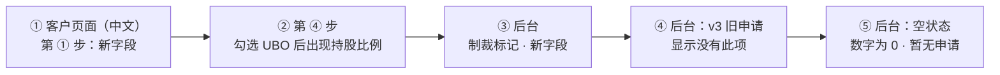
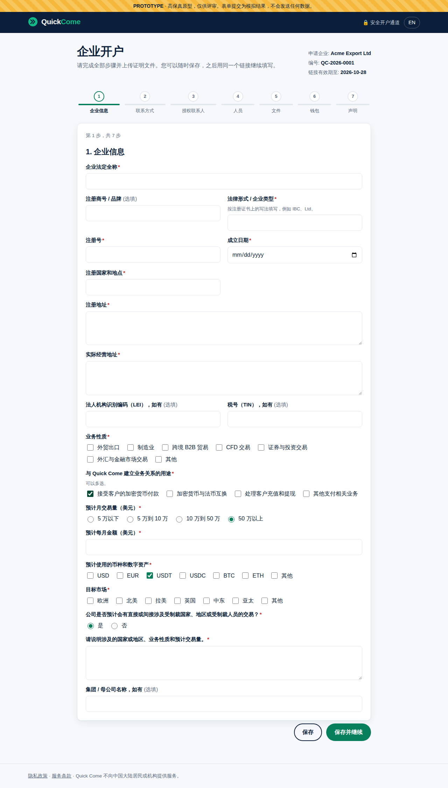
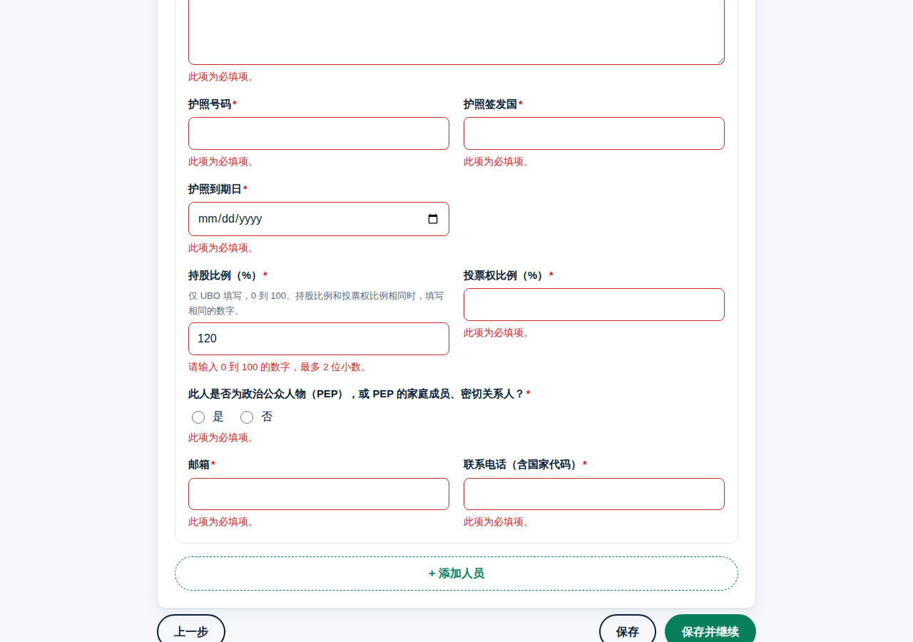
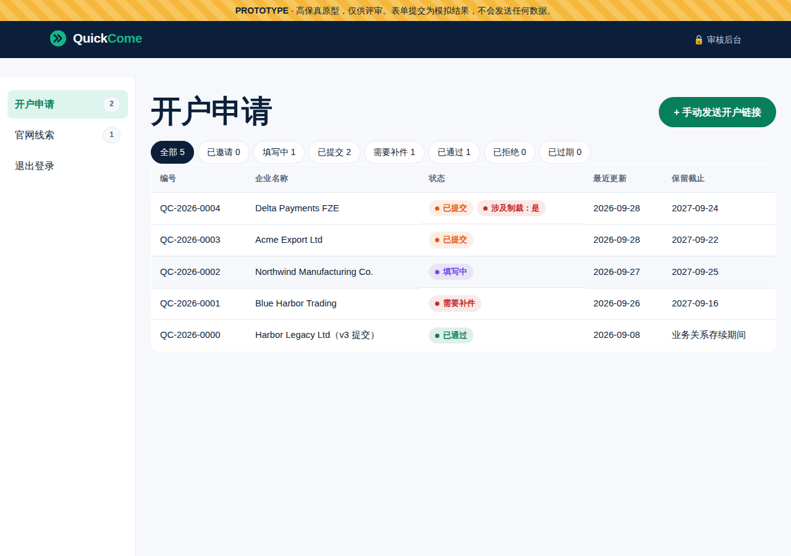
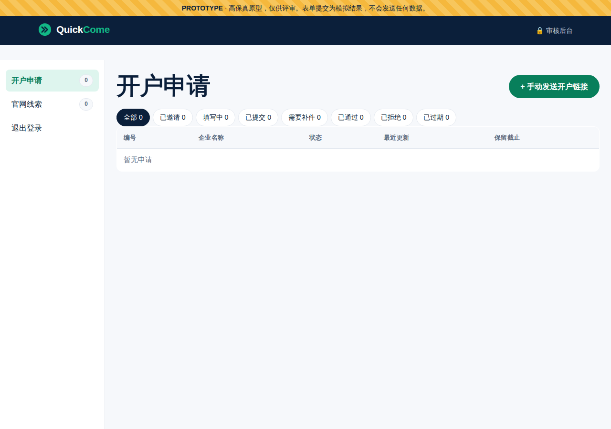
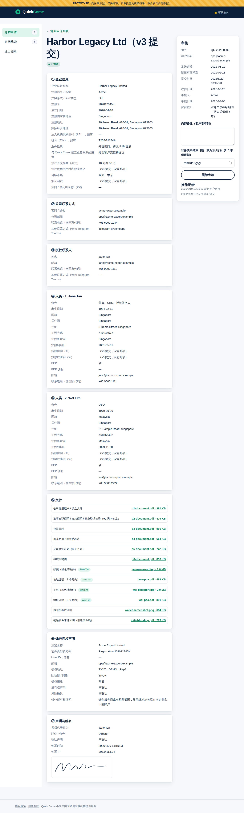
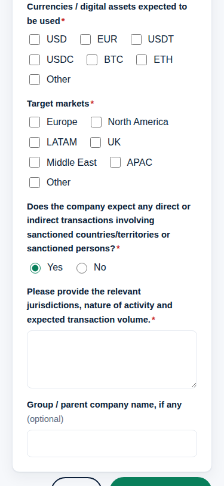

# 《原型说明》v4：按修改版开户表单调整
- 版本：v4
- 产出角色：研发工程师（PM 已走查）
- 状态：✅ **Amos 于 2026-09-28 确认原型**，已完成正式开发
- 输入：《需求说明书 v4》
- 变更历史：v4（2026-09-28）首次创建

## 一图看懂：请按这个顺序看

## 1. 预览链接（可以直接复制打开，需要登录 Vercel）
| # | 看什么 | 完整链接 |
|---|---|---|
| ① | 客户页面（中文）：第 ① 步的新字段 | https://amos111-git-claude-four-agent-0e9459-jeffzhaifei-3827s-projects.vercel.app/zh/onboarding/?t=demo |
| ① | 客户页面（英文） | https://amos111-git-claude-four-agent-0e9459-jeffzhaifei-3827s-projects.vercel.app/onboarding/?t=demo |
| ③④ | 审核后台（密码随便填，动态码随便填 6 位数字） | https://amos111-git-claude-four-agent-0e9459-jeffzhaifei-3827s-projects.vercel.app/admin/ |
| ⑤ | 审核后台：空状态（没有任何申请和线索） | https://amos111-git-claude-four-agent-0e9459-jeffzhaifei-3827s-projects.vercel.app/admin/?empty=1 |

原型全部使用模拟数据，不会保存或发送任何内容。

## 2. 请确认的内容
| # | 在哪里看 | 预期效果 |
|---|---|---|
| 1 | 客户页面第 ① 步 | "业务用途"变成 4 个选项，可以多选；月交易量没有"其他"一档，选"50 万以上"后出现"预计每月金额"；"目标市场"前面新增"币种和数字资产"（多选）；"目标市场"后面新增"是否涉及制裁"，选"是"后出现说明框 |
| 2 | 客户页面第 ④ 步（先填完第 ① 到 ③ 步） | 勾选"UBO"后出现"持股比例（%）"和"投票权比例（%）"；填 120 会提示"请输入 0 到 100 的数字" |
| 3 | 客户页面第 ⑤ 步 | 不再有"初始资金来源证明""SOF 和 SOW 证明"两项 |
| 4 | 后台列表 | QC-2026-0004 Delta Payments FZE 旁边有红色的"涉及制裁：是" |
| 5 | 后台详情：QC-2026-0004 | 标题旁有红色标记；企业信息里显示币种、制裁说明、预计每月金额；人员显示持股和投票权比例 |
| 6 | 后台详情：QC-2026-0000（v3 提交） | 新字段显示"（v3 提交，没有此项）"；旧的"初始资金来源证明"文件标注"（旧版文件项）"，照常可以下载 |
| 7 | 空状态链接 | 导航数字显示 0，列表显示"暂无申请"，"官网线索"显示"暂无线索" |

## 3. 截图
| 客户：第 ① 步新字段 | 客户：UBO 持股比例 |
|---|---|
|  |  |

| 后台：制裁标记 | 后台：空状态 |
|---|---|
|  |  |

| 后台：v3 旧申请 | 手机：第 ① 步 |
|---|---|
|  |  |

## 4. 原型自查（研发、PM）
- [x] 中英文案齐全（`npm run build` 的文案检查通过）
- [x] 375px 宽度没有横向滚动
- [x] 浏览器控制台没有报错
- [x] 模拟数据包含空状态（agents v0.5.1 C32）和 v3 旧数据
- [x] PM 按《需求说明书 v4》§2 逐条走查：V1 到 V8 都能在原型里看到
