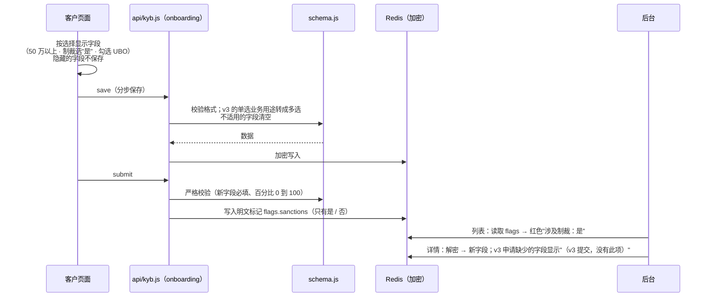

# 《技术方案》v4：开户表单字段调整
- 版本：v4
- 产出角色：研发工程师
- 输入：《需求说明书 v4》、原型（Amos 已确认）
- 变更历史：v4（2026-09-28）首次创建。架构不变，没有偏离已审核的决定

## 一图看懂：一个字段从页面到后台

## 1. 改动的影响范围
| 模块 | 文件 | 说明 |
|---|---|---|
| 文案 | `site/src/i18n/onboarding.json` | 新字段的中英文案；业务用途 4 个选项；月交易量去掉"其他" |
| 表单组件 | `site/src/components/app/Field.astro` | 新增 `percent` 类型（数字键盘） |
| 客户页面 | `site/src/pages/[...lang]/onboarding.astro`、`site/src/scripts/onboarding.ts`、`site/src/lib/onboarding.ts` | 新字段；条件显示；隐藏的字段不保存；百分比校验；v3 的单选值可以正常回填；文件清单去掉第 11、12 项 |
| 服务端校验 | `lead-api/src/kyb/schema.js` | 新字段规则；条件必填；不适用的字段清空；兼容 v3 数据 |
| 客户接口 | `lead-api/src/kyb/onboarding.js` | 提交时写入 `flags.sanctions` |
| 后台 | `lead-api/src/kyb/admin.js`、`site/src/scripts/admin.ts`、`site/src/styles/app.css` | 列表返回 `flags`；红色标记；新字段标签；旧数据和旧文件的显示；原型的空状态（`?empty=1`） |

**破坏性变更：**没有。v3 的数据不需要迁移，读取时兼容。
**基础设施：**没有变化，不需要新的环境变量。

## 2. 关键决定
| # | 决定 | 原因 |
|---|---|---|
| X1 | 制裁标记是明文记录里的一个布尔值，**说明内容仍然加密** | 后台列表不用逐条解密也能标红；布尔值本身不是个人信息 |
| X2 | 不适用的字段（例如不是 UBO 的持股比例）在前端和服务端**都会清空** | 取消勾选 UBO 之后，旧数值不会留在存储里（TPV4） |
| X3 | v3 的旧数据**读取时兼容**，不做批量迁移 | 旧申请很少，兼容处理更安全，也不会动已经加密的数据 |
| X4 | 第 11、12 项只是不再接受新上传；**已上传的文件保留** | 已提交的资料属于审核记录，不能因为表单改版而删除 |

## 3. 技术债与风险
- 没有新增技术债。
- 制裁声明只是客户的自我声明，没有对接筛查服务。这在需求里已经写明不做。

## 4. 研发自检
- [x] 原型经过 Amos 确认后才开始正式开发
- [x] 单元测试 40 个全部通过；端到端测试 207 个全部通过
- [x] 375、768、1280 三种宽度没有横向滚动；可访问性 100 分
- [x] 数量为 0、列表为空时有明确的显示（agents v0.5.1 C32）
- [x] 函数数量不变（4 个）；本地运行 `vercel build` 通过
