# 《原型说明》v6：稳定币收付款
- 版本：v6
- 产出角色：研发工程师（PM 已走查）
- 状态：⏸ **待 Amos 确认原型**
- 输入：《需求说明书 v6》、《架构方案 v6》（2026-09-29 审核通过）
- 变更历史：v6（2026-09-29）首次创建

## 一图看懂：请按这个顺序看

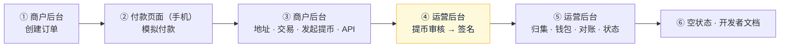

## 1. 预览链接（可以直接复制打开，需要登录 Vercel）
| # | 看什么 | 完整链接 |
|---|---|---|
| ① | 商户后台（中文）：邮箱随便填，密码随便填，动态码随便填 6 位数字 | https://amos111-git-claude-four-agent-0e9459-jeffzhaifei-3827s-projects.vercel.app/zh/merchant/ |
| ① | 商户后台（英文） | https://amos111-git-claude-four-agent-0e9459-jeffzhaifei-3827s-projects.vercel.app/merchant/ |
| ① | 商户首次设置密码（开户通过后，邮件里的链接） | https://amos111-git-claude-four-agent-0e9459-jeffzhaifei-3827s-projects.vercel.app/zh/merchant/?setup=1 |
| ② | 付款页面（中文，建议用手机打开） | https://amos111-git-claude-four-agent-0e9459-jeffzhaifei-3827s-projects.vercel.app/zh/pay/ORD-20260929-0412/ |
| ② | 付款页面（英文） | https://amos111-git-claude-four-agent-0e9459-jeffzhaifei-3827s-projects.vercel.app/pay/ORD-20260929-0412/ |
| ④⑤ | 运营后台：左边"收付款"下面的 7 个新页面（密码随便填，动态码随便填 6 位数字） | https://amos111-git-claude-four-agent-0e9459-jeffzhaifei-3827s-projects.vercel.app/admin/ |
| ⑥ | 商户后台：空状态 | https://amos111-git-claude-four-agent-0e9459-jeffzhaifei-3827s-projects.vercel.app/zh/merchant/?empty=1 |
| ⑥ | 运营后台：空状态（钱包也显示为"未初始化"） | https://amos111-git-claude-four-agent-0e9459-jeffzhaifei-3827s-projects.vercel.app/admin/?empty=1 |
| ⑥ | 开发者文档（英文 / 中文） | https://amos111-git-claude-four-agent-0e9459-jeffzhaifei-3827s-projects.vercel.app/docs/ ，https://amos111-git-claude-four-agent-0e9459-jeffzhaifei-3827s-projects.vercel.app/zh/docs/ |

- 原型全部使用模拟数据，不会保存或发送任何内容，刷新后恢复原样。
- **签名框里请随便输入几个字符，不要输入真实的私钥或助记词。**

## 2. 请确认的内容
| # | 在哪里看 | 预期效果 | 对应验收 |
|---|---|---|---|
| 1 | 商户后台 → 概览 | 可用余额、冻结、今日收款、未完成订单；最近到账里有"确认中 12/19""已完成""部分付款""超额付款""低于 1 USDT（不入账）" | AC-P4、P5、P6 |
| 2 | 商户后台 → 订单 → "+ 创建订单" | 填金额后生成订单，弹出订单详情：收款地址、付款页面链接（可复制、可打开） | AC-P2 |
| 3 | 付款页面 | 金额、二维码、地址、复制按钮、TRC20 提醒、倒计时；下面的"原型操作"可以模拟足额付款（确认中 1/19 → 19/19 → 付款成功）、部分付款、过期 | AC-P13 |
| 4 | 商户后台 → 地址 | 输入 userid 申请地址；同一个 userid 再申请一次，提示"已经有地址了"；订单地址池显示"使用中 / 休息中（24 小时） / 空闲" | AC-P3、Q-v6-2 |
| 5 | 商户后台 → 交易 | "到账明细"和"账本明细"两个标签；账本每一行都有变动后的余额 | AC-P7 |
| 6 | 商户后台 → 提币 | 顶部是处理时效说明；填金额后实时显示手续费、冻结金额、提交后余额；余额不够时提示；提交后在记录里出现"待审核"，可以取消（解冻） | AC-P8、P9 |
| 7 | 商户后台 → API 设置 | Secret 只显示一次、可以重新生成；回调地址只能是 https；IP 白名单为空时提示"不能用 API 提币"；发送测试回调 | AC-P8、P11 |
| 8 | 商户后台 → 回调记录 | 成功、重试中、24 小时后停止；可以手动重发 | AC-P12 |
| 9 | **运营后台 → 提币审核 → "批准并签名"** | 签名框逐笔显示"✓ 一致"。**勾选"演示：假设服务器被攻破"**，第 1 笔变成红色"✗ 收款地址不一致"，签名按钮变灰，不能签名 | AC-P11、架构 §2.4 |
| 10 | 运营后台 → 归集 | 按金额、商户筛选，批量勾选；每行标出"用能量"或"燃烧 TRX"、首次归集含激活；底部汇总栏选择归集到热钱包或冷钱包；签名时要输入主助记词和热钱包私钥 | AC-P10 |
| 11 | 运营后台 → 商户 | "Harbor Legacy Ltd"开户已通过，点"开通商户"设置费率；点任一商户可以修改费率、停用 | AC-P1、P7 |
| 12 | 运营后台 → 异常到账 / 对账 | 四种异常及系统的处理方式；对账有一天"不一致（已发邮件）" | AC-P6、P7 |
| 13 | 运营后台 → 钱包设置 → "演示初始化流程" | 抄写 24 个单词 → 抽查第 3、11、20 个（原型里都是 abandon）→ 完成，显示第 1 个地址；热钱包的能量和每天大约能归集的笔数 | 需求 §7 |
| 14 | 运营后台 → 系统状态 | 链上监控最后一次运行时间；免费额度用量条，70% 以上变色 | AC-P17 |
| 15 | 两个空状态链接 | 余额 0.00，列表显示"暂无"，导航数字显示 0；钱包显示"还没有初始化" | AC-P15 |

## 3. 截图
| 商户：概览 | 商户：发起提币 |
|---|---|
| 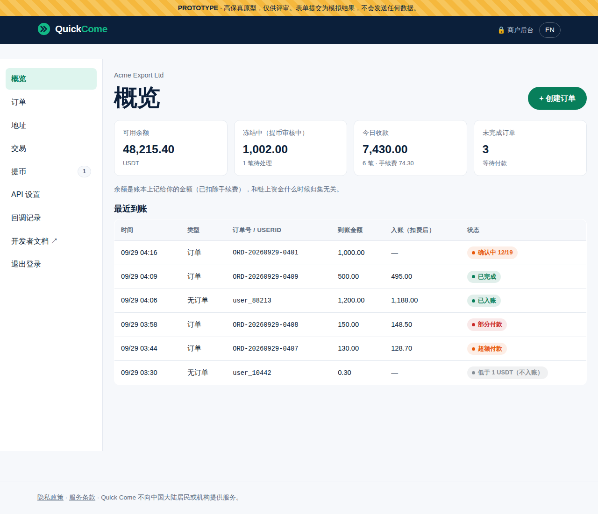 | 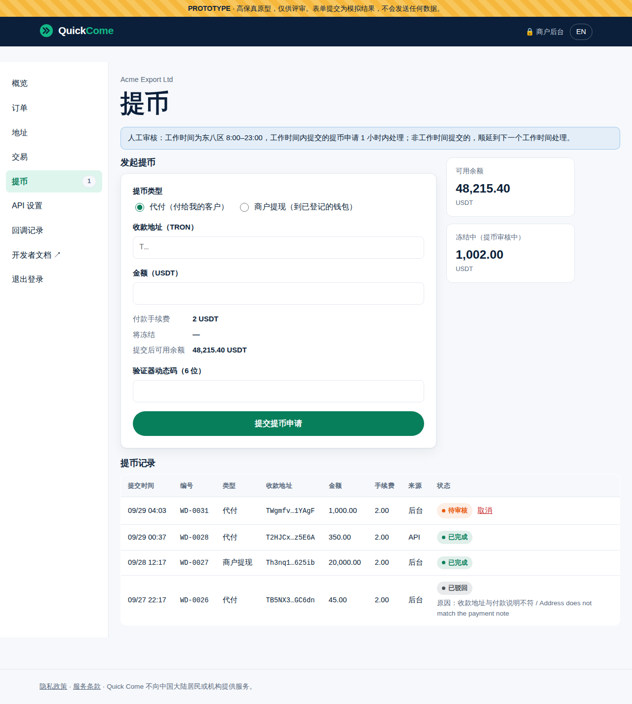 |

| 商户：订单详情 | 付款页面：等待付款 → 付款成功 |
|---|---|
| 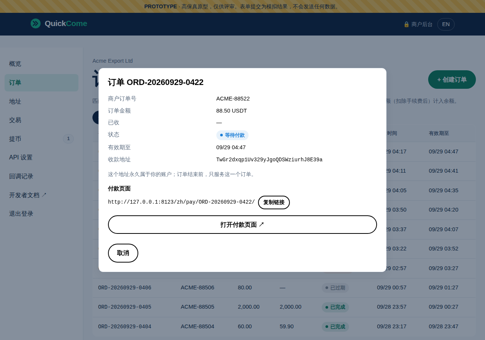 | 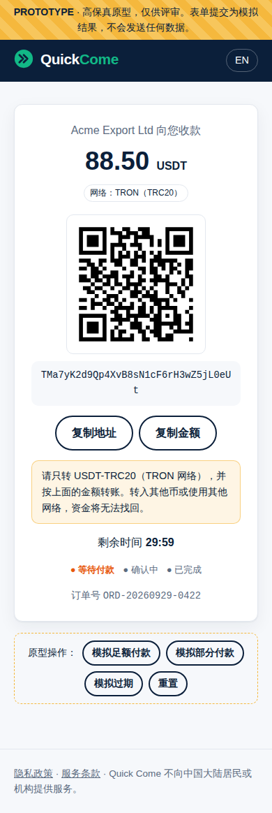 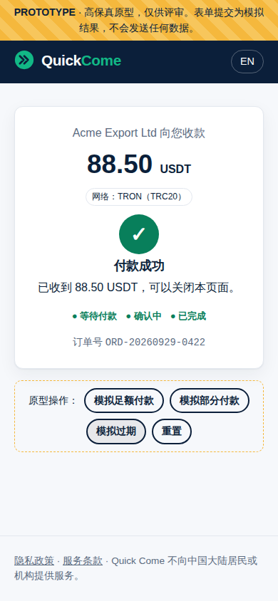 |

| 后台：签名被拦下（演示服务器被篡改） | 后台：归集签名 |
|---|---|
| 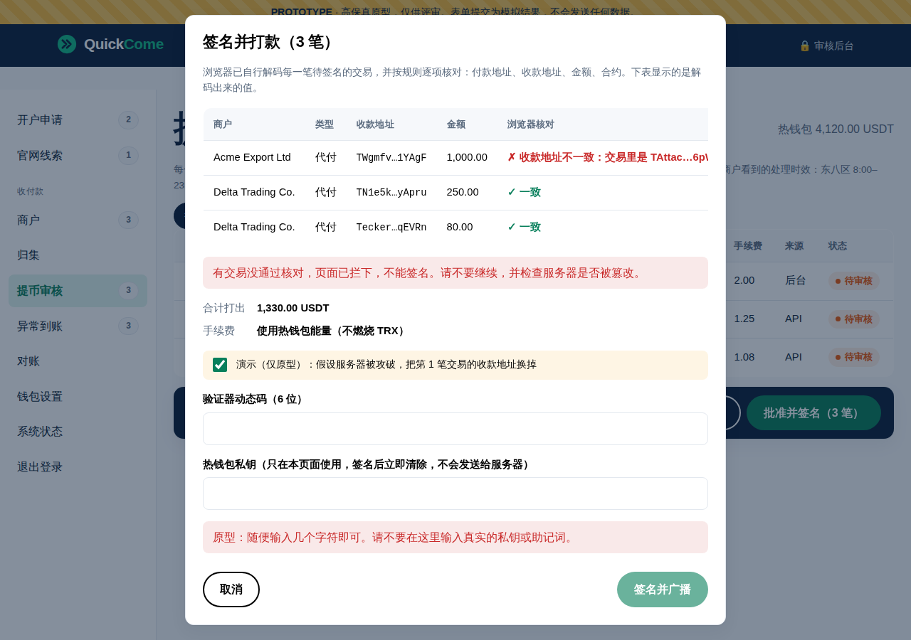 | 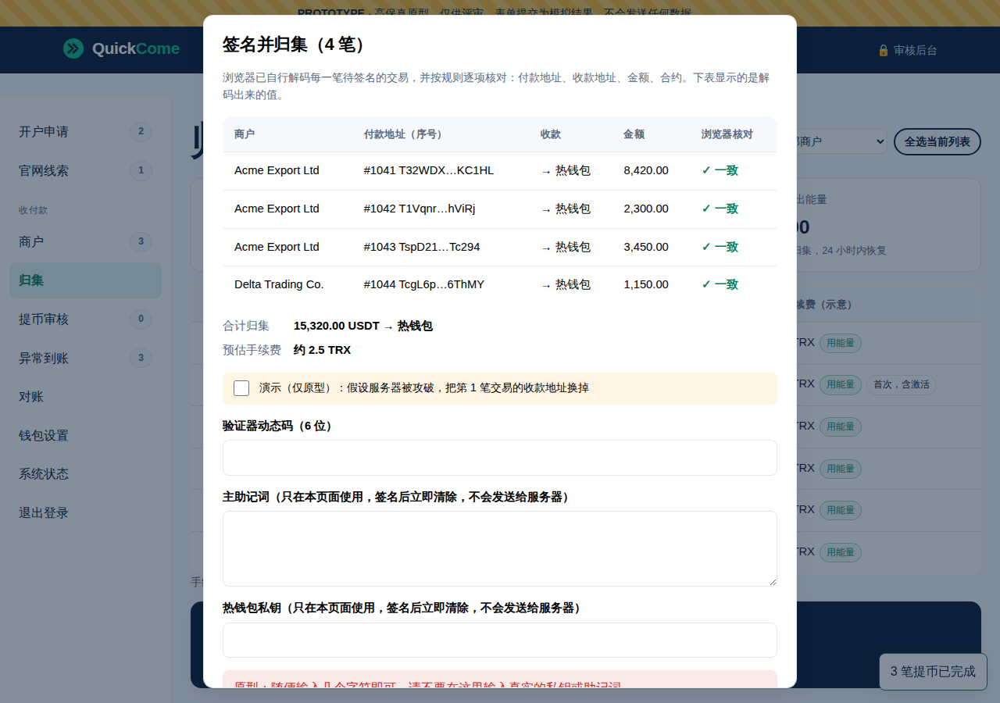 |

| 后台：归集 | 后台：系统状态 |
|---|---|
| 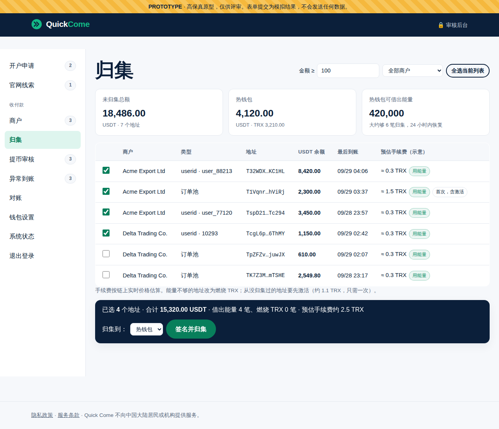 | 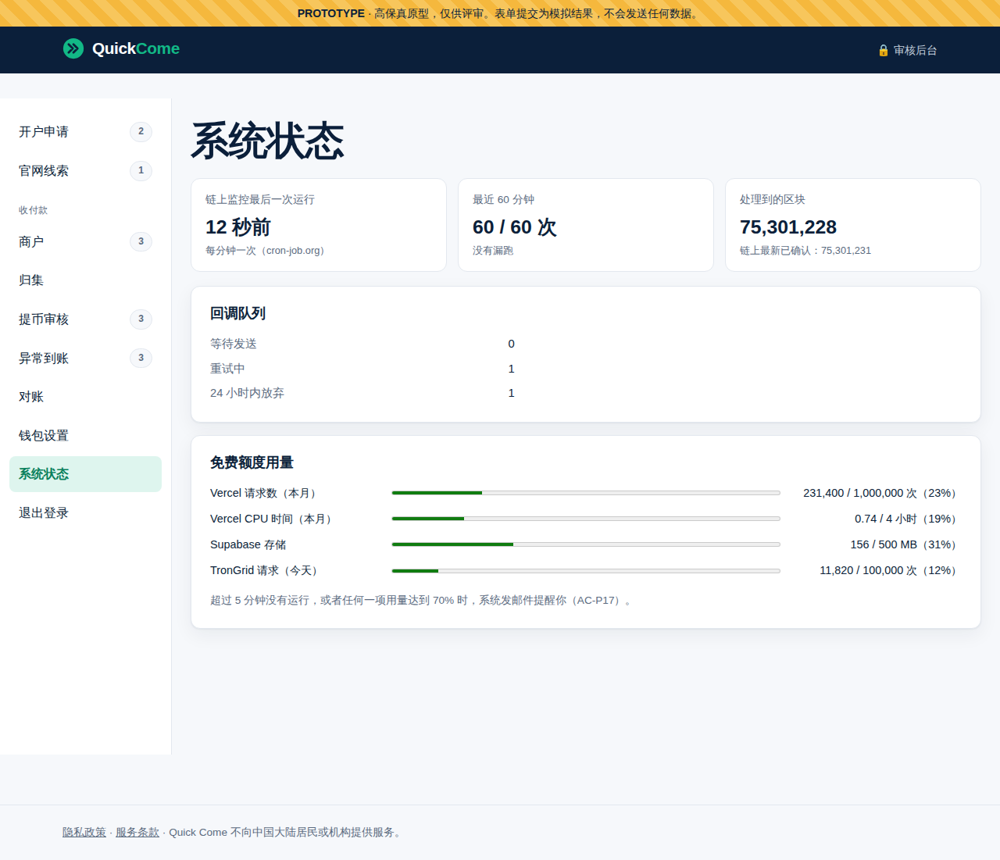 |

| 商户：空状态 | 开发者文档 |
|---|---|
| 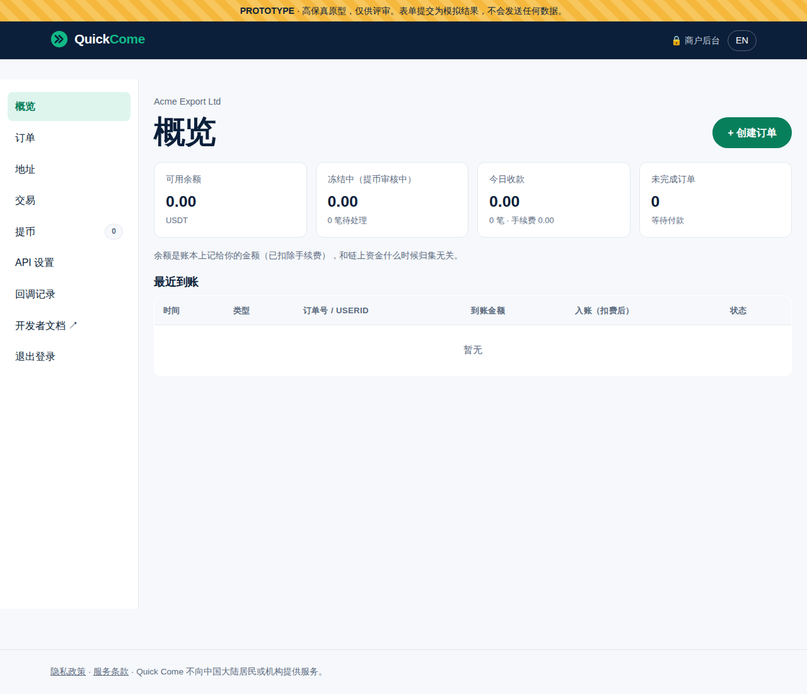 | 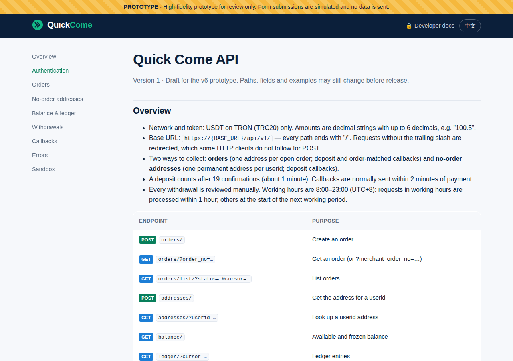 |

## 4. 做原型时发现的问题
| # | 内容 | 建议 |
|---|---|---|
| FB-v6-6 | 需求里写"沙箱放在测试环境，商户使用单独的测试 Key"。但测试环境开了 Vercel 的访问保护，**只有登录了你的 Vercel 账号才能访问**，商户的系统连不上 | 朋友试用阶段先不开放沙箱，朋友直接在生产环境用 1 USDT 这样的小金额联调。以后需要沙箱时，再单独讨论（例如关闭测试环境的访问保护） |
| FB-v6-7 | 开发者文档里的接口地址暂时写成 `{BASE_URL}`，因为域名还没定（架构 R21） | 买好域名后替换；在那之前，给朋友的接口地址用 `amos111.vercel.app` |

## 5. 原型自查（研发、PM）
- [x] 中英文案齐全（`npm run build` 的文案检查已包含新的 `merchant.json`）
- [x] 375px 宽度没有横向滚动（商户后台、付款页面）
- [x] 浏览器控制台没有报错；在和生产相同的安全策略（CSP）下运行
- [x] 模拟数据包含空状态（agents v0.5.1 C32）
- [x] 原有的 214 个端到端测试全部通过（v1 到 v5 的功能不受影响）
- [x] 付款页面的地址 `/pay/<订单号>/` 已在 `vercel.json` 里配置改写规则；本地测试服务器同样支持
- [x] PM 按《需求说明书 v6》§10 逐条走查：AC-P1 到 AC-P17 中和页面有关的项都能在原型里看到（AC-P14 的示例代码在开发阶段实际运行验证，AC-P16、P18 在测试环境验收）
- [x] 正式模式（测试环境和生产）下，运营后台的 7 个新页面只显示"开发中"，不会显示模拟数据
