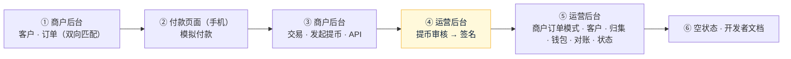
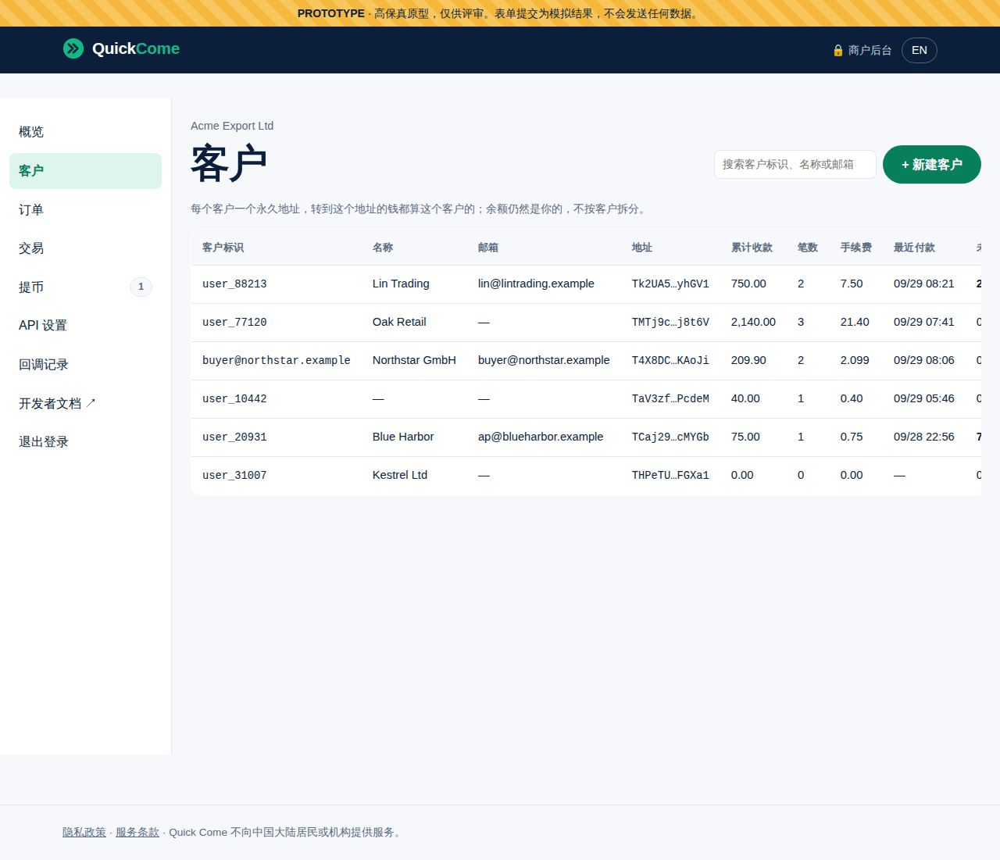
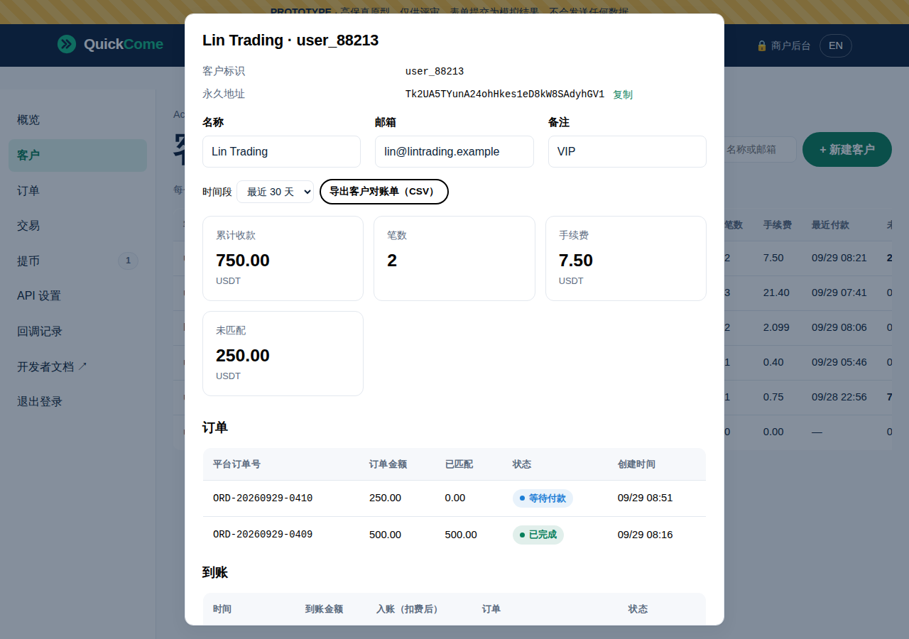
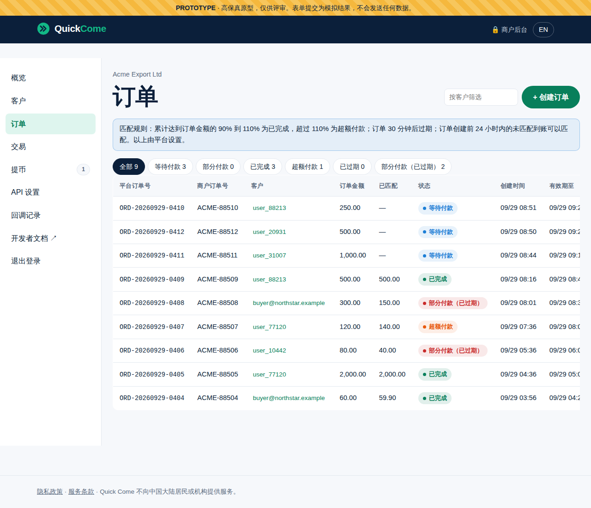
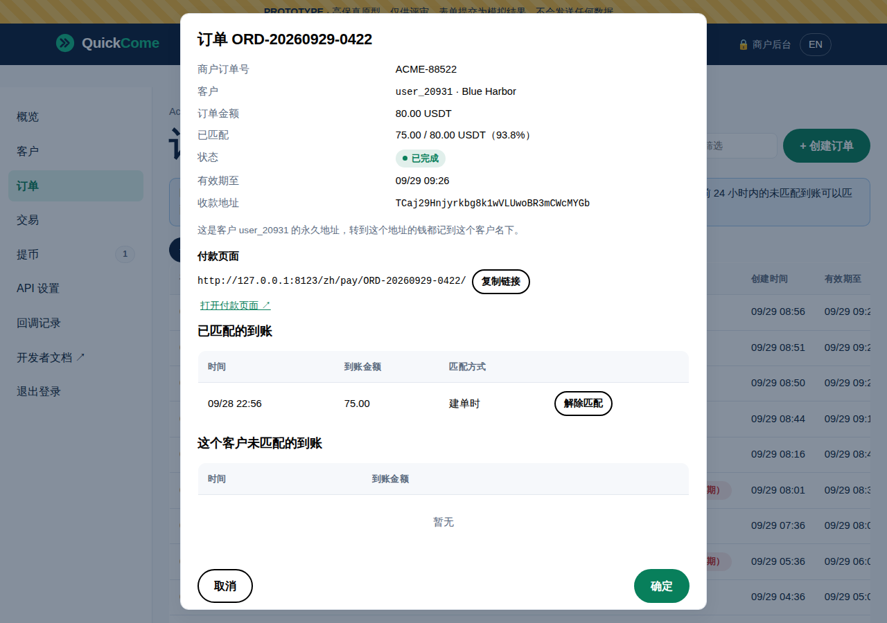
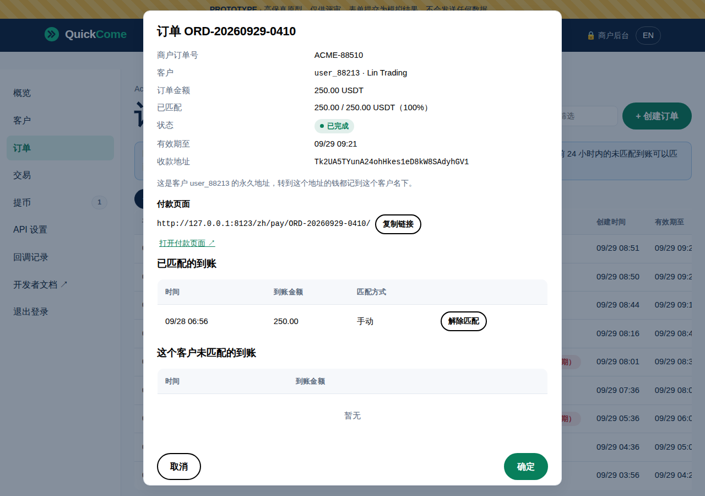
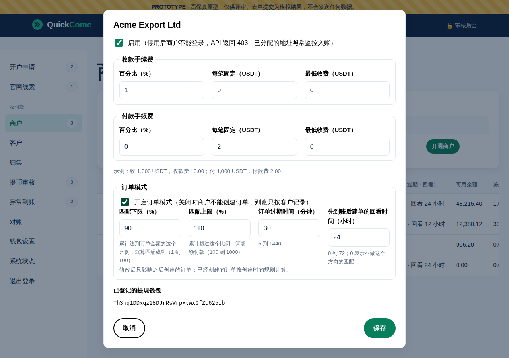
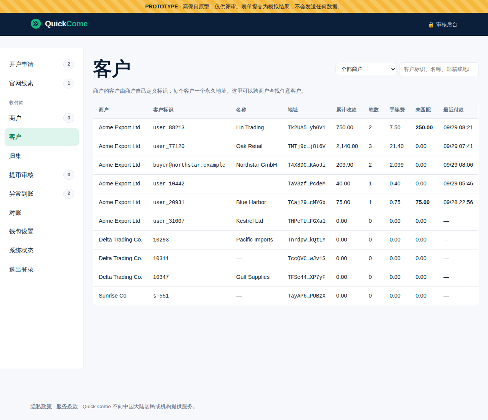

# 《原型说明》v6.1：稳定币收付款
- 版本：v6.1
- 产出角色：研发工程师（PM 已走查）
- 状态：⏸ **待 Amos 确认原型**
- 输入：《需求说明书 v6.1》、《架构方案 v6》（含 v6.1 的修改）
- 变更历史：
  - v6（2026-09-29）：首次创建。
  - **v6.1（2026-09-29）**：按需求变更 v6.1 修改。
    - 新增"客户"页面，删除"地址"页面。
    - 订单改为客户必填，支持双向匹配和手动匹配。
    - 运营后台新增"客户"页面和订单模式设置。
    - 付款页面支持分几次付款。
    - 开发者文档同步更新。

## 一图看懂：请按这个顺序看

## 1. 预览链接（可以直接复制打开，需要登录 Vercel）
| # | 看什么 | 完整链接 |
|---|---|---|
| ① | 商户后台（中文）：邮箱随便填，密码随便填，动态码随便填 6 位数字 | https://amos111-git-claude-four-agent-0e9459-jeffzhaifei-3827s-projects.vercel.app/zh/merchant/ |
| ① | 商户后台（英文） | https://amos111-git-claude-four-agent-0e9459-jeffzhaifei-3827s-projects.vercel.app/merchant/ |
| ① | 商户首次设置密码（开户通过后，邮件里的链接） | https://amos111-git-claude-four-agent-0e9459-jeffzhaifei-3827s-projects.vercel.app/zh/merchant/?setup=1 |
| ② | 付款页面（中文，建议用手机打开） | https://amos111-git-claude-four-agent-0e9459-jeffzhaifei-3827s-projects.vercel.app/zh/pay/ORD-20260929-0412/ |
| ② | 付款页面（英文） | https://amos111-git-claude-four-agent-0e9459-jeffzhaifei-3827s-projects.vercel.app/pay/ORD-20260929-0412/ |
| ④⑤ | 运营后台：左边"收付款"下面的 8 个新页面（密码随便填，动态码随便填 6 位数字） | https://amos111-git-claude-four-agent-0e9459-jeffzhaifei-3827s-projects.vercel.app/admin/ |
| ① | 商户后台：订单模式关闭时（没有"订单"页面，到账只按客户记录） | https://amos111-git-claude-four-agent-0e9459-jeffzhaifei-3827s-projects.vercel.app/zh/merchant/?ordermode=0 |
| ⑥ | 商户后台：空状态 | https://amos111-git-claude-four-agent-0e9459-jeffzhaifei-3827s-projects.vercel.app/zh/merchant/?empty=1 |
| ⑥ | 运营后台：空状态（钱包也显示为"未初始化"） | https://amos111-git-claude-four-agent-0e9459-jeffzhaifei-3827s-projects.vercel.app/admin/?empty=1 |
| ⑥ | 开发者文档（英文 / 中文） | https://amos111-git-claude-four-agent-0e9459-jeffzhaifei-3827s-projects.vercel.app/docs/ ，https://amos111-git-claude-four-agent-0e9459-jeffzhaifei-3827s-projects.vercel.app/zh/docs/ |

- 原型全部使用模拟数据，不会保存或发送任何内容，刷新后恢复原样。
- **签名框里请随便输入几个字符，不要输入真实的私钥或助记词。**

## 2. 请确认的内容
| # | 在哪里看 | 预期效果 | 对应验收 |
|---|---|---|---|
| 1 | 商户后台 → 概览 | 可用余额、冻结、今日收款、未完成订单、**未匹配的到账**；最近到账带客户和订单列 | AC-P4、P15 |
| 2 | **商户后台 → 客户** | 客户列表：标识、名称、邮箱、永久地址、累计收款、笔数、手续费、最近付款、未匹配；可以搜索、新建客户。点一行打开详情：可以改名称、邮箱、备注；按时间段看统计；看这个客户的订单、到账、代付；导出客户对账单 | AC-P3、P19 |
| 3 | **商户后台 → 订单 → "+ 创建订单"，客户填 `user_20931`，金额填 `80`** | 这个客户 10 小时前有一笔 75 USDT 的未匹配到账，75 / 80 = 93.75%，在 90% 到 110% 之间，所以**订单一创建就是"已完成"**，匹配方式显示"建单时"（先到账后建单） | AC-P2、P20 |
| 4 | **商户后台 → 订单 → 点 ORD-20260929-0410（user_88213，250 USDT）** | 下面"这个客户未匹配的到账"里有一笔 26 小时前的 250 USDT（超过 24 小时回看时间，所以没有自动匹配）。点"匹配到这个订单"→ 状态变成"已完成"，匹配方式为"手动"；再点"解除匹配"→ 回到"等待付款" | AC-P21 |
| 5 | 商户后台 → 订单列表 | 顶部显示匹配规则（90% 到 110%、30 分钟过期、回看 24 小时，由平台设置）；状态有等待付款、部分付款、已完成、超额付款、已过期、部分付款（已过期）；ORD-0405 是两笔到账累计完成的；可以按客户筛选 | AC-P5、P20 |
| 6 | 付款页面 | 显示这个客户的固定地址；"模拟部分付款"后显示"已收到 X，还需支付 Y"，继续等待；再"模拟足额付款"补齐后显示付款成功；过期时如果收过一部分，显示"部分付款（已过期）" | AC-P13 |
| 7 | 商户后台 → 交易 | 到账明细带客户和订单列，可以勾选"只看未匹配"、按客户筛选；账本明细带客户列 | AC-P7、P19 |
| 8 | 商户后台 → 提币 | 处理时效说明；代付可以选填客户；手续费、冻结、余额实时计算；可以取消 | AC-P8、P9 |
| 9 | 商户后台 → API 设置 | 显示订单模式的设置（只读）；Secret 只显示一次；回调地址只能 https；没有 IP 白名单时不能用 API 提币 | AC-P8、P11 |
| 10 | **运营后台 → 商户 → 点 Acme Export** | 新增"订单模式"：开关、匹配下限（%）、匹配上限（%）、订单过期时间（分钟）、回看时间（小时）。填超出范围的数（例如下限 120）会提示；商户列表显示每个商户的订单模式 | AC-P20 |
| 11 | **运营后台 → 客户** | 按商户、客户标识、名称、邮箱或地址跨商户搜索；点一行看这个客户的订单、到账和统计 | AC-P19 |
| 12 | 运营后台 → 提币审核 → "批准并签名" | 逐笔"✓ 一致"；勾选"演示：假设服务器被攻破"，第 1 笔变红、不能签名 | AC-P11 |
| 13 | 运营后台 → 归集 | 每行显示商户和客户；筛选、批量勾选、用能量或燃烧 TRX、签名时要主助记词和热钱包私钥 | AC-P10 |
| 14 | 运营后台 → 对账 | 平台整体对账，加上新的"按商户核对客户合计" | AC-P7、P19 |
| 15 | 运营后台 → 异常到账 / 钱包设置 / 系统状态 | 异常只剩不支持的币和低于 1 USDT（过期后才到的 USDT 算客户未匹配的到账）；初始化流程；免费额度用量 | AC-P6、P17 |
| 16 | 空状态、订单模式关闭两个链接 | 余额 0、列表"暂无"；订单模式关闭时没有"订单"标签，订单页面提示联系平台开通 | AC-P15 |

## 3. 截图
| 商户：客户列表 | 商户：客户详情 |
|---|---|
|  |  |

| 商户：订单列表 | 商户：先到账后建单（建单即完成） |
|---|---|
|  |  |

| 商户：手动匹配 | 后台：订单模式设置 |
|---|---|
|  |  |

| 后台：客户（跨商户） | 后台：签名被拦下（演示服务器被篡改） |
|---|---|
|  |  |

| 商户：概览 | 付款页面：等待付款 → 付款成功 |
|---|---|
|  |   |

| 后台：归集 | 开发者文档 |
|---|---|
|  |  |

## 4. 做原型时发现的问题
| # | 内容 | 建议 |
|---|---|---|
| FB-v6-6 | 需求里写"沙箱放在测试环境，商户使用单独的测试 Key"。但测试环境开了 Vercel 的访问保护，**只有登录了你的 Vercel 账号才能访问**，商户的系统连不上 | ✅ Amos 同意（2026-09-29）：朋友试用阶段不开放沙箱，用小金额在生产环境联调；开发者文档已改 |
| FB-v6-7 | 开发者文档里的接口地址暂时写成 `{BASE_URL}`，因为域名还没定（架构 R21） | 买好域名后替换；在那之前，给朋友的接口地址用 `amos111.vercel.app` |

## 5. 原型自查（研发、PM）
- [x] 中英文案齐全（`npm run build` 的文案检查已包含新的 `merchant.json`）
- [x] 375px 宽度没有横向滚动（商户后台、付款页面）
- [x] 浏览器控制台没有报错；在和生产相同的安全策略（CSP）下运行
- [x] 模拟数据包含空状态（agents v0.5.1 C32）
- [x] 原有的 214 个端到端测试全部通过（v1 到 v5 的功能不受影响）
- [x] v6.1 的匹配规则写在 `site/src/lib/matching.ts`（原型和正式版共用），10 个单元测试覆盖测试预审 TP6-7 的边界：正好等于 L 或 H、差 1 个最小单位、多笔累计、回看时间、不重复匹配、手动匹配和解除匹配
- [x] 付款页面的地址 `/pay/<订单号>/` 已在 `vercel.json` 里配置改写规则；本地测试服务器同样支持
- [x] PM 按《需求说明书 v6》§10 逐条走查：AC-P1 到 AC-P17 中和页面有关的项都能在原型里看到（AC-P14 的示例代码在开发阶段实际运行验证，AC-P16、P18 在测试环境验收）
- [x] 正式模式（测试环境和生产）下，运营后台的新页面只显示"开发中"，商户后台不能登录，不会显示模拟数据
