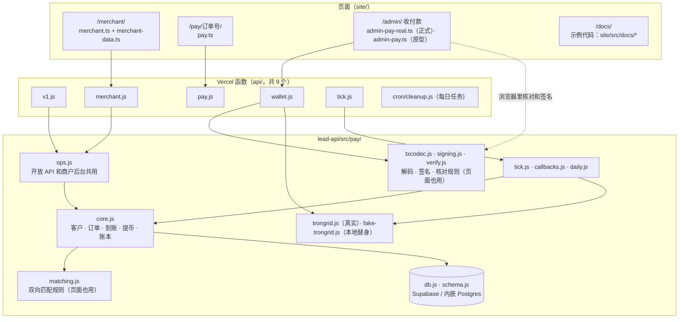

# 《实现说明》v6：稳定币收付款
- 版本：v6.1
- 产出角色：研发工程师
- 状态：✅ 本地开发和测试完成（P1 到 P13）；⏳ 等账号配置（P14）后在测试环境验收（P15）
- 输入：《需求说明书 v6.1》、《架构方案 v6》（含 v6.1 修改）、《原型说明 v6.1》、《任务清单 v6》
- 变更历史：v6.1（2026-09-29）首次创建

## 一图看懂：代码结构

## 1. 和架构方案不同的地方
| # | 架构方案里写的 | 实际的做法 | 原因 |
|---|---|---|---|
| D1 | 归集的第 1 步：新地址先激活，再借出能量 | 新地址（从没激活过）直接转一笔 TRX（按链上价格计算，现在约 10 TRX），**这笔转账同时完成激活和支付手续费**；已激活、并且热钱包能量够的地址才借出能量 | 在 TRON 上，借能量给一个没激活的地址会失败；把激活和补手续费合成一笔，也少一次签名 |
| D2 | 待签名交易的有效期 30 分钟 | 服务器从 TronGrid 取得交易后，**改写交易原文里的过期时间**（TronGrid 默认只给 60 秒），用 `broadcasthex` 广播我们签名的那一份原文 | 60 秒不够 Amos 核对和输入密钥；改写后浏览器照样自己解码核对，签的就是这一份原文 |
| D3 | 签名前再输入一次验证码 | 用的是**开户后台的同一个管理员验证器**，并且同一个动态码不能用两次（和登录共用防重放记录） | Amos 只需要一个验证器 |
| D4 | 开放 API 支持 Idempotency-Key | POST 请求**必须**带 Idempotency-Key，而且先占住这个 Key 再执行 | 签名被截获后重放，不会重复建订单或重复提币；两个相同请求同时到达时，只有一个会执行 |
| D5 | 每个 API Key 限流 | 同一个函数实例内每秒 20 次 | 免费版不适合用 Redis 做集中限流（命令数会超免费额度）；迁移到云服务器后改为集中限流 |
| D6 | 链上监控停止超过 5 分钟发邮件 | 三道检查：① cron-job.org 自带失败通知；② GitHub Actions 每 15 分钟检查一次生产环境 `/api/tick/?health=1`，失败时 GitHub 给你发邮件；③ 每日任务 | 监控停了的时候，它自己没法报警，需要外部检查 |
| D7 | 不支持的币每天检查 | 每天最多检查 1,000 个地址：有余额的地址全部检查，其余按最近付款时间取 | 控制 TronGrid 的用量 |
| D8 | 回调记录保留 | 回调记录保留 7 天，幂等记录保留 24 小时，每日任务清理 | 控制 500 MB 的免费存储（架构 §3.3） |
| D9 | 手续费入账时从到账金额中扣除 | 手续费**最多等于到账金额**（最低收费大于到账金额时，这笔入账 0） | 需求没有写到这种情况；之前会让余额变负、扫链停住（BUG-P12） |
| D10 | 订单到期后变为过期 | 到期后**再等 5 分钟**才关闭；到账按链上付款时间判断是否按时 | 确认和扫描要 1～2 分钟，按时付的钱不能因为扫得晚被当成过期（BUG-P14） |
| D11 | 每分钟扫描已确认的转账 | 只读到**最新的已确认区块**，重叠 3 分钟；一笔处理失败只记异常，不影响其他 | 防止漏扫（BUG-P13）和一笔错误卡住全部（BUG-P12） |
| D12 | 回调只发 https、不发内网 | 发送时在连接那一刻再检查解析结果（防 DNS 重绑定）；IPv6 内嵌 IPv4 的写法都检查 | BUG-P15 |

## 2. 安全相关的实现
- **系统不保存私钥（AC-P11 ①）：**
  - 服务器只接受账户级公钥：误把私钥（xprv）交上来会直接拒绝，还要核对浏览器算出的第 1 个地址。
  - 端到端测试检查数据库、服务器日志、数据目录里的所有文件，都没有助记词和私钥。
- **签名页面（AC-P11 ②，架构 §2.4）：**
  - 页面自己解码交易原文，按 `verify.js` 的规则逐项核对：收款地址只能是 `config/wallets.json` 里的热钱包或冷钱包；付款地址必须是助记词推导出的地址；不允许多签权限；过期时间不能超过 2 小时；补手续费不能超过 30 TRX。
  - 签名后清空输入框。
  - 服务器再核对一次"签名人 = 付款地址"。
  - **签名格式用 TRON 主网的真实交易验证过**：恢复位是 0 或 1。
- **开放 API（AC-P11 ③⑤）：**
  - HMAC 签名，时间戳 ±5 分钟。
  - 所有查询都限定在当前商户。测试里用 A 商户的 Key 读写 B 商户的数据，全部返回 404。
- **回调（AC-P11 ④）：**
  - 带签名，只允许 https，域名解析出内网地址时不发送，不跟随跳转。
- **商户后台：**
  - 密码加验证器；连续输错 5 次锁定 15 分钟；同一个动态码不能用两次。
  - POST 请求要带 CSRF 请求头。
  - 导出的 CSV 防公式注入。
- **账本只追加：**数据库触发器拒绝修改和删除。

## 3. 用真实网络验证过的部分（只读，不花钱）
| 内容 | 结果 |
|---|---|
| 解码器 | 用 TRON 主网的 4 种真实交易（USDT 转账、TRX 转账、借出能量、收回能量）验证：解码结果和 TronGrid 返回的 JSON 一致，txID 一致 |
| 签名格式 | 从主网真实交易的签名恢复出的地址，就是付款地址 |
| 地址推导 | 公开测试助记词的第 0 个地址 = `TUEZSdKsoDHQMeZwihtdoBiN46zxhGWYdH`（和 TronLink 一致） |
| Nile 测试网 | USDT 合约 `TXYZopYRdj2D9XRtbG411XZZ3kM5VkAeBf` 是 TetherToken；能读到已确认的转账事件；能为没激活的地址构造 USDT 转账；能读到能量价格（每单位能量 100 sun） |

## 4. 要在测试环境（Nile）验证的部分
下面这些，本地的 TronGrid 替身模拟不了真实节点的全部行为，必须在测试环境走一遍（P15，AC-P16）：
- 广播：`broadcasthex` 接受我们改过过期时间的交易。
- 借出能量、收回能量的数量计算（按链上的能量总量换算）。
- 转 TRX 燃烧：约 10 TRX 够不够一笔 USDT 转账。
- 每分钟扫链的延迟：到账后 2 分钟内发通知（AC-P4）。

## 5. 函数数量
一共 9 个，没有超过免费版的上限 12 个（单元测试会检查）：
- `health`、`leads`、`kyb`、`cron/cleanup`
- `v1`、`merchant`、`pay`、`wallet`、`tick`

## 6. 研发自检
- [x] 按任务清单 P1 到 P13 实现，每条验收标准都有对应的测试（见测试报告）
- [x] 和架构方案不同的地方已经写在 §1
- [x] 金额全部整数运算；比例按百万分之一
- [x] 中英文案齐全（构建时检查）
- [x] 原型模式保留给开发分支的预览
- [x] 正式模式下，没有配置数据库时，新接口返回 503，不影响官网和开户
