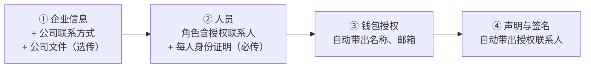

# v7 原型说明：开户表单 7 步 → 4 步
- 版本：v7
- 产出角色：研发（PM 已对照《需求说明书 v7》走查）
- 状态：⏸ 等待 Amos 确认原型
- 预览地址（开发分支，需要先登录 Vercel；页面顶部有黄色的 PROTOTYPE 标识，所有数据都是模拟的，不会发送）：
  - 开户页（中文）：https://amos111-git-claude-four-agent-0e9459-jeffzhaifei-3827s-projects.vercel.app/zh/onboarding/?t=demo
  - 开户页（英文）：https://amos111-git-claude-four-agent-0e9459-jeffzhaifei-3827s-projects.vercel.app/onboarding/?t=demo
  - 运营后台：https://amos111-git-claude-four-agent-0e9459-jeffzhaifei-3827s-projects.vercel.app/admin/ （原型模式：密码随便填，动态码填任意 6 位数字）→ 开户申请 → 点 **QC-2026-0003**（v7 格式的申请）和 **QC-2026-0000**（旧版 v3 格式的申请，检查旧资料照常显示）

## 一图看懂

## 请 Amos 确认
1. 4 个步骤的内容和顺序（对照《需求说明书 v7》§2.1 的字段对照表）。
2. ① 企业信息最后的"公司文件"区域和提示文字。
3. ② 人员：角色里的"授权联系人"、证件类型（护照 / 身份证）、每人的身份证明上传；邮箱和电话标为"选填"，下面写"授权联系人必填"。
4. ③、④ 的自动带出（先在 ① 填写法定全称和公司邮箱，再到 ③ 看；在 ② 勾选一位"授权联系人"并填姓名，再到 ④ 看）。
5. 运营后台的申请详情：v7 申请按新结构显示（公司文件、每位人员下面是身份证明）；旧申请照常显示原来的全部内容和文件（标为"旧版"）。

## 哪些是模拟的
- 开户页不调用后端：保存、上传、提交都是模拟结果，文件不会离开浏览器。
- 后端的校验、旧申请的自动整理、开通邮件改发授权联系人、L5、L6 在原型确认后正式开发，在测试环境验收。

## 截图（本地原型，桌面 1280 和手机 390）
已附在对话里：每一步的桌面截图、② 人员的手机截图、后台两种申请的详情。
