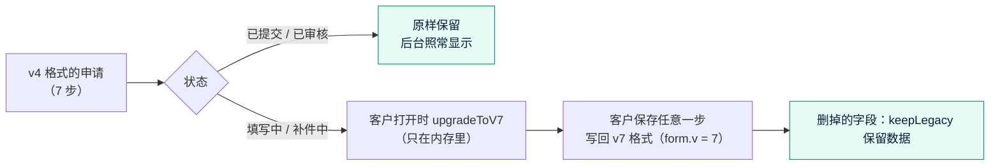

# 《实现说明》v7：开户表单精简 + 集中限流 + 邮箱哈希检索
- 版本：v7
- 产出角色：研发工程师
- 状态：✅ 已实现，等待测试环境验收
- 输入：《需求说明书 v7》（字段对照表 §2.1、旧申请规则 §2.3）、《原型说明 v7》
- 变更历史：v7（2026-10-01）首次创建

## 一图看懂：旧申请打开时怎么整理

## 1. 开户表单（`lead-api/src/kyb/schema.js`）
| 内容 | 实现 |
|---|---|
| 步骤 | `SECTIONS = ['entity', 'people', 'wallet', 'decl']`；保存其他步骤名返回 400 |
| 企业信息 | 增加官网、公司邮箱、电话（必填）；删除 LEI、税号、集团 / 母公司 |
| 人员 | 角色增加 `contact`；证件 `idType`（`passport` / `id_card`）、`idNo`、`idCountry`、`idExpiry`（晚于今天）；删除居住国；邮箱、电话只有授权联系人必填；提交时必须恰好 1 位授权联系人 |
| 钱包 | 删除证件类型及号码、User ID、所有权证明类型 |
| 文件 | `DOC_IDS = {company, id}`。`company` 不带人员，最多 20 个，选传；`id` 必须属于已保存的人员，每人 1～3 个，必传。旧文件项不能再上传，已有的保留 |
| 补件步骤 | `docSection`：公司文件属于企业信息，身份证明属于人员；后台可以勾选 `entity`、`people`、`wallet` |

## 2. 旧申请（需求说明书 §2.3）
- `upgradeToV7(payload)`：公司联系方式并入企业信息；第 ③ 步的授权联系人按邮箱或姓名（不区分大小写）找到已有人员就加上 `contact` 角色，找不到就新增一位人员；护照三项复制到证件信息（类型记为护照）；文件 `passport` 改为 `id`，`d1`～`d16` 改为 `company`（原来的项目记在 `legacyDoc`，后台显示原名称）。旧的 `contact`、`rep` 和所有旧字段都保留。
- 只在 `onboarding.js` 打开**可以编辑**的申请时执行；已提交、已审核的不经过它。整理结果在客户下一次保存时写回。
- `keepLegacy`：保存某一步时，把这一步里旧字段的数据带过来（人员按 `pid` 对应）。
- `mapUnlocked`：v4 时要求补件开放的 `contact`、`rep`、`docs` 换成 `entity`、`people`。
- 待开通列表（`pay/kyb-link.js`）：邮箱取授权联系人，没有时取旧的第 ③ 步，再没有时取邀请邮箱。

## 3. L5：集中限流（`lead-api/src/pay/api-v1.js`）
- `createRateLimiter({ redis })`：键 `qc:v1rl:<API Key 的 SHA-256 前 24 位>:<秒>`，`INCR` 后第一次设置 5 秒过期；超过 20 返回 429。
- 生产和测试环境用开户已有的 Upstash（`api/_pay.js` 已经创建），本地和端到端用 Redis 替身，代码相同。
- Redis 报错或 1 秒没有响应：放行，日志 `[pay] RATE_LIMIT_UNAVAILABLE`。
- 用量：每个开放 API 请求多 1～2 条 Redis 命令。商户调用量大时 Upstash 免费额度可能不够，到时候先告诉 Amos。

## 4. L6：邮箱哈希检索
- 新列 `customers.email_hash`（`alter table … if not exists`）和索引 `customers_email_hash (merchant_id, email_hash)`。
- `emailHash(keys, email)`：去首尾空格、转小写后 HMAC-SHA256，密钥由 `APP_SECRET` 派生（`derivePayKeys` 的 `search`，和加密用的密钥不同）。没有密钥算不出哈希，数据库里仍然没有明文邮箱。
- 写入：`ops.js` 新建和修改客户、`core.js` 创建订单时新建的客户，都同时写 `email_enc` 和 `email_hash`。
- 搜索 `listCustomers`：输入是完整邮箱时按哈希精确查找（不受数量限制），再合并最近 5000 个客户里的模糊匹配；部分邮箱只做模糊匹配（和 v6 一样）。
- 补算：`backfillEmailHash` 在初始化（`pay/deps.js`）时执行，每批 500 个，按地址序号翻页，解密失败的跳过；完成后写 `pay_meta.email_hash_v7`，以后不再执行。

## 5. 走查中修复的问题
- BUG-V7-1：第 ② 步人员规则不通过时，前端没有同时提示缺身份证明（校验短路）。改为两项都检查。
- BUG-V7-2：服务器出错时开户页显示"链接无效"。改为只有 404 才显示链接无效，其他情况提示稍后重试并给出"重试"按钮。

## 6. 研发自检
- [x] 前端（`onboarding.ts`）和服务端（`schema.js`）规则一致，服务端为准
- [x] 旧申请的数据不删除；已提交的申请不被修改
- [x] 没有新的环境变量；数据库改动可以重复执行
- [x] 限流故障不影响收款；数据库里没有明文邮箱
- [x] 项目地图、项目索引已更新（索引检查通过）
