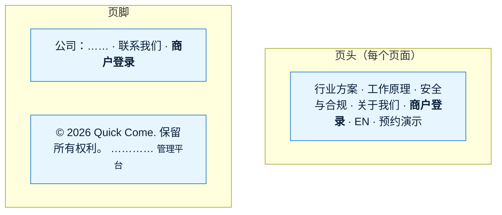
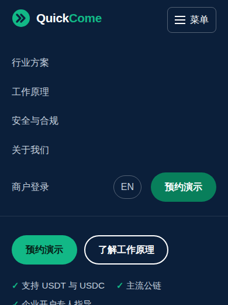
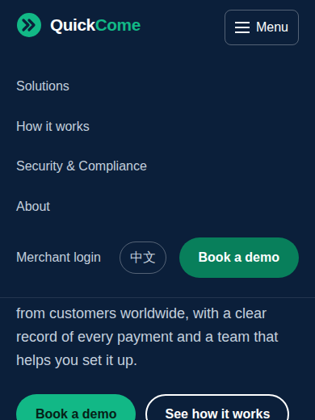
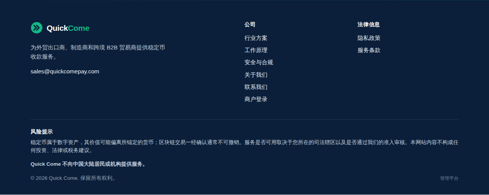
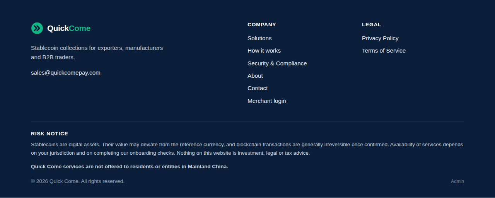
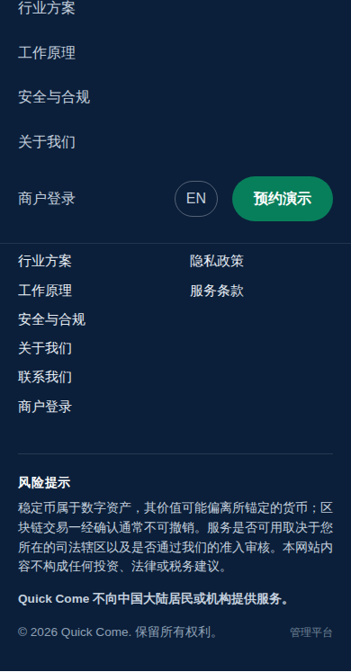
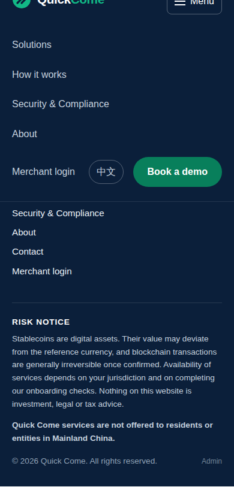

# 《原型说明》v7.1：官网的商户登录和管理平台入口
- 版本：v7.1
- 产出角色：研发工程师
- 状态：✅ Amos 于 2026-10-01 确认（"确认原型"），按原型实现
- 输入：《需求说明书 v7.1》
- 变更历史：v7.1（2026-10-01）首次创建

## 一图看懂：改了哪几处

## 1. 截图（正式构建，本地）
| 页面 | 截图 |
|---|---|
| 中文页头（桌面 1280） |  |
| 英文页头（桌面 1280） |  |
| 英文页头（1101，刚好不用菜单的宽度） |  |
| 中文手机菜单（390） |  |
| 英文手机菜单（390） |  |
| 中文页脚（桌面）：公司一栏和最底部右侧 |  |
| 英文页脚（桌面） |  |
| 中文页脚（手机） |  |
| 英文页脚（手机） |  |

## 2. 改动的文件
- `site/src/components/Header.astro`：导航加"商户登录"；导航文字不换行；1100 像素以下用菜单。
- `site/src/components/Footer.astro`：公司一栏加"商户登录"；最底部右侧加"管理平台"。
- `site/src/i18n/en.json`、`site/src/i18n/zh.json`：`nav.merchantLogin`、`footer.admin`、`footer.adminTitle`。

## 3. 走查中发现并已改
- 英文页面在 961～1100 像素之间，加了"商户登录"后导航放不下，Logo 和导航文字被折成两行。已改为 1100 像素以下用菜单。

## 4. 研发自检
- [x] 中英文都截了图；桌面、手机、刚好不用菜单的宽度都检查了
- [x] 375、768、1024、1280 都没有横向滚动，控制台没有报错
- [x] 商户后台、管理平台没有加进站点地图
