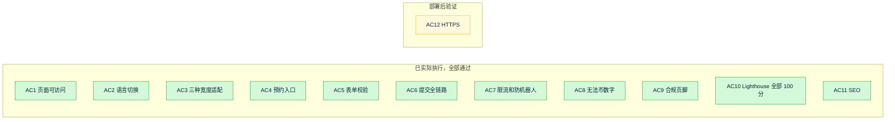
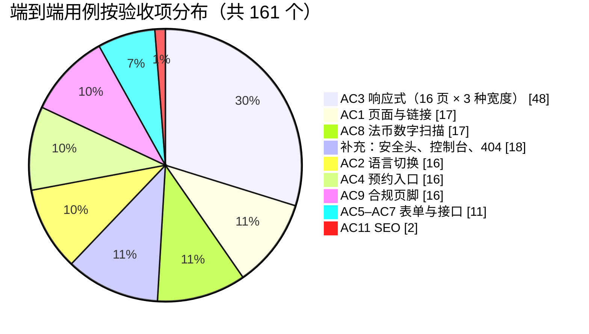
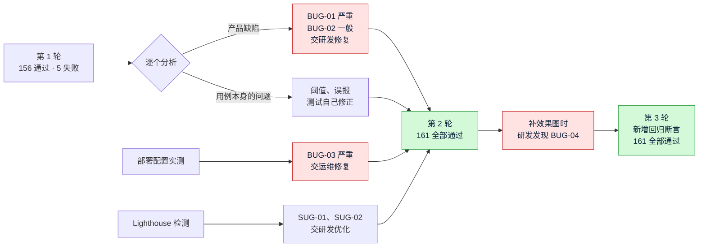
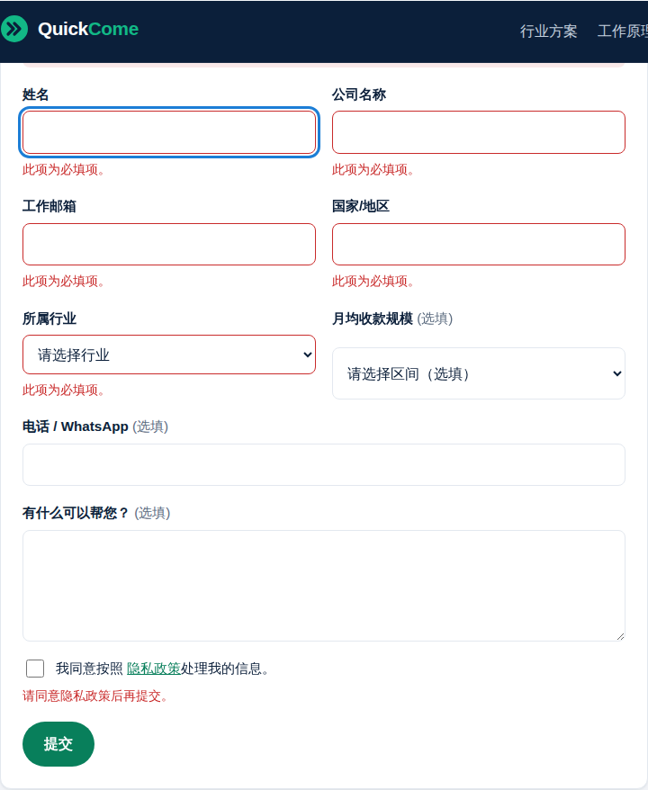
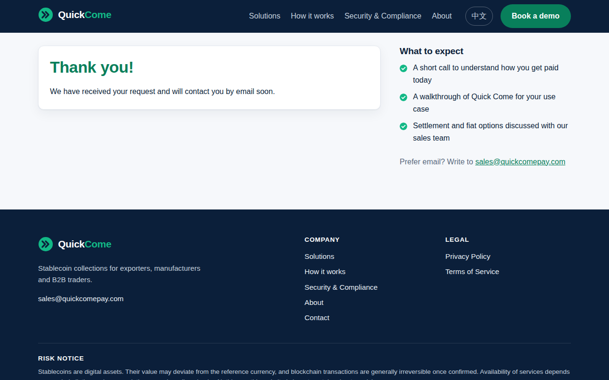

# 《测试报告》v1：Quick Come 官网
- 版本：v1
- 产出角色：测试工程师
- 输入：《v1-需求说明书》§5 验收标准 AC1 到 AC12、《v1-技术方案》§4 和 §5 实现说明
- 测试时间：2026-09-27
- 变更历史：v1（2026-09-27）首次创建，首版全量测试
- 变更历史（续）：v1.1（2026-09-27）补图，新增 BUG-04 及第 3 轮回归结果

## 一图看懂
**图 1：验收标准覆盖情况。** 🟢 表示已实际执行并通过；🟡 表示要等部署到生产后才能验证。

**图 2：161 个端到端用例的分布。**

**图 3：缺陷的发现与修复过程。**

**图 4：代表性截图。** 三种宽度下的完整截图，每次运行测试都会生成在 `e2e/.tmp/screens/`；下面是存进仓库的两张。

| 联系页表单校验提示（中文） | 提交成功（BUG-04 修复后） |
|---|---|
|  |  |

## 1. 结论
| 项目 | 结果 |
|---|---|
| 验收标准覆盖 | AC1 到 AC11：**已实际执行，全部通过**。AC12：**尚未执行**（需要生产环境，部署后用 `verify.sh` 验证）。 |
| 缺陷 | 第 1 轮发现 BUG-01 到 BUG-03 共 3 个缺陷（其中 BUG-03 来自部署配置实测），另有 2 条建议级问题，**全部已修复，并在第 2 轮回归通过**。补图阶段又发现 BUG-04（一般），已修复，**第 3 轮回归 161 个用例全部通过**。 |
| 遗留问题 | 没有阻断级或严重级遗留。有 3 条需要 PM 或 Amos 确认的事项，见第 5 节。 |

## 2. 测试方式
**实际执行**，不是只看代码。测试环境尽量贴近生产：
| 组件 | 测试环境 |
|---|---|
| 网站 | 执行 `npm run build` 得到的正式构建产物 |
| Web 服务器 | **真实的 Nginx 1.24**，使用 `deploy/nginx/` 里的生产配置片段，包括安全响应头、`/api` 反向代理和 Nginx 层限流 |
| lead-api | 两个实例：主实例（放宽应用层限流，经 Nginx 访问）；限流实例（默认配置，每 10 分钟 5 次，专门用来测 AC7） |
| 邮件 | 本地模拟的 SMTP 服务器，走真实的 SMTP 协议投递，会记录收到的原始邮件 |
| 浏览器 | Chromium（Playwright 1.56.1）；Lighthouse 13.5 移动端模式 |

**复现方法：**
- 端到端测试：`cd e2e && npm ci && npx playwright test`
- Lighthouse：`node lighthouse.mjs`
- 单元测试：`cd lead-api && npm test`

**测试证据：**
- 结果：`e2e/.tmp/results.json`
- 48 张截图（16 个页面 × 3 种宽度）：`e2e/.tmp/screens/`
- Lighthouse 报告：`e2e/.tmp/lighthouse/`

以上证据都是测试时生成的临时文件，不进代码仓库。重新执行上面的复现命令，就能再生成一份。

## 3. 用例与结果

### 3.1 验收标准逐条对照
| AC | 用例 | 方法 | 用例数 | 结果 |
|---|---|---|---|---|
| AC1 | TC-01 16 个页面都返回 200；TC-02 爬取全站站内链接和资源，没有 404 | 实际执行 | 17 | ✅ 通过 |
| AC2 | TC-03 在 16 个页面上逐一点击语言切换，都跳到另一种语言的对应页面，`html lang` 也随之切换 | 实际执行 | 16 | ✅ 通过 |
| AC3 | TC-09 16 个页面 × 3 种宽度（375、768、1280）：页面宽度不超过视口，任何可见元素都没有超出视口，并保存截图供人工复核 | 实际执行，另做了人工看图 | 48 | ✅ 通过 |
| AC4 | TC-04 桌面端导航栏里能看到"预约演示"；375px 下打开菜单后能看到并点击，且跳转正确 | 实际执行 | 16 | ✅ 通过 |
| AC5 | 前端校验：TC-12 必填项为空时阻止提交（中英两版），TC-13 邮箱和电话格式错误，TC-16 服务端返回的错误能显示在对应字段旁。绕过前端：TC-17 经 Nginx 直接发请求，非法邮箱、空姓名、未同意、非法行业、换行注入都返回 400，数据不保存；非 JSON 格式返回 415 | 实际执行 | 5 | ✅ 通过（第 2 轮） |
| AC6 | TC-14 中英两版各提交一次：页面显示成功、表单隐藏；本地备份多出 1 条记录，字段完整；记录下的访客 IP 是 Nginx 传过来的真实地址；模拟 SMTP 收到 1 封邮件，收件人正确，包含全部字段，回复地址是访客邮箱 | 实际执行 | 2 | ✅ 通过（第 2 轮） |
| AC7 | TC-18 同一 IP 前 5 次返回 201，第 6 次返回 429（`Retry-After` 约为 600 秒），换一个 IP 不受影响；TC-19 填了蜜罐字段的提交返回 201，但没有保存 | 实际执行 | 2 | ✅ 通过 |
| AC8 | TC-10 对 16 个页面的全部文字做规则扫描：百分比、时效数字、带数字的法币金额、费用数字；TC-11 首页对比表的"法币出金"一行，以及工作原理页的法币区块，都写着"与销售协商 / Contact sales" | 实际执行 | 17 | ✅ 通过（第 2 轮，扫描规则的口径见 §5） |
| AC9 | TC-05 16 个页面的页脚都有风险提示、隐私政策链接、服务条款链接、"不面向中国大陆"声明，且链接指向同一语言的页面 | 实际执行 | 16 | ✅ 通过 |
| AC10 | TC-21 首页和联系页，中英两版，用 Lighthouse 移动端模式检测 | 实际执行 | 4 | ✅ 通过（见 §3.2） |
| AC11 | TC-06 16 个页面的标题和描述各不相同，hreflang（en、zh-Hans、x-default）和 canonical 都正确，都有分享图；TC-07 sitemap 正好包含 16 个页面，robots.txt 引用了 sitemap | 实际执行 | 2 | ✅ 通过 |
| AC12 | HTTPS、HTTP 跳转 HTTPS、证书有效并能自动续期 | **尚未执行**：需要生产服务器和域名。运维已经准备好 `deploy/scripts/verify.sh`，部署后执行 | — | ⏸ 待部署后验证 |

### 3.2 Lighthouse 结果（AC10，移动端）
| 页面 | 性能（要求 ≥ 85） | 可访问性（要求 ≥ 90） | 最佳实践（要求 ≥ 90） | SEO（要求 ≥ 90） |
|---|---|---|---|---|
| `/` | 100 | 100 | 100 | 100 |
| `/contact/` | 100 | 100 | 100 | 100 |
| `/zh/` | 100 | 100 | 100 | 100 |
| `/zh/contact/` | 100 | 100 | 100 | 100 |

说明：本地测试环境没有 HTTPS，canonical 又指向正式域名，所以跳过了 `is-on-https`、`redirects-http`、`canonical` 三个单项。这三项会在生产环境里由 AC12 和 `verify.sh` 覆盖。

### 3.3 补充用例（不在验收标准里，但属于上线必要条件）
| 用例 | 内容 | 结果 |
|---|---|---|
| TC-08 | 不存在的页面返回 404 页面；安全响应头齐全（CSP、X-Frame-Options、nosniff、Referrer-Policy），不暴露 Nginx 版本号；16 个页面在浏览器控制台都没有报错，也没有 CSP 拦截 | ✅ 18 个用例全部通过 |
| TC-15 | 服务端返回 429 或 500、或者网络失败时，前端显示对应提示，按钮恢复可点击，可以重试 | ✅ 通过 |
| TC-20 | 超大请求体（40KB）被 Nginx 拒绝，返回 413 | ✅ 通过 |
| 单元测试 | 研发写的 lead-api 单元测试（测试只负责执行和记录） | ✅ 17 个全部通过 |
| 部署配置 | 生产 Nginx 配置模板渲染后（使用自签证书）执行 `nginx -t` | 第 1 轮 ❌ → 第 2 轮语法通过，见 BUG-03 |
| 备份脚本 | `backup-leads.sh` 加密后再解密，内容与原文件一致，备份文件权限为 600 | ✅ 通过 |

**合计：** 端到端测试 161 个，Lighthouse 4 个页面，单元测试 17 个，另加部署配置和备份脚本的实际验证。

## 4. 缺陷清单
| ID | 严重程度 | 现象（只描述看到的问题） | 发现轮次 | 状态 |
|---|---|---|---|---|
| BUG-01 | 严重 | 表单提交成功后，"感谢"提示出现了，但表单本身仍然显示在页面上，可以再次填写提交。这可能导致重复线索。（TC-14） | 第 1 轮 | ✅ 研发已修复，第 2 轮回归通过 |
| BUG-02 | 一般 | 电话填入"call me maybe"后，前端没有提示格式错误，请求照常发给了服务端，服务端返回 400 后才显示提示。（TC-13） | 第 1 轮 | ✅ 研发已修复，第 2 轮回归通过 |
| BUG-03 | 严重（部署阻断） | 生产 Nginx 配置在 Nginx 1.24 上执行 `nginx -t`，报错 `unknown directive "http2"`。Ubuntu 24.04 自带的就是 1.24。 | 第 1 轮 | ✅ 运维已修复，第 2 轮语法检查通过 |
| BUG-04 | 一般 | 表单提交成功后，页面自动滚动到"感谢"卡片，但卡片标题"Thank you!"被顶部固定的导航栏挡住了。（研发补效果图时发现；TC-14 新增了断言：成功标题必须位于导航栏下方） | 补图阶段 | ✅ 研发已修复；已确认去掉修复时用例会失败、修复后通过；第 3 轮全量 161 个用例通过 |
| SUG-01 | 建议 | Lighthouse 提示：品牌绿色的文字和按钮与背景的对比度只有 4.08（白底）和 3.84（浅灰底），低于 WCAG AA 要求的 4.5。可访问性得分为 95 到 96，仍然达到了 AC10 的要求。 | 第 1 轮 | ✅ 研发调整了文字用的深绿色（品牌主色 `#12B886` 没有变），第 2 轮可访问性得分为 100 |
| SUG-02 | 建议 | Lighthouse 提示：Logo 链接的读屏名称"Quick Come - Home"，不包含页面上看到的文字"QuickCome"。 | 第 1 轮 | ✅ 研发已修复 |

**测试用例自身的问题（第 1 轮，已由测试自己修正，不算产品缺陷）：**
- TC-06 描述长度的阈值原先统一定为 30 个字符。中文的信息密度更高，改为按语言分别设定。
- TC-10 把"24/7, 365 days a year"识别成了时效数字。这句话说的是服务可用时间，不是到账时效，已经加入排除项。排除口径需要 PM 确认，见 §5 Q1。

## 5. 需要 PM 或 Amos 确认的事项
> 这些是测试**不能自己决定**的口径问题，按规则反馈给 PM。

| # | 事项 | 测试的现有处理 |
|---|---|---|
| Q1 | AC8 的扫描排除了两处数字：联系表单"月均收款规模"下拉框里的金额区间（例如"USD 50k - 250k"），以及"365 days a year"。这两处算不算违反 AC8？ | 按"不算"处理：前者是客户自己选的规模档位，后者是服务时间，都不是法币费率或到账时效 |
| Q2 | 首页有"通常几分钟到账"的表述（稳定币链上确认），电汇一栏写的是"通常需要数个工作日"（没有具体数字）。AC8 只限制法币相关的数字，这两句不在限制范围内。确认这个口径可以吗？ | 按"不违反"处理 |
| Q3 | AC4：手机端的"预约演示"按钮放在"菜单"里，另外每个页面底部也有一个，但手机首屏没有常驻按钮。这算满足"在首屏或导航里能直接点到"吗？ | 按"导航里能点到"判定为通过 |

## 6. 测试自检
- [x] 覆盖了全部验收标准：AC1 到 AC11 已实际执行；AC12 已说明为什么没执行，以及部署后怎么验证
- [x] 做了严重程度分级
- [x] 说明了是"实际执行"：全部为实际执行，没有只看代码的项
