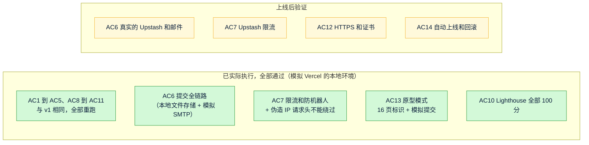
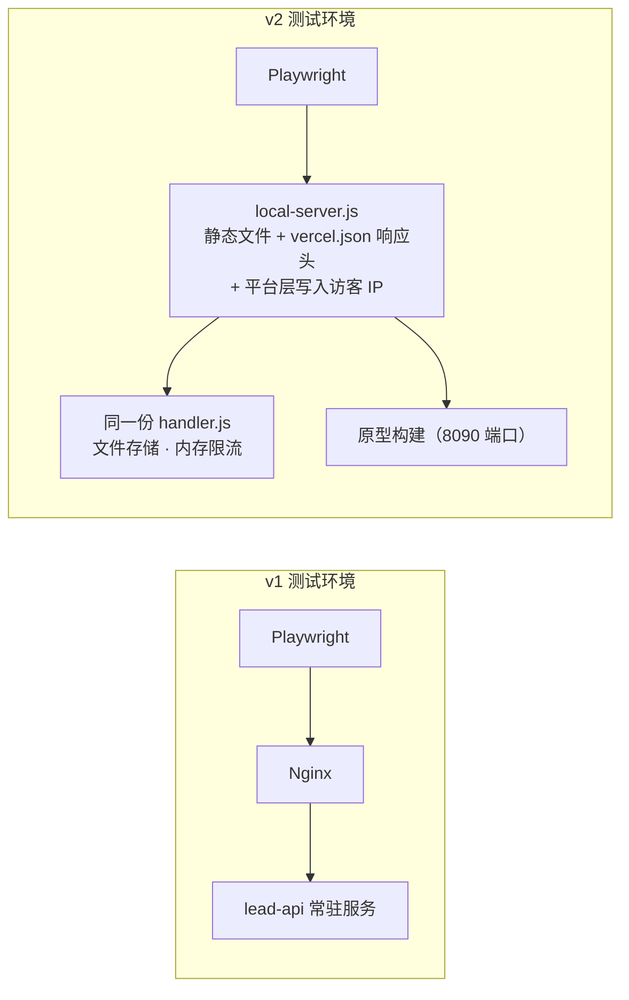

# 《测试报告》v2：Quick Come 官网，改为 Vercel 部署
- 版本：v2
- 产出角色：测试工程师
- 输入：《需求说明书 v2》的验收标准变化、《技术方案 v2》
- 测试时间：2026-09-27
- 变更历史：v2（2026-09-27）首次创建。本次是针对 v2 变更点的回归测试，同时重跑了 v1 的全部用例。

## 一图看懂
**图 1：v2 验收标准的状态。** 🟢 已实际执行并通过；🟡 要等 Amos 完成 Vercel 后台配置、上线后才能验证。

**图 2：测试环境的变化。** v1 用真实的 Nginx；v2 用模拟 Vercel 的本地服务器，处理逻辑与生产相同，但存储和限流换成了本地实现。

## 1. 结论
| 项目 | 结果 |
|---|---|
| 本地测试环境（实际执行） | 端到端测试 **180 个全部通过**（v1 的 161 个、新增 AC13 原型用例 18 个、CSP 兼容性检查 1 个）。单元测试 **18 个全部通过**。Lighthouse 首页和联系页（中英两版）四项**都是 100 分**。 |
| Vercel 构建 | ✅ PR #3 上的 Vercel 预览构建状态为 **Ready**（2026-09-27 14:55 UTC），说明静态站点和函数都打包成功 |
| 在线验证 | ⏸ **尚未执行**：AC6 和 AC7 的真实存储部分、AC12、AC14 要等 Amos 完成 Vercel 后台配置并上线。预览地址需要登录，测试无法访问，这是 D5 的设计。 |
| 缺陷 | 本轮**没有发现产品缺陷** |

## 2. v2 新增和修改的用例
| 用例 | 验收标准 | 内容 | 结果 |
|---|---|---|---|
| TC-18（修改） | AC7 | 同一 IP 第 6 次提交返回 429；**再伪造 `x-real-ip` 和 `x-forwarded-for` 请求头，仍然返回 429**；只保存了 5 条线索 | ✅ |
| TC-20（修改） | 补充 | 40KB 的请求体被函数拒绝，返回 413。v1 是由 Nginx 拒绝的 | ✅ |
| TC-08（修改） | 补充 | 响应头按 `vercel.json` 输出：非生产域名只有基础安全头；生产域名 `quickcomepay.com` 另外有严格 CSP 和 HSTS | ✅ |
| TC-08b（新增） | 补充 | 构建产物的 HTML 里没有内联脚本、内联样式和 style 属性，与生产环境的严格 CSP 兼容 | ✅ |
| TC-22（新增） | AC13 | 16 个页面：原型构建都有 PROTOTYPE 标识和 noindex；正式构建都没有 | ✅ 16 个 |
| TC-23（新增） | AC13 | 中英两版：原型表单的前端校验正常；提交后显示成功，但**没有发出任何接口请求**，也没有写入存储 | ✅ 2 个 |
| 单元测试 | AC5 到 AC7 | handler 的全部分支；Redis 存储；Resend 请求格式和出错时的处理；没配置存储时函数入口安全失败 | ✅ 18 个 |

## 3. 上线后的验证计划（执行人：测试）
| AC | 方法 |
|---|---|
| AC6 | 在正式网站上用中英文各提交一次，检查收件邮箱，以及 Upstash Data Browser 里的 `qc:leads` 和 `qc:mail` |
| AC7 | `bash e2e/smoke-prod.sh https://quickcomepay.com --ratelimit`：只发非法请求，确认第 6 次返回 429，不会产生线索 |
| AC12 | `smoke-prod.sh`：HTTP 跳转 HTTPS、HSTS、证书剩余有效期 |
| AC14 | 以 Vercel 部署记录里的时间为准：合并后 5 分钟内上线；由 Amos 或经授权的运维演练一次 Instant Rollback |

## 4. 测试环境与生产环境的差异（如实说明）
- 本地服务器只模拟了本项目用到的 `vercel.json` 功能（研发风险 R7），在线冒烟测试可以弥补这一点。
- 存储和限流在本地用的是文件版和内存版；Upstash 版的代码只有单元测试覆盖（使用模拟的 Redis 对象），真实的 Upstash 要等上线后验证。

## 5. 测试用例自身的修正
- TC-18：v2 里访客 IP 由平台层写入，测试用伪造的请求头已经无法模拟"不同 IP"。所以把"其他 IP 不受影响"这一项移到了单元测试里，端到端测试改为验证"伪造 IP 不能绕过限流"。验收标准的含义没有变化。

## 6. 测试自检
- [x] 覆盖了 v2 修改和新增的全部验收标准，没法在本地验证的写明了上线后的验证方法和执行人
- [x] 缺陷分级：本轮没有缺陷
- [x] 写明了哪些是实际执行、哪些要等上线后执行
- [x] 单独列出了测试用例本身的修正
- [x] 附了覆盖图和测试环境对比图
