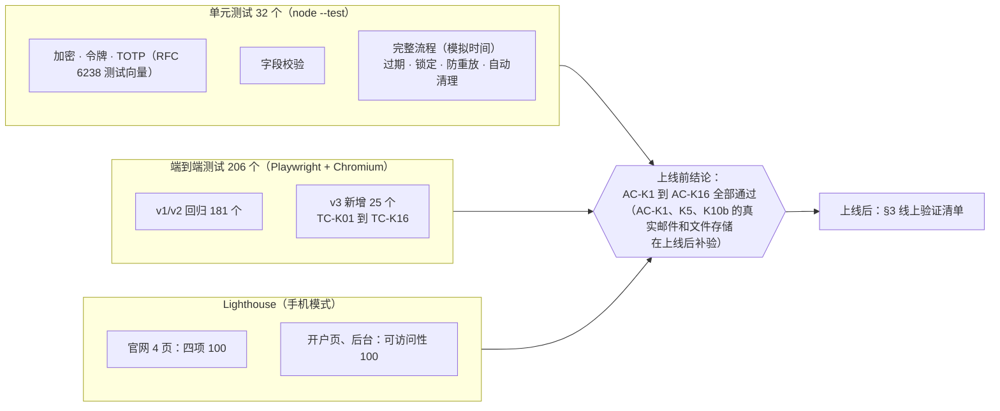

# 《测试报告》v3：线上 KYB 开户
- 版本：v3
- 产出角色：测试工程师
- 输入：《需求说明书 v3》（AC-K1 到 AC-K16，含测试预审 TP1 到 TP5）、《技术方案 v3》
- 变更历史：v3（2026-09-28）上线前版本。**v3.3（2026-09-28）：上线后的验证结果见 §5.5，全部通过。**

## 一图看懂

## 1. 结论
- **上线前测试全部通过：**单元测试 32 / 32，端到端测试 206 / 206，`npm audit` 没有漏洞。
- 本轮发现 **5 个缺陷**，全部修复并回归通过（§4）。
- 按测试预审 TP1 和 TP5，**真实邮件和真实的 Blob 私有存储只能在上线后验证**，见 §3。

## 2. 验收标准覆盖
| 验收标准 | 用例 | 结果 |
|---|---|---|
| AC-K1 从线索发送链接，客户收到邮件 | TC-K03（模拟 SMTP 检查邮件内容，不含 Paypaz） | ✅ 本地；上线后用真实邮箱补验 |
| AC-K2 令牌 256 位；无效或过期显示提示；重新发送后旧链接失效 | TC-K03、TC-K07、TC-K10；单元："链接 30 天过期…" | ✅ |
| AC-K3 全部字段可填、可保存、关掉再打开内容还在 | TC-K04（中途离开再用同一链接打开） | ✅ |
| AC-K4 前端提示 + 服务端拒绝 | TC-K04（必填、PEP 说明）；单元：字段校验（护照过期、董事和 UBO、"其他"须注明） | ✅ |
| AC-K5 文件类型、10MB 上限、必传文件 | TC-K04（HTML 文件被拒、缺文件不能继续）、TC-K14（10MB + 1 字节返回 413）；单元：必传文件 | ✅ 本地；真实直传在上线后补验 |
| AC-K6 没签名、没勾选不能提交；记录签名、时间、IP | TC-K04、TC-K06（后台显示签名图片和 IP） | ✅ |
| AC-K7 提交后只读；通知邮件不含敏感字段 | TC-K04 | ✅ |
| AC-K8 密码 + TOTP；5 次锁定 15 分钟；8 小时过期；未登录返回 401 | TC-K01、K02、K06、K12、K13；单元：锁定（模拟时间）、会话过期、防重放 | ✅ |
| AC-K9 筛选、详情、补件、再次提交通知、通过 | TC-K06、K07、K08 | ✅ |
| AC-K10 （a）数据库里是密文（b）文件只能授权下载（c）不能访问别人的申请 | TC-K05（直接读存储文件）、TC-K06（未登录下载返回 401）；单元："一个客户的链接不能访问另一个申请的文件" | ✅（b）的真实私有存储在上线后补验 |
| AC-K11 中英双语，切换语言不丢数据 | TC-K14 | ✅（发现并修复 BUG-K2） |
| AC-K12 保留截止日；手动删除；自动清理 | TC-K08、K09、K11；单元："未通过满 1 年删除，通过的业务关系结束满 5 年删除"（模拟时间，TP4） | ✅ |
| AC-K13 预览环境使用模拟数据，显示 PROTOTYPE 标识 | TC-22、TC-23（沿用）；原型构建上的 TC-K16 | ✅ |
| AC-K14 隐私政策新增 KYB 一节 | TC-K15（中英两版） | ✅（发现并修复 BUG-K3） |
| AC-K15 三种宽度无横向滚动；可访问性 ≥ 90 | TC-K16（9 个用例）；Lighthouse | ✅ 可访问性 100 |
| AC-K16 官网 v2 全部回归 | 181 个旧用例 | ✅ |

**Lighthouse（手机模式）：**

| 页面 | 性能 | 可访问性 | 最佳实践 | SEO |
|---|---|---|---|---|
| 官网首页、联系页（中英） | 100 | 100 | 100 | 100 |
| 开户页（中英，原型构建） | 96 | 100 | 100 | 不适用（按设计 noindex） |
| 审核后台（原型构建） | 100 | 100 | 100 | 不适用（按设计 noindex） |

## 3. 上线后的验证计划（执行人：测试，Amos 配合）
| # | 检查 | 方法 | 通过标准 |
|---|---|---|---|
| V1 | 配置齐全 | `curl https://amos111.vercel.app/api/health/` | `ok`、`storage`、`mail`、`secret`、`blob`、`blobUpload`、`cron` 全部为 true，`mailMode` 为 `smtp` |
| V2 | 后台初始化和登录 | Amos 打开 https://amos111.vercel.app/admin/ ，按页面提示操作 | 能登录；二维码能被验证器 App 识别 |
| V3 | 真实邮件（TP1） | Amos 用**另一个邮箱**扮演客户，在后台手动发送开户链接 | 收到邮件，没进垃圾箱；发件人是 Amos 的邮箱 |
| V4 | 真实文件直传（TP5、R10） | 用 V3 收到的链接填写并上传文件 | 上传成功；浏览器控制台没有 CSP 报错 |
| V5 | 私有存储（AC-K10b） | 复制后台文件下载地址，在没有登录的浏览器里打开 | 返回 401 |
| V6 | 补件、通过、删除 | 在后台操作 V3 的测试申请 | 与本地结果一致；删除后文件下载返回 404 |
| V7 | 定时清理 | Vercel 后台 → Settings → Cron Jobs 能看到任务，并且手动运行一次 | 返回 `ok: true` |
| V8 | 官网回归 | `bash e2e/smoke-prod.sh https://amos111.vercel.app` | 全部通过 |

## 4. 本轮发现的缺陷
| # | 级别 | 现象 | 原因 | 修复 | 回归 |
|---|---|---|---|---|---|
| BUG-K1 | 一般 | 签完名后切到别的步骤再回来，签名被清空 | 每次显示第 ⑦ 步都会重设画布 | 尺寸没变时不重设 | TC-K07 |
| BUG-K2 | 一般 | 填了内容但没保存就切换语言，内容丢失（AC-K11） | 语言切换是普通链接，直接跳转 | 切换前先保存，并回到原来的步骤 | TC-K14 |
| BUG-K3 | 一般 | 隐私政策没有 KYB 一节（AC-K14） | 开发遗漏 | 中英两版新增一节，更新日期改为 2026-09-28（**需法务审核**，RK3） | TC-K15 |
| BUG-K4 | 轻微 | 开户页顶部的"企业 / 编号 / 有效期"列表不符合可访问性规范（Lighthouse 96 分） | `<dl>` 里没有 `<dt>`、`<dd>` | 改为标准写法 | Lighthouse 100 |
| BUG-K6 | 严重（阻塞上线） | 首次生产部署失败：`CRON_SECRET` 末尾有换行 | 运维给出的生成命令没有去掉换行（`openssl ... \| pbcopy`） | 命令加上 `tr -d '\n'`，重新填写三个密钥；`config.js` 自动去掉首尾空白，并新增单元测试 | 重新部署后在线检查 |
| BUG-K7 | 严重（阻塞上线） | 上线后，开户和后台接口全部返回 404 | Vercel 在本项目（非 Next.js）里没有把 `api/admin/[action].js` 这种动态文件名部署成接口；本地模拟环境按路径前缀转发，所以没有暴露；预览地址需要登录，上线前也没法从外部检查 | 改为每个动作一个固定文件名的入口（`api/admin/<动作>.js`，由脚本生成）；新增单元测试，检查入口文件和处理逻辑的动作列表一致，并禁止 `[xxx].js` 文件名 | 重新部署后在线检查 |
| BUG-K9 | 一般（上线后 Amos 发现） | 后台导航"开户申请""官网线索"旁边的数字不显示，只有空圆圈 | 数量为 0 时显示为空；"官网线索"的数量只有点进这个标签才会加载 | 登录后同时加载两个数量；0 也显示为"0"；悬停时说明数字的含义（待审核 / 还没发送开户链接） | TC-K02、TC-K06 新增断言 |
| BUG-K8 | 严重（阻塞上线） | BUG-K7 修复后，预览和生产部署都在 Deploying outputs 阶段失败（构建本身成功） | 每个动作一个函数，一次部署有 24 个函数，超过了 Vercel 对每次部署的函数数量限制 | 开户接口合并为一个函数 `api/kyb.js`（`/api/kyb/?g=<分组>&a=<动作>`），全部函数减到 4 个；本地服务器同步改为只认这个入口，其他 `/api/` 地址返回 404；单元测试限制函数不超过 12 个；**以后每次合并前先确认预览构建成功** | 端到端 207 个全部通过；`vercel build` 本地确认 4 个函数 |
| BUG-K5 | 轻微 | 后台文件大小显示为"0.0 MB" | 小文件也按 MB 显示 | 小于 1MB 时显示 KB | 截图确认 |

## 5.5 上线后的验证（2026-09-28，PR #9 合并后，生产地址 https://amos111.vercel.app ）
上线过程中，有 3 次合并没有成功上线：BUG-K6、BUG-K7、BUG-K8，见 §4。这 3 次线上都停留在上一个正常版本，**官网一直没有受到影响**。PR #9 合并后，按 §3 的清单逐项验证：

| # | 检查 | 执行人 | 结果 |
|---|---|---|---|
| V1 | `/api/health/` | 测试 | ✅ `ok`、`storage`、`mail`、`secret`、`blob`、`blobUpload`、`cron` 都是 true，`mailMode` 是 `smtp` |
| V1b | 接口的安全行为 | 测试 | ✅ 未登录访问后台数据返回 401；无效链接返回 404；跨站请求返回 403；清理接口不带口令返回 401；未知分组返回 404 |
| V2 | 后台初始化和登录 | Amos | ✅ 用 iCloud 密码 App 绑定验证码后登录成功；再次初始化返回 409 |
| V3 | 真实邮件（TP1） | Amos | ✅ QQ 邮箱 SMTP 发出，"客户"邮箱在**收件箱**收到 |
| V4 | 真实文件直传（TP5） | Amos | ✅ 上传成功，提交成功，`MAIL_TO` 收到新申请通知 |
| V5 | 私有存储（AC-K10b） | Amos | ✅ 在无痕窗口打开文件链接，返回 unauthorized |
| V6 | 补件、通过、删除 | Amos | ✅ 补件时只开放了第 ⑤ 步；旧链接失效；重新提交后收到通知；通过后保留期显示正确；删除后文件链接返回 not_found |
| V7 | 定时清理 | Amos | ✅ Vercel Cron Jobs 手动运行成功 |
| V8 | 官网回归 | 测试 | ✅ `smoke-prod.sh` 全部通过（页面、HTTPS、HSTS 和 CSP、证书、非法提交被拒绝） |

**结论：AC-K1 到 AC-K16 全部通过**，其中 AC-K1、AC-K5、AC-K10（b）已在真实环境补验。

## 5. 测试用例自身的修正
| # | 问题 | 处理 |
|---|---|---|
| TF1 | Playwright 的 `request` 接口在 http 本地地址上不会带 `Secure` Cookie，所以后台下载返回 401。浏览器本身是会带的：签名图片正常加载 | 改为在浏览器里用 `fetch` 下载，与 Amos 实际点击相同。确认这是测试方法的问题，不是产品缺陷 |
| TF2 | 邮件正文是 quoted-printable 编码，中文检查不通过 | 测试环境增加解码函数 `decodeQP`（按 UTF-8） |
| TF3 | 宽度测试原本逐步点步骤条，但前端校验会阻止跳到后面的步骤，所以其实一直在检查第 ① 步 | 改为把 7 个步骤同时显示后一次检查，并加断言确认第 ⑦ 步可见 |
| TF4 | 单元测试"链接过期"时间快进 31 天后，后台会话也过期了 | 这是正确行为，测试里重新登录，并补充了"重新发送"的检查 |

## 6. 测试自检
- [x] 每条验收标准都有用例；预审 TP1 到 TP5 都已落实
- [x] 本地没法验证的部分如实列在 §3
- [x] 缺陷和测试用例的修正都有记录
