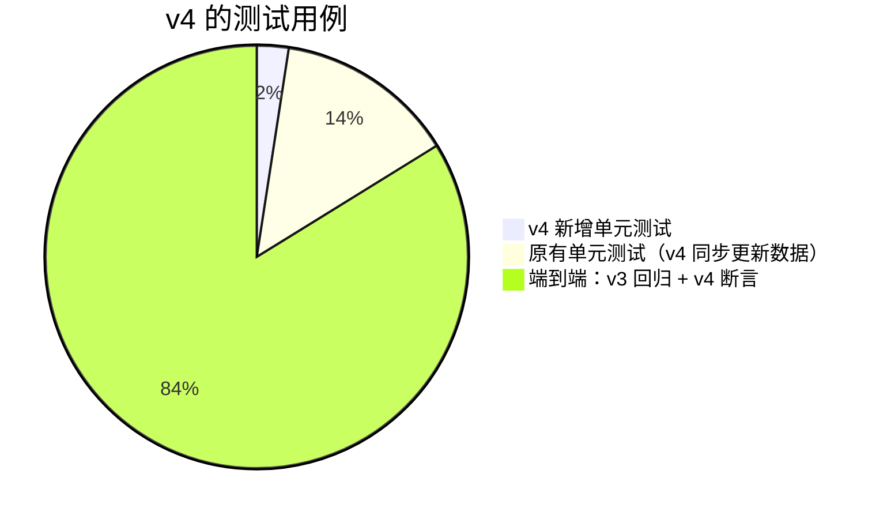

# 《测试报告》v4：开户表单字段调整
- 版本：v4
- 产出角色：测试工程师
- 输入：《需求说明书 v4》（AC-V1 到 AC-V11，预审 TPV1 到 TPV4）
- 变更历史：v4（2026-09-28）上线前版本；v4.1（2026-09-28）追加 §3.5 上线后检查结果

## 一图看懂

## 1. 结论
- 单元测试 **40 / 40**，端到端测试 **207 / 207**，全部通过。
- Lighthouse 可访问性：开户页和后台都是 100 分。
- 本轮没有发现新的缺陷。

## 2. 验收标准覆盖
| 验收标准 | 用例 | 结果 |
|---|---|---|
| AC-V1 币种 | 单元"币种必填；选其他要注明"；端到端 TC-K04（没选时报错、选"其他"后注明 TRX） | ✅ |
| AC-V2 制裁声明 | 单元"制裁声明必填…"；端到端 TC-K04（没选、选"是"但没写说明，都会报错） | ✅ |
| AC-V3 持股比例 | 单元"UBO 必填…"：0 和 100 允许，101、-1、abc、50.123、100.5 都被拒绝（TPV1）；不是 UBO 时不保存（TPV4）；端到端 TC-K04（勾选 UBO 前隐藏，填 120 会报错） | ✅ |
| AC-V4 业务用途多选 | 单元（多选；兼容 v3 的单选值；选"其他"要注明）；端到端 TC-K04 | ✅ |
| AC-V5 月交易量 | 单元（"其他"被拒绝；50 万以上要写金额）；端到端 TC-K04（没有"其他"选项；没填金额时报错） | ✅ |
| AC-V6 文件清单 | 端到端 TC-K04（第 ⑤ 步没有第 11、12 项，也没有"Appendix"字样）；单元（第 11 项上传返回 400，第 13 项正常） | ✅ |
| AC-V7 后台显示和红色标记 | 端到端 TC-K06（列表和详情都有"涉及制裁：是"；详情显示 TRX、金额、说明、75.5%、业务用途）；单元（列表返回 `flags.sanctions`） | ✅ |
| AC-V8 v3 旧数据 | 单元"v3 格式的旧申请…"：按 v3 结构直接写入存储（TPV2）；已提交的正常读取；填写中的必须补填才能提交；补填后，业务用途自动变为多选 | ✅ |
| AC-V9 双语和加密 | 构建时的文案检查；端到端 TC-K05（制裁说明、金额在存储里不是明文）；单元（制裁说明加密） | ✅ |
| AC-V10 空状态 | 端到端 TC-K02（没有申请时，数字显示 0，列表显示"暂无申请"）；原型 `?empty=1` 截图 | ✅ |
| AC-V11 v3 回归 | 端到端 v3 全部用例、官网全部用例 | ✅ |

## 3. 上线后的检查（执行人：测试，Amos 配合）
| # | 检查 | 通过标准 |
|---|---|---|
| L1 | `/api/health/` | 全部为 true |
| L2 | 生产环境的开户页 | 新字段显示正常，没有第 11、12 项 |
| L3 | 后台打开已有的测试申请 | 新字段显示"（v3 提交，没有此项）"，或者显示为空 |
| L4 | Amos 用测试邮箱发送一个新链接，填写时制裁选"是"，然后提交 | 后台列表出现红色标记 |

## 3.5 上线后的检查结果（2026-09-28，PR #12 合并后）
| # | 结果 |
|---|---|
| L1 | ✅ `/api/health/` 全部为 true，`mailMode` 为 `smtp` |
| L2 | ✅ 生产环境的开户页包含币种、制裁声明、持股比例字段，没有第 11 项 |
| 接口 | ✅ 未登录访问后台数据返回 401；无效链接返回 404 |
| 官网 | ✅ `smoke-prod.sh` 全部通过 |
| L3、L4 | ⏸ 等 Amos 用测试邮箱验证 |

**测试方法修正：**第一次运行 `smoke-prod.sh` 时，健康检查有一次失败。单独重复请求 6 次，其中 1 次在 TLS 握手阶段被断开（`SSL_ERROR_SYSCALL`，没有拿到 HTTP 状态码），其余 5 次都返回 200，而且各项都是 true。`smoke-prod.sh` 一共运行了 5 次：3 次全部通过，另外 2 次分别有 1 项、2 项失败，而且失败的检查项每次不同。结合 TLS 握手被断开的现象，判断为测试环境出网代理的偶发断连，不是产品缺陷。

## 4. 测试自检
- [x] 每条验收标准都有用例
- [x] 数量、列表类界面测了"为 0 / 为空"（agents v0.5.1 C32）
- [x] 每个用例都先确认到达了要检查的状态（agents v0.5 C29）
