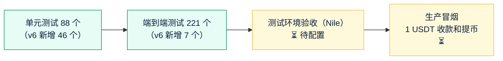

# 《测试报告》v6：稳定币收付款
- 版本：v6.1
- 产出角色：测试工程师
- 状态：✅ **本地测试全部通过**；✅ 测试环境自动检查全部通过（2026-09-30）；⏳ Amos 在 Nile 上验收（§4）
- 输入：《需求说明书 v6.1》§9、§10，《任务清单 v6》
- 日期：2026-09-29

## 一图看懂

## 1. 测试范围和结果
| 类别 | 数量 | 结果 |
|---|---|---|
| 单元测试（`npm test`） | 88 个（官网和开户原有 42 个，v6 新增 46 个） | ✅ 全部通过（内嵌 Postgres 和真实 Postgres 16 各跑一遍） |
| 端到端测试（`e2e`，Chromium） | 221 个（v1 到 v5 原有 214 个，v6 新增 7 个） | ✅ 全部通过 |
| 类型检查（v6 页面脚本） | — | ✅ 没有错误 |
| 真实网络只读验证 | 主网真实交易 4 种、Nile 测试网 | ✅（见《实现说明》§3） |

## 2. 验收标准对应的测试
| 验收标准 | 测试 | 结果 |
|---|---|---|
| AC-P1 开通商户、设置密码和验证码、登录 | `pay-merchant.test.js`（链接只能用一次、锁定、防重放）；e2e TC-P02 | ✅ |
| AC-P2 创建订单返回客户地址和付款页面；订单模式关闭不能建单 | `pay-core.test.js`、`pay-api.test.js`；e2e TC-P03 | ✅ |
| AC-P3 同一客户同一地址；地址互不重复 | `pay-core.test.js`、`tron.test.js`（xpub 推导 = 助记词推导，已知测试向量） | ✅ |
| AC-P4 到账后发通知 | `pay-tick.test.js`（扫链翻页、去重、回调）；e2e TC-P03 | ✅ 本地；⏳ "2 分钟内"要在 Nile 实测 |
| AC-P5 订单状态流转、匹配通知 | `matching.test.js`（10 个边界）、`pay-core.test.js` | ✅ |
| AC-P6 低于 1 USDT 不入账；其他代币记为异常 | `pay-core.test.js`、`pay-daily.test.js` | ✅ |
| AC-P7 手续费、只追加账本、对账 | `pay-core.test.js`（数据库拒绝修改账本）、`pay-daily.test.js`（一致 / 不一致） | ✅ |
| AC-P8 提币冻结、取消和驳回解冻、余额不够拒绝、没有白名单不能 API 提币 | `pay-core.test.js`、`pay-api.test.js`；e2e TC-P05 | ✅ |
| AC-P9 提币通知邮件合并、处理时效说明 | `pay-tick.test.js`；e2e TC-P05（收到邮件） | ✅ |
| AC-P10 归集 3 步、只能归集到热钱包或冷钱包 | `pay-wallet.test.js`、e2e TC-P06（浏览器用助记词签名，3 步都完成） | ✅ 本地；⏳ 能量数量在 Nile 实测 |
| AC-P11 ① 数据库、日志里没有私钥 | e2e TC-P07（数据库、服务器日志、数据目录的所有文件） | ✅ |
| AC-P11 ② 签名页面不发送密钥；篡改的交易被拦下 | `pay-wallet.test.js`（改收款地址、改付款地址、多签、过期时间、金额过高）；e2e TC-P05（错误的私钥被拦下、签名后清空） | ✅ |
| AC-P11 ③ 签名错误、时间戳过期返回 401 | `pay-api.test.js`；e2e TC-P04 | ✅ |
| AC-P11 ④ 回调带签名 | `pay-tick.test.js`、`docs-examples.test.js` | ✅ |
| AC-P11 ⑤ 商户之间隔离 | `pay-api.test.js`（A 的 Key 读写 B 的数据全部 404） | ✅ |
| AC-P12 回调重试、24 小时后停止、手动重发 | `pay-tick.test.js` | ✅ |
| AC-P13 付款页面 | e2e TC-P03（正式接口显示付款成功）；原型阶段已检查 375px | ✅ |
| AC-P14 文档示例可以直接运行 | e2e TC-P04：**原样运行**文档里的 Node.js 和 Python 示例；`docs-examples.test.js`：回调验证示例 | ✅（发现并修正了示例里过时的字段） |
| AC-P15 空状态 | e2e TC-P02（新商户余额 0.00、列表"暂无"） | ✅ |
| AC-P16 测试环境走通、生产 1 USDT 冒烟 | — | ⏳ 待 P14、P15 |
| AC-P17 链上监控停止提醒、存储用量提醒 | `pay-daily.test.js`；GitHub Actions `tick-watch` | ✅ 本地；⏳ 生产上线后生效 |
| AC-P18 v1 到 v5 回归 | 原有 214 个端到端测试 | ✅ |
| AC-P19 按客户查看、统计、对账 | `pay-api.test.js`、`pay-merchant.test.js`、`pay-daily.test.js`；e2e TC-P04 | ✅ |
| AC-P20 双向匹配、设置生效 | `matching.test.js`、`pay-core.test.js`（包括同时建单和到账不重复匹配）；e2e TC-P03、P04 | ✅ |
| AC-P21 手动匹配、解除匹配，不改余额 | `pay-core.test.js`、`pay-merchant.test.js` | ✅ |

## 3. 测试中发现并修复的问题
| # | 问题 | 修复 |
|---|---|---|
| BUG-P1 | 开发者文档的 Node.js 示例还在用 v6.1 之前的字段（没有 `customer_id`，还有已经取消的 `ttl_minutes`），商户照着写会失败 | 示例改为单独的文件，端到端测试原样运行 |
| BUG-P2 | 其他代币的余额可能超过 JS 数字的精确范围（Nile 上实际看到 3×10²⁵） | 放不下的余额保留原始字符串，只用于显示；USDT 余额不受影响 |
| BUG-P3 | 真实交易里有带多签权限的交易，签名人不是付款地址 | 解码器读出多签权限，签名页面见到就拦下（本项目从不使用多签） |
| BUG-P4 | 测试环境：开放 API 全部返回 Vercel 的 404 | Vercel 把 `/api/v1/:path*` 编译成不接受结尾 `/` 的正则，还会把参数加进查询串（会影响签名）。改为 `/api/v1/(.*)`，用 `vercel build` 生成的路由表确认；新增测试 |
| BUG-P5 | 测试环境：链上监控在运行，但健康检查显示"从未运行" | 线上的数据库驱动（postgres.js）把 jsonb 参数多编码了一层，本地的内嵌 Postgres 不会，所以本地没发现。修正序列化，启动时一次性修复已写入的值；**单元测试和端到端测试现在都可以在真实 Postgres 上运行**（`TEST_DATABASE_URL`、`E2E_DATABASE_URL`），去掉修复后有 17 个测试失败 |

## 4. 测试环境验收清单（P15，Amos 在 Nile 上操作）
配置完成后，我会给你完整的测试环境链接。按顺序做：
1. 后台 → 钱包设置 → 初始化主助记词（测试用，抄在纸上即可）。
2. 后台 → 商户 → 开通一个测试商户（用你自己的另一个邮箱）→ 收邮件 → 设置密码、绑定验证码 → 登录商户后台。
3. 商户后台 → 客户 → 新建客户 → 用 TronLink（Nile）往这个客户的地址转 2 测试 USDT → 2 分钟内看到到账。
4. 商户后台 → 订单 → 给同一个客户建 5 USDT 的订单 → 转 3 + 2 → 订单变成"已完成"。
5. 先转 1 USDT，再建 1 USDT 的订单 → 订单一创建就是"已完成"。
6. 商户后台 → 提币 → 提 1 USDT 到你的 TronLink 地址 → 后台审核 → 输入验证码和测试热钱包的私钥 → Tronscan（Nile）上看到到账。
7. 后台 → 归集 → 选第 3 步的客户地址 → 输入测试助记词和热钱包私钥 → 几分钟后热钱包收到 USDT。

## 5. 测试自检
- [x] 每条验收标准都有对应的测试，或写明了在哪一步验证
- [x] 空状态（C32）
- [x] 安全项逐条有测试
- [x] 发现的问题都已修复并补了测试
