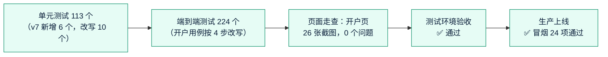

# 《测试报告》v7：开户表单精简 + 集中限流 + 邮箱哈希检索
- 版本：v7
- 产出角色：测试工程师
- 状态：✅ **本地测试全部通过**（实际执行，见 §1）；✅ CI 通过；✅ 测试环境自动检查通过；✅ **Amos 于 2026-10-01 在测试环境验收通过**（§4）；✅ 生产上线（健康检查正常，冒烟检查 24 项通过）
- 输入：《需求说明书 v7》§5、§7，《任务清单 v7》
- 日期：2026-10-01

## 一图看懂

## 1. 测试范围和结果（实际执行）
| 类别 | 数量 | 结果 |
|---|---|---|
| 单元测试（`npm test`） | 113 个 | ✅ 全部通过；内嵌 Postgres 和真实 Postgres 16 各跑一遍 |
| 端到端测试（`e2e`，Chromium，收付款用真实 Postgres 16） | 224 个 | ✅ 全部通过 |
| 页面走查（`walkthrough.spec.ts` 开户页部分） | 中英 × 桌面 1280 和手机 390：4 个步骤空状态、第 ①② 步校验出错、接口出错，共 26 张截图 | ✅ 自动检查 0 个问题；控制台只有故意制造的 500 |
| 项目索引检查 | — | ✅ 通过 |

## 2. 验收标准对应的测试
| 验收标准 | 测试 |
|---|---|
| AC-7-1 4 步、中英一致 | `kyb.spec.ts` TC-K04（步骤数）、TC-K16（中英两版）；构建时检查中英文案结构 |
| AC-7-2 企业信息含联系方式，没有 LEI 等 | TC-K04；`kyb-core.test.js`"字段校验" |
| AC-7-3 公司文件多个、选传、提示文字、超量和类型拒绝 | TC-K04（一次选多个、类型不对、提示文字）；`kyb-flow.test.js`（不传也能提交、第 21 个被拒绝） |
| AC-7-4 恰好 1 位授权联系人，只有他的邮箱电话必填 | TC-K04；`kyb-core.test.js`"v7 人员" |
| AC-7-5 证件类型、号码、签发国、到期日；没有居住国 | TC-K04（过期日期被拦截）；`kyb-core.test.js` |
| AC-7-6 每人身份证明 1～3 个；删除人员时删除文件 | TC-K04（两位人员都要上传）；`kyb-flow.test.js`（第 4 个被拒绝、缺了不能提交）；删除人员删文件沿用 v3 的测试 |
| AC-7-7 没有证明文件一步、地址证明、钱包所有权证明 | TC-K04；`kyb-flow.test.js`（旧文件项上传返回 400） |
| AC-7-8 钱包和签名自动带出 | TC-K04 |
| AC-7-9 待开通邮箱取授权联系人；旧申请取第 ③ 步 | `kyb-flow.test.js`"完整流程"和"v4 格式的旧申请" |
| AC-7-10 旧申请：已提交的原样显示，填写中的整理后不丢内容 | `kyb-core.test.js`"v7 旧申请整理"；`kyb-flow.test.js`"v4 格式的旧申请"（已提交、填写中、补件中三种） |
| AC-7-11 后台详情新结构、补件勾选 3 个步骤 | TC-K06、TC-K07 |
| AC-7-12 L5 两个实例合计超过 20 次返回 429；Redis 故障放行 | `pay-api.test.js`"L5 限流"两项 |
| AC-7-13 L6 6000 个客户按完整邮箱能找到；没有明文；补算 | `pay-api.test.js`"L6 邮箱检索"两项（真实 Postgres 16 也通过） |
| AC-7-14 走查 | §1 页面走查 |

## 3. 测试中发现并修复的问题
| 编号 | 问题 | 原因 | 修复 |
|---|---|---|---|
| BUG-V7-1 | 第 ② 步人员规则不通过时，不提示缺身份证明，客户要改两次 | 前端校验短路 | `onboarding.ts` 两项都检查；TC-K04 覆盖 |
| BUG-V7-2 | 服务器出错时开户页显示"链接无效"，客户会以为链接坏了 | 读取失败一律当作链接无效 | 只有 404 才显示链接无效，其他情况提示重试；TC-K10 覆盖 |

## 4. 测试环境验收清单（Amos 操作）
部署到测试环境后，我会给你完整链接。按顺序做：
1. 后台 → 开户申请 → 发一个开户链接给你自己的另一个邮箱。
2. 打开邮件里的链接：确认只有 4 步；第 ① 步有官网、邮箱、电话，末尾可以上传多个公司文件（不传也能继续）。
3. 第 ② 步：只填一位人员，不勾"授权联系人"、不上传身份证明，点下一步 → 应该同时提示两项。勾上授权联系人、填邮箱电话、上传护照或身份证（可以 2 个文件）。
4. 第 ③ 步：法定全称和邮箱已经自动填好；第 ④ 步：授权代表姓名已经是授权联系人 → 签名提交。
5. 后台打开这份申请：企业信息、公司文件、人员和身份证明都在；点"要求补件"，可以勾选的是 3 个步骤。
6. 通过这份申请 → 后台"商户"→"待开通"：邮箱是第 ② 步授权联系人的邮箱。
7. 后台打开一份**以前（v4）提交的申请**：原来的内容和文件都还在。
8. （L5、L6 没有界面变化）商户后台 → 客户 → 搜索一个客户的完整邮箱，能找到。

## 5. 测试自检
- [x] 每条验收标准都有对应的测试（§2）
- [x] 旧数据兼容：已提交、填写中、补件中三种都测了
- [x] 空状态、出错状态、手机宽度（走查）
- [x] 发现的问题都已修复并补了测试
- [x] 写明了实际执行（不是代码走查）
