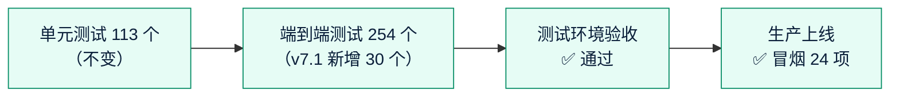

# 《测试报告》v7.1：官网的商户登录和管理平台入口
- 版本：v7.1
- 产出角色：测试工程师
- 状态：✅ 本地测试全部通过（实际执行，见 §1）；✅ CI 通过；✅ 测试环境自动检查通过；✅ **Amos 于 2026-10-01 在测试环境验收通过**；✅ 生产上线（冒烟 24 项通过）
- 输入：《需求说明书 v7.1》§3、§4
- 日期：2026-10-01

## 一图看懂

## 1. 测试范围和结果（实际执行）
| 类别 | 数量 | 结果 |
|---|---|---|
| 单元测试（`npm test`） | 113 个 | ✅ 全部通过 |
| 端到端测试（`e2e`，Chromium） | 254 个（v7.1 新增 30 个） | ✅ 全部通过 |
| 原有的全站死链检查（TC-02） | 新增的 `/merchant/`、`/zh/merchant/`、`/admin/` 链接一起检查 | ✅ 没有 404 |

## 2. 验收标准对应的测试
| 验收标准 | 测试 |
|---|---|
| AC-7.1-1 页头商户登录（中英、手机菜单） | `pages.spec.ts` TC-V71-1（16 个页面逐个检查）、TC-V71-2（点击进入对应语言的商户后台） |
| AC-7.1-2 页脚"公司"一栏的商户登录 | TC-V71-1 |
| AC-7.1-3 页脚最底部的管理平台（更小、nofollow） | TC-V71-1（字号比版权小、`rel="nofollow"`）、TC-V71-2（点击进入 `/admin/`） |
| AC-7.1-4 各宽度不折行、无横向滚动 | TC-V71-3：375、768、1000、1024、1101、1280，中英文。**已验证这个测试能发现问题**：临时改回原来的 960 断点，1000 像素的英文页面失败；改回 1100 后通过 |
| AC-7.1-5 站点地图不包含后台 | TC-V71-4；原有 TC-07（站点地图正好 16 个页面）不变 |

## 3. 测试环境验收清单（Amos 操作）
1. 打开测试环境首页，页头右侧有"商户登录"，点击进入商户后台登录页。
2. 切换到英文，页头显示 Merchant login，点击进入英文的商户后台。
3. 拉到页面最底部：版权一行右侧有淡色小字"管理平台"，点击进入运营后台。
4. 用手机打开，点"菜单"，里面有"商户登录"。

## 4. 测试自检
- [x] 每条验收标准都有对应的测试
- [x] 新增的宽度测试确认能发现原来的问题（C57 的做法：先复现，再验证修复）
- [x] 写明了实际执行
