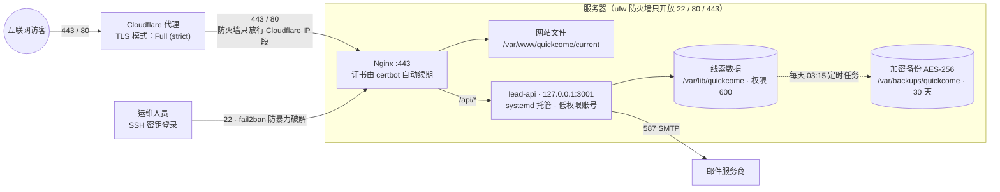
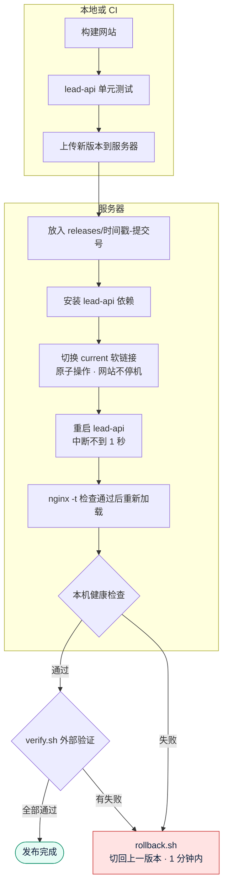
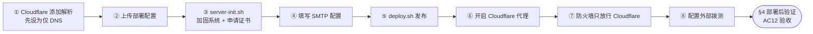

# 《部署方案》v1：Quick Come 官网
- 版本：v1
- 产出角色：运维工程师
- 输入：《00-架构方案》§3、《v1-技术方案》§3（研发给出的部署需求）
- 状态：配置和脚本已经写好，并做了能做的本地验证；**正式部署要等 Amos 提供资源**（见 §1）
- 变更历史：v1（2026-09-27）首次创建
- 变更历史（续）：v1.1（2026-09-27）按 agents v0.2 的可视化规范补图：新增"一图看懂"一节，正文没有改动

## 一图看懂
**图 1：部署拓扑。** 端口、防火墙、服务账号和数据的存放位置。

**图 2：发布流程（`deploy.sh`）。** 任何一步失败都不会切换版本；切换后验证失败，就执行回滚。

**图 3：首次上线的 8 个步骤。** 对应 §3 的步骤表，标出了每一步由谁执行。

## 0. 本次是否涉及基础设施变更
是。这是首次上线：新建 1 台服务器，新配置域名、证书和 Cloudflare。以前没有线上服务，所以**不存在停机或兼容性风险**。

## 1. 部署前需要 Amos 提供的资源
| # | 资源 | 说明 |
|---|---|---|
| 1 | 服务器 | 新加坡地域，Ubuntu 24.04 LTS，1 核 CPU、1 到 2GB 内存、20GB 以上 SSD，**最好支持 IPv6**。需要提供公网 IP，以及一个能用 SSH 密钥登录、有 sudo 权限的普通用户（例如 `deploy`）。`deploy.sh` 通过非交互的 SSH 执行 sudo，所以这个用户需要**免密 sudo**（NOPASSWD）；也可以只对部署用到的命令开放免密。 |
| 2 | 域名 | 购买 `quickcomepay.com` 和 `getquickcome.com`，并把 DNS 托管到 Cloudflare 免费版。 |
| 3 | SMTP 账号 | 用来发送线索通知邮件。可以是企业邮箱的 SMTP，也可以是 Amazon SES、Postmark 这类发信服务。发件地址建议用 `no-reply@quickcomepay.com`，并配置好 SPF 和 DKIM，避免邮件进垃圾箱。 |
| 4 | 收件邮箱 | 接收线索的邮箱，默认是 `sales@quickcomepay.com`。 |
| 5 | 证书提醒邮箱 | 用来接收 Let's Encrypt 证书快到期的提醒。 |

**SSH 访问方式：**
- 我所在的云端测试容器每次会话都是临时的，出于安全考虑，建议**不要把长期有效的私钥交给我**。
- 推荐做法：由您或您的运维同事在自己的电脑上执行 §3 的命令。
- 如果希望由我来执行，请给我一个**临时部署账号**，用完即删，之后把账号权限收回。

## 2. 环境依赖与配置项
| 项目 | 值或来源 |
|---|---|
| 运行环境 | Node.js 22 LTS（从 NodeSource 安装）、Nginx 1.24（Ubuntu 自带）、certbot、ufw、fail2ban、unattended-upgrades |
| 目录 | 网站文件：`/var/www/quickcome/releases/<版本>`，`current` 是指向当前版本的软链接 lead-api：`/srv/quickcome/lead-api/releases/<版本>`，同样有 `current` 软链接 数据：`/var/lib/quickcome`（权限 700，属于服务账号 quickcome） 配置：`/etc/quickcome`（权限 700） 备份：`/var/backups/quickcome` |
| lead-api 配置 | `/etc/quickcome/lead-api.env`（权限 600），字段见 `lead-api/.env.example`。必须填写：`SMTP_HOST`、`SMTP_PORT`、`SMTP_SECURE`、`SMTP_USER`、`SMTP_PASS`、`MAIL_FROM`、`MAIL_TO` |
| 备份密钥 | `/etc/quickcome/backup.key`，初始化时自动生成。**请另外抄一份保存在安全的地方**，否则服务器丢失后备份无法解密 |
| 配置文件 | `deploy/nginx/*`、`deploy/systemd/*`、`deploy/scripts/*` |

## 3. 部署步骤
| 步骤 | 执行位置 | 操作 | 预计耗时 |
|---|---|---|---|
| 1 | Cloudflare | 添加 `quickcomepay.com` 和 `getquickcome.com` 两个站点，以及以下 A 记录（服务器有 IPv6 的话，再加对应的 AAAA 记录）：`@`、`www`，都指向服务器 IP。**先设为"仅 DNS"（灰色云朵）**，因为申请证书时需要直连服务器 | 10 分钟，另加 DNS 生效时间 |
| 2 | 本地 | 把 `deploy/` 目录和 `lead-api/.env.example` 上传到服务器： `rsync -az deploy deploy@<IP>:~/qc-setup/` `rsync -az lead-api/.env.example deploy@<IP>:~/qc-setup/lead-api/` | 1 分钟 |
| 3 | 服务器 | **先确认当前是用 SSH 密钥登录的**，再执行初始化： `cd ~/qc-setup/deploy/scripts && sudo DOMAIN=quickcomepay.com ALT_DOMAIN=getquickcome.com ADMIN_EMAIL=<提醒邮箱> bash server-init.sh` 这一步会装软件、加固系统、配置防火墙、申请证书、配置 Nginx 和 systemd | 5 到 10 分钟 |
| 4 | 服务器 | `sudo nano /etc/quickcome/lead-api.env`，填写 SMTP 账号和收件邮箱 | 2 分钟 |
| 5 | 本地（需要能 SSH 到服务器） | `DEPLOY_HOST=deploy@<IP> DOMAIN=quickcomepay.com bash deploy/scripts/deploy.sh` 这一步会：构建网站 → 跑单元测试 → 上传新版本 → 切换软链接 → 重启 lead-api → 自动执行验证 | 3 到 5 分钟 |
| 6 | Cloudflare | 把 DNS 记录改成"代理"（橙色云朵）；SSL/TLS 模式设为 **Full (strict)**；开启"始终使用 HTTPS" | 5 分钟 |
| 7 | 服务器 | `sudo quickcome-update-cloudflare-ips.sh --lock-firewall` 作用：让 Nginx 取到访客的真实 IP，否则限流会把所有访客当成同一个 Cloudflare IP；同时把 80 和 443 端口限制为只允许 Cloudflare 访问 | 1 分钟 |
| 8 | 外部拨测 | 在 UptimeRobot 之类的服务上，添加 `https://quickcomepay.com/` 和 `https://quickcomepay.com/api/health` 两个监控，每 5 分钟检查一次，异常时发邮件告警 | 5 分钟 |

## 4. 部署后验证（确认部署成功）
1. **自动检查：** 执行 `bash deploy/scripts/verify.sh https://quickcomepay.com`，逐项检查：
   - 16 个页面都返回 200
   - 不存在的页面返回 404
   - sitemap.xml 和 robots.txt 可以访问
   - `/api/health` 返回正常
   - HTTP 请求 301 跳转到 HTTPS
   - 响应头包含 HSTS 和 CSP
   - 证书剩余有效期超过 14 天
   - **全部显示 ✅ 才算通过。这一步对应 AC12。**
2. **真实投递测试（AC6 的生产部分）：** 在正式网站上用中英文各提交一次表单，确认收件邮箱在 1 分钟内收到邮件，而且没有进垃圾箱。
3. **服务器端检查：**
   - `sudo systemctl status quickcome-lead-api`：服务状态应为 active
   - `sudo journalctl -u quickcome-lead-api -n 50`：日志中不应出现 `MAIL_FAILED`
   - `sudo ls -l /var/lib/quickcome`：`leads.jsonl` 的权限应为 600
4. **证书自动续期：** 执行 `sudo certbot renew --dry-run`，应显示成功。
5. **备份：**
   - `sudo systemctl start quickcome-backup.service`，然后 `sudo ls -l /var/backups/quickcome`，应能看到加密的备份文件。
   - `systemctl list-timers | grep quickcome`，应能看到每天的备份定时任务。
6. **验证结束后清理测试数据：** 如果不想保留验证时提交的测试线索，由 Amos 确认后，编辑 `leads.jsonl` 删除对应的行。

## 5. 回滚方案
| 场景 | 操作 | 预计耗时 | 影响 |
|---|---|---|---|
| 新版本网站或 lead-api 有问题 | `DEPLOY_HOST=... DOMAIN=... bash deploy/scripts/rollback.sh`，回到上一个版本；也可以在命令后面加版本目录名，回到指定版本 | 1 分钟以内 | 网站不停机；lead-api 重启，中断不到 1 秒 |
| Nginx 配置改错 | 每次重新加载 Nginx 前都会先执行 `nginx -t`，检查不通过就不会生效，原来的配置继续运行 | — | 无影响 |
| Cloudflare 故障，或者代理出了问题 | 把 DNS 改回"仅 DNS"，然后执行 `sudo ufw allow 80/tcp && sudo ufw allow 443/tcp` 重新放开端口 | 5 分钟，另加 DNS 生效时间 | 暂时失去 CDN 加速和 DDoS 防护 |
| 线索数据文件损坏或丢失 | 从 `/var/backups/quickcome/` 解密恢复，命令见 `backup-leads.sh` 文件头部的说明 | 5 分钟 | 最多丢失最近 24 小时内的线索，因为备份每天一次 |

每次发布只保留最近 5 个版本；更早的版本会被自动清理，无法再回滚。

## 6. 风险说明（有风险的操作）
| 操作 | 风险 | 防范措施 |
|---|---|---|
| `server-init.sh` 禁用 SSH 密码登录、禁止 root 登录 | 如果当前是用密码登录的，执行后可能被锁在服务器外面 | 执行前确认已经能用密钥登录；**另开一个 SSH 窗口保持连接**，确认新会话能登录后，再关掉旧会话；如果真的被锁，用云厂商控制台的 VNC 登录恢复 |
| 限制防火墙只允许 Cloudflare（`--lock-firewall`） | 如果 Cloudflare 代理还没开，网站会无法访问 | 严格按顺序：第 6 步完成、确认能通过 Cloudflare 访问后，才执行第 7 步 |
| 服务器没有 IPv6 | 配置里的 `listen [::]` 会让 Nginx 启动失败（本地测试容器就遇到了这个情况） | 初始化时如果报 "Address family not supported"，删掉 `/etc/nginx/sites-available/quickcome.conf` 里所有 `[::]` 开头的监听行，再重新加载 Nginx |
| 线索数据包含个人信息 | 数据泄露 | 数据文件权限 600；lead-api 以低权限账号运行，并启用了 systemd 沙箱加固；备份文件加密存储 |

## 7. 已做的验证与没做的验证（如实说明）
| 项目 | 状态 |
|---|---|
| Nginx 站点公共配置、限流配置 | ✅ 在真实的 Nginx 1.24 上跑完了全部 161 个端到端测试 |
| 生产配置模板、bootstrap 配置模板 | ✅ 用自签证书渲染后，`nginx -t` 语法检查通过。**第 1 轮发现 `http2 on;` 在 1.24 上不支持，已修复**（BUG-03） |
| `backup-leads.sh` | ✅ 加密后再解密，内容一致，文件权限为 600 |
| 全部 shell 脚本 | ✅ `bash -n` 语法检查通过 |
| `server-init.sh`、`deploy.sh`、`rollback.sh`、`update-cloudflare-ips.sh`、systemd 服务文件 | ⚠️ **还没有在真实服务器上执行过**。测试容器里没有 systemd，也没有真实的域名和 SSH 目标，无法端到端运行。首次部署时，运维会逐步执行，并按 §4 逐项验证 |

## 8. 运维自检
- [x] 有风险的操作都写了防范措施和回滚方案（§5、§6）
- [x] 部署方案包含验证步骤（§4）
