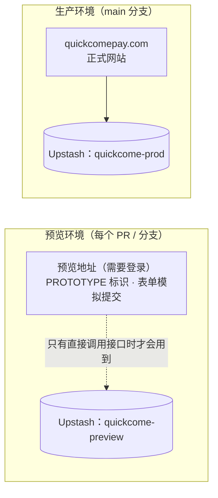

# 《部署方案》v2：Vercel 自动部署
- 版本：v2
- 产出角色：运维工程师
- 状态：⏸ **需要 Amos 在 Vercel 后台完成 §2 的配置**（我没有 Vercel 后台权限）；完成后合并 PR #3，Vercel 会自动上线
- 输入：《架构方案 v2》（已审核通过）、《技术方案 v2》
- 变更历史：v2（2026-09-27）首次创建。v1 的自建服务器方案已停用（D6），v1 文档保留作为历史记录。

## 0. 本次是否涉及基础设施变更
**是。**托管平台从自建服务器改为 Vercel。v1 从来没有上线过，所以**不存在停机和数据迁移的风险**。

合并后，现有 Vercel 生产部署的内容会被替换。那个部署是之前合并 PR #1、#2 时自动产生的，不是正式网站。

## 一图看懂

**图 1：上线前的配置步骤。** 步骤 ① 到 ⑤ 由 Amos 在 Vercel 和 Cloudflare 后台完成；步骤 ⑥ 到 ⑧ 由我们执行，其中 ⑥ 需要 Amos 授权。

```mermaid
flowchart LR
    S1["① 开通 Upstash Redis<br/>生产、预览各一个库<br/>新加坡地域"] --> S2["② 配置邮件<br/>Resend 或 SMTP<br/>+ MAIL_FROM / MAIL_TO"]
    S2 --> S3["③ 添加域名<br/>quickcomepay.com<br/>getquickcome.com 跳转"]
    S3 --> S4["④ Cloudflare 添加解析<br/>设为仅 DNS"]
    S4 --> S5["⑤ 确认预览地址<br/>需要登录才能访问"]
    S5 --> S6["⑥ 合并 PR #3<br/>Vercel 自动上线"]
    S6 --> S7["⑦ 冒烟测试<br/>smoke-prod.sh"]
    S7 --> S8["⑧ 真实提交一次<br/>+ 回滚演练"]
    S8 --> OK(["交 Amos 验收"])

    classDef amos fill:#FFF9DB,stroke:#F5B83D,color:#0B1F3A
    classDef us fill:#E6FCF5,stroke:#0A8F68,color:#0B1F3A
    class S1,S2,S3,S4,S5 amos
    class S6,S7,S8 us
```

**图 2：环境隔离。** 预览环境和生产环境使用不同的数据库，预览环境的表单还是模拟提交，所以不会产生真实线索。

## 1. 环境依赖
| 项目 | 值 |
|---|---|
| Vercel 套餐 | Pro（Amos 已确认） |
| 构建 | 全部由 `vercel.json` 决定：先安装根目录和 `site/` 两处的依赖，再构建网站，输出目录是 `site/dist` |
| Node.js | 22.x。如果 Vercel 项目设置里的 Node 版本不是 22，请在 Project Settings → General → Node.js Version 选择 22.x |
| 函数地域 | `sin1`（新加坡），写在 `vercel.json` 里 |
| 环境变量 | 清单见 `lead-api/.env.example`；§2 说明每一个在哪里配置 |

## 2. Amos 需要在后台完成的配置
| 步骤 | 位置 | 操作 |
|---|---|---|
| ① | Vercel → amos111 项目 → **Storage** → Create Database → **Upstash for Redis** | 创建 `quickcome-prod` 数据库，Primary Region 选 **ap-southeast-1（新加坡）**，Connect 时**只勾选 Production** 环境。 再创建一个 `quickcome-preview` 数据库，只连接 **Preview** 环境。 连接后，Vercel 会自动注入 `KV_REST_API_URL` 和 `KV_REST_API_TOKEN` 两个变量。 |
| ② | Vercel → Project → **Settings → Environment Variables**（选 Production） | 添加 `MAIL_FROM`（例如 `Quick Come Website <no-reply@quickcomepay.com>`）和 `MAIL_TO`（接收线索的邮箱）。然后二选一： **有企业邮箱**：添加 `SMTP_HOST`、`SMTP_PORT`、`SMTP_SECURE`、`SMTP_USER`、`SMTP_PASS` **没有企业邮箱**：注册 Resend，按它的提示在 Cloudflare 添加发件域名的 DNS 验证记录，然后添加 `RESEND_API_KEY` |
| ③ | Vercel → Project → **Settings → Domains** | 添加 `quickcomepay.com`，并按 Vercel 的提示把 `www.quickcomepay.com` 设为跳转到主域名。 再添加 `getquickcome.com` 和 `www.getquickcome.com`，都设为 **Redirect to quickcomepay.com（308）** |
| ④ | Cloudflare → DNS | 按第 ③ 步里 Vercel 显示的记录添加解析（通常是 A 记录 `76.76.21.21`，或者 CNAME 指向 Vercel 给的地址）。**Proxy status 设为 DNS only（灰色云朵）**。等 Vercel Domains 页面显示 Valid Configuration，证书会自动签发。 |
| ⑤ | Vercel → Project → **Settings → Deployment Protection** | 确认 **Vercel Authentication 是开启的**（默认 Standard Protection）。这样预览地址需要登录，而正式域名可以公开访问。 |

⚠️ SMTP 密码、Resend Key 这类敏感信息，**只填在 Vercel 后台**，不要发到对话里，也不要写进仓库。

## 3. 上线步骤（配置完成后）
| 步骤 | 执行人 | 操作 | 预计耗时 |
|---|---|---|---|
| ⑥ | 我（需要 Amos 回复"可以合并"） | 合并 PR #3 到 `main`，Vercel 会自动构建并上线生产 | 2 到 3 分钟 |
| ⑦ | 我 | `bash e2e/smoke-prod.sh https://quickcomepay.com --ratelimit` | 1 分钟 |
| ⑧ | 我和 Amos | 在正式网站上用中英文各提交一次表单，确认收件邮箱收到邮件；在 Vercel 后台演练一次 Instant Rollback，然后再恢复 | 10 分钟 |

## 4. 部署后验证（确认部署成功）
1. **`smoke-prod.sh` 全部显示 ✅：**
   - 16 个页面、404、sitemap 和 robots
   - `/api/health`：存储和邮件都已配置
   - HTTP 跳转 HTTPS
   - 响应头包含 HSTS 和 CSP
   - 没有原型标识
   - 非法提交被拒绝
   - 证书有效期
   - 限流
2. **真实投递：**收件邮箱在 1 分钟内收到邮件，而且没有进垃圾箱。
3. **存储：**在 Vercel → Storage → quickcome-prod → Data Browser 里，能看到 `qc:leads` 列表多了对应的记录，`qc:mail` 列表里对应的发送结果是 `ok: true`。
4. **日志：**Vercel → Project → Logs 里，没有 `MAIL_FAILED` 或 `storage not configured`。

## 5. 回滚方案
| 场景 | 操作 | 耗时 | 影响 |
|---|---|---|---|
| 新版本有问题 | Vercel → Deployments → 选上一个正常的版本 → **Instant Rollback** | 几秒 | 无停机 |
| 想从代码层面撤回 | 在 GitHub 上 revert 那次合并，Vercel 会自动重新部署 | 2 到 3 分钟 | 无停机 |
| 邮件服务故障 | 线索仍然会保存在 Redis 里；修好后执行 `lead-api/scripts/resend-failed.js` 补发 | — | 销售收到通知的时间会延后 |
| 域名解析出问题 | 网站仍然可以通过 Vercel 分配的 `*.vercel.app` 地址访问（需要登录）；修正 Cloudflare 里的记录即可 | 看 DNS 生效时间 | 正式域名暂时无法访问 |

## 6. 风险说明
| 风险 | 防范措施 |
|---|---|
| 预览环境误连生产数据库 | 第 ① 步要求两个数据库分别只连接各自的环境；上线后在 Vercel 的环境变量页面核对一次 |
| 合并时后台还没配置好 | 表单会返回"服务暂时出现问题"，`/api/health` 返回 503，而且线索不会写到错误的地方。所以**先完成 §2，再合并** |
| Cloudflare 开了代理（橙色云朵） | 可能导致证书签发失败或者请求循环跳转。第 ④ 步要求设为"仅 DNS" |

## 7. 已做的验证与没做的验证（如实说明）
| 项目 | 状态 |
|---|---|
| Vercel 构建（静态站点 + 函数） | 见 PR #3 上 Vercel 机器人的构建状态；原型阶段的静态构建已经确认 Ready |
| 函数逻辑 | ✅ 18 个单元测试；端到端测试在模拟 Vercel 的本地环境里通过 |
| 真实的 Upstash、邮件服务、域名、证书 | ⚠️ **还没验证**：需要 Amos 先完成 §2 |

## 8. 运维自检
- [x] 有风险的操作都写了回滚方案
- [x] 有部署后验证步骤（`e2e/smoke-prod.sh`）
- [x] 如实标注了没有在真实环境验证的部分
- [x] 附了配置步骤图和环境隔离图
