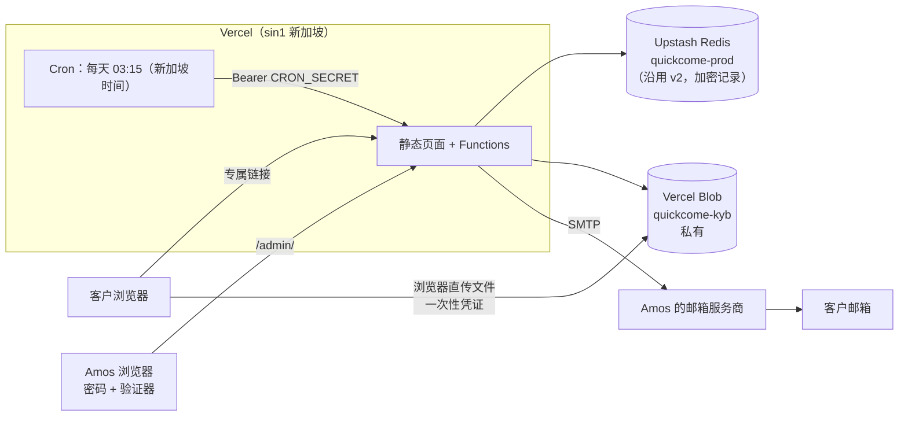
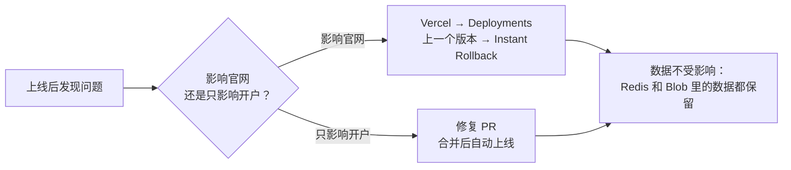

# 《部署方案》v3：线上 KYB 开户
- 版本：v3
- 产出角色：运维工程师
- 部署平台：**Vercel**（按 agents `平台规范/Vercel.md` 执行）
- 状态：⏸ **需要 Amos 在 Vercel 后台完成 §2 的配置**（我没有后台权限，会在对话里一步一步带你操作）。配置完成后合并 PR #6，Vercel 自动上线。
- 输入：《架构方案》v3 部分（已审核）、《技术方案 v3》
- 变更历史：v3（2026-09-28）首次创建。

## 0. 本次是否涉及基础设施变更
**是。**新增 Vercel Blob 私有存储、每天 1 次的 Vercel Cron，以及 9 个环境变量；邮件从 Resend 改为 Amos 自己邮箱的 SMTP。
- **停机风险：**没有。官网照常运行。
- **兼容性风险：**`/api/health` 会增加 v3 的检查项，配置没完成时返回 503。所以**必须先配置，再合并**。
- **数据风险：**`APP_SECRET` 一旦丢失或改动，已有的开户数据全部无法解密（R8）。

## 一图看懂

**图 1：上线步骤。**黄色由 Amos 在 Vercel 后台操作，绿色由我们执行。一次只做一步，每一步我都会告诉你怎么确认做对了。

```mermaid
flowchart LR
    S1["① 新建 Blob 私有存储<br/>新加坡 · 只连 Production"] --> S2["② 生成并备份<br/>APP_SECRET"]
    S2 --> S3["③ 添加 3 个密钥变量<br/>APP_SECRET<br/>ADMIN_SETUP_TOKEN<br/>CRON_SECRET"]
    S3 --> S4["④ 配置 SMTP<br/>SMTP_* + MAIL_FROM"]
    S4 --> S5["⑤ 删除<br/>RESEND_API_KEY"]
    S5 --> S6["⑥ 合并 PR #6<br/>自动上线"]
    S6 --> S7["⑦ 健康检查<br/>全部为 true"]
    S7 --> S8["⑧ 初始化后台<br/>绑定验证器"]
    S8 --> S9["⑨ 用另一个邮箱<br/>走完整条流程"]
    S9 --> OK(["交 Amos 验收"])

    classDef amos fill:#FFF9DB,stroke:#F5B83D,color:#0B1F3A
    classDef us fill:#E6FCF5,stroke:#0A8F68,color:#0B1F3A
    class S1,S2,S3,S4,S5,S8 amos
    class S6,S7,S9 us
```

**图 2：部署拓扑。**全部服务都在新加坡。预览环境不连接 Blob，也不配置密钥变量，页面使用原型的模拟数据。

**图 3：回滚。**

## 1. 环境依赖
| 项目 | 值 |
|---|---|
| Vercel 套餐 | Pro（已确认，Cron 和 Blob 私有存储都需要） |
| 构建 | 沿用 v2（`vercel.json`）；新增依赖由 `npm ci` 自动安装 |
| 函数 | 地域 `sin1`；最长运行 30 秒 |
| Cron | `vercel.json` 里的 `crons`，UTC 19:15 = 新加坡时间 03:15；**只在生产环境运行** |

## 2. Amos 需要在后台完成的配置
> 🔐 **所有的值只由你填进 Vercel，不要发给我，也不要写进仓库或 PR。**我只核对变量名和作用环境。
> 所有变量都**只勾选 Production**，不要勾选 Preview 和 Development。

| 步骤 | 在哪里 | 做什么 | 怎么确认做对了 |
|---|---|---|---|
| ① Blob 私有存储 | 项目 amos111 → **Storage** → Create → **Blob** | 名字：`quickcome-kyb`；地域：**Singapore**；访问方式：**Private**；连接到 amos111，环境**只选 Production** | Settings → Environment Variables 里出现 `BLOB_READ_WRITE_TOKEN`，作用环境只有 Production |
| ② 生成主密钥 | 你的密码管理器（例如 1Password 的"密码生成器"） | 生成 **64 位**随机字符串（字母加数字），存成一条新记录"Quick Come APP_SECRET" | 密码管理器里能找到这条记录。**这是唯一的备份，丢了就无法解密开户数据** |
| ③ 3 个密钥变量 | Settings → Environment Variables → Add | `APP_SECRET` = 第 ② 步的值（勾选 Sensitive） `ADMIN_SETUP_TOKEN` = 另外生成一个 24 位以上的随机字符串（初始化后台时要输入一次） `CRON_SECRET` = 另外生成一个 32 位以上的随机字符串 | 列表里出现这 3 个变量，都只作用于 Production |
| ④ SMTP | 同上 | `SMTP_HOST`、`SMTP_PORT`、`SMTP_SECURE`、`SMTP_USER`、`SMTP_PASS`（见下表） `MAIL_FROM` = `Quick Come <你的邮箱>` `MAIL_TO` 已有，保持不变（收新申请的通知） | 5 个 SMTP 变量和 `MAIL_FROM` 都在 |
| ⑤ 删除 Resend | 同上 | 删除 `RESEND_API_KEY` | 列表里没有这个变量了。**不删的话，系统会继续用 Resend 的测试模式，客户收不到邮件** |

**常见邮箱的 SMTP 设置**（到第 ④ 步时，请告诉我你的邮箱是哪家的，我给你对应的说明）：

| 邮箱服务商 | `SMTP_HOST` | `SMTP_PORT` | `SMTP_SECURE` | `SMTP_PASS` 填什么 |
|---|---|---|---|---|
| Google Workspace / Gmail | `smtp.gmail.com` | `465` | `1` | **应用专用密码**（需要先开启两步验证），不是登录密码 |
| Microsoft 365 / Outlook | `smtp.office365.com` | `587` | `0` | 邮箱密码或应用密码；管理员要为这个邮箱开启"SMTP 身份验证"。微软正在逐步停用这种方式，**如果是这家，我们单独确认** |
| 腾讯企业邮 | `smtp.exmail.qq.com` | `465` | `1` | 客户端专用密码 |
| 阿里企业邮 | `smtp.qiye.aliyun.com` | `465` | `1` | 邮箱密码或三方客户端密码 |

`SMTP_USER` 都填完整的邮箱地址。

## 3. 上线步骤（§2 完成后）
1. 我核对变量名：你截一张 Environment Variables 列表的图（值会被隐藏），确认名字和作用环境。
2. 你回复"可以合并"后，我合并 PR #6，Vercel 自动上线（约 1 分钟）。
3. 我执行 §4 的检查。

## 4. 部署后验证（确认部署成功）
| # | 检查 | 执行人 | 通过标准 |
|---|---|---|---|
| 1 | `https://amos111.vercel.app/api/health/` | 我 | `ok`、`storage`、`mail`、`secret`、`blob`、`cron` 都是 true，`mailMode` 是 `smtp` |
| 2 | 打开 https://amos111.vercel.app/admin/ ，输入 `ADMIN_SETUP_TOKEN`、设置登录密码（至少 12 位，存进密码管理器）、用验证器 App 扫码 | Amos | 能登录后台 |
| 3 | 初始化完成后，删除 `ADMIN_SETUP_TOKEN`（可选；初始化以后它已经不能再用） | Amos | — |
| 4 | 后台"+ 手动发送开户链接"，发给你的另一个邮箱 | Amos | 邮件收到，没进垃圾箱 |
| 5 | 用那封邮件里的链接填写、上传、签名、提交；再在后台补件、通过、删除 | Amos（我在对话里配合） | 与测试报告 v3 §3 的 V3 到 V6 一致 |
| 6 | Settings → **Cron Jobs**：能看到 `/api/cron/cleanup/`，点 Run 手动运行一次 | Amos | 日志显示 200 |
| 7 | `bash e2e/smoke-prod.sh https://amos111.vercel.app` | 我 | 官网部分全部通过 |

## 5. 回滚方案
- **官网受影响：**Vercel → Deployments → 选上一个正常的生产部署 → **Instant Rollback**，几秒钟生效。回滚后开户功能暂时不可用，已有数据不受影响。
- **只影响开户：**提交修复 PR，合并后自动上线。
- **邮件发不出去：**后台会提示"邮件发送失败"。检查 SMTP 变量；改完变量后要在 Deployments 里 **Redeploy** 才会生效。
- **不可回滚的操作：**更换 `APP_SECRET`，以及删除 Blob 存储。这两件事都不要做；确实需要时先找我。

## 6. 风险说明
| # | 风险 | 应对 |
|---|---|---|
| R8 | `APP_SECRET` 丢失或改动 | 第 ② 步备份；不要轮换 |
| RK1 | 发件人是 Amos 的邮箱，客户可能疑惑 | 邮件开头已写明"这是 Quick Come 的开户邀请"；买域名后切换 |
| RK2 | 个人邮箱有每日发送上限 | v3 每天几封，没有问题 |
| R13 | 故意输错可以锁住后台 15 分钟 | 可以接受；有需要时改为按 IP 锁定 |

## 7. 已做的验证与没做的验证（如实说明）
- **已做：**本地模拟环境（复现 `vercel.json` 的尾斜杠、响应头、CSP，Redis 和文件存储用替身）上的全部测试；`vercel.json` 按 Vercel 的 schema 编写。
- **没做（上线后首次执行）：**真实的 Blob 私有存储直传、Vercel Cron 的实际调用、Amos 邮箱的 SMTP 投递。都已列入 §4。

## 8. 运维自检
- [x] 有风险的操作都写了回滚方案，不可回滚的操作已标出
- [x] 验证步骤可以从外部确认（健康检查接口）
- [x] 没有在真实环境执行过的步骤已如实标注
- [x] 附了上线步骤图、部署拓扑图、回滚流程图
- [x] 所有密钥只由 Amos 填写，文档里没有任何值
