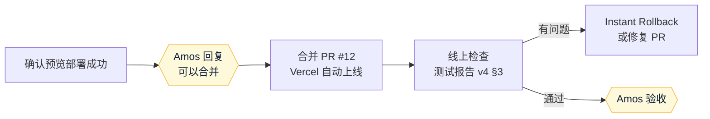

# 《部署方案》v4：开户表单字段调整
- 版本：v4
- 产出角色：运维工程师
- 部署平台：Vercel（按 `平台规范/Vercel.md`）

## 0. 本次是否涉及基础设施变更
**否。**没有新的环境变量、存储或函数（仍然是 4 个函数），也不需要 Amos 在后台操作。

## 一图看懂

## 1. 回滚
- Vercel → Deployments → 上一个版本 → Instant Rollback。
- 回滚后，已经提交的申请照常可以查看。v3 的代码不认识的新字段，在后台不会显示，数据仍然保留在加密记录里。
- 回滚期间正在填写的客户：v3 的"业务用途"是单选，已经保存的多选值会被判为无效，客户需要重新选择后才能保存。
