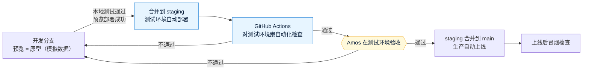
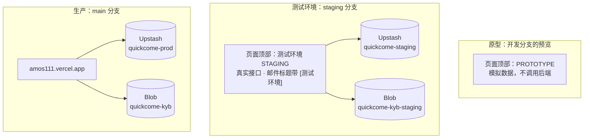

# 《部署方案》v5：新增测试环境（staging）
- 版本：v5
- 产出角色：运维工程师（研发补充了代码改动部分，§3）
- 部署平台：Vercel **Hobby（免费版）**，按 `平台规范/Vercel.md` 执行
- 状态：⏸ **等 Amos 确认方案**。确认后先做 §3 的代码改动，再带 Amos 按 §2 一步一步配置
- 来源：Amos 提出"测试环境验收通过后再上生产，避免把问题直接带到生产环境"（2026-09-28），回复"按建议"
- 日期：2026-09-28

## 0. 本次是否涉及基础设施变更
**是。**新增一个测试环境，包括：
- 独立的数据库、文件存储和密钥。
- 一条自动化测试流水线。

生产环境不变，**不停机**。

## 一图看懂

**图 1：以后的上线流程。**验收从生产环境移到测试环境。

**图 2：三个环境互相隔离。**

## 1. 测试环境是什么样的
| 项目 | 测试环境 | 生产环境 |
|---|---|---|
| 分支 | `staging` | `main` |
| 地址 | https://amos111-git-staging-jeffzhaifei-3827s-projects.vercel.app/ （以 Vercel 实际生成的为准，我会给完整链接） | https://amos111.vercel.app |
| 访问 | 需要登录 Vercel（和现在的预览环境一样） | 公开 |
| 数据库、文件存储 | **独立的**一套 | 现有的一套 |
| 密钥 | **独立的** `APP_SECRET`、`ADMIN_SETUP_TOKEN` | 现有的 |
| 邮件 | 真的发送，标题前面加上 **"[测试环境]"** | 正常发送 |
| 后台账号 | 需要单独初始化一次（独立的密码和验证码） | 现有的 |
| 定时清理 | 不运行（Vercel Cron 只在生产环境运行），测试数据用后台手动删除 | 每天运行 |
| 页面标识 | 顶部显示"测试环境 STAGING" | 没有标识 |

## 2. Amos 需要做的一次性配置（确认方案后，我一步一步带你做）
> 🔐 所有值都只由你填写，不发给我。

| 步骤 | 做什么 | 作用环境 |
|---|---|---|
| ① | Storage → 新建 Upstash Redis：名字 `quickcome-staging`，地域 Singapore | **只勾 Preview** |
| ② | Storage → 新建 Blob：名字 `quickcome-kyb-staging`，Private，Singapore；另外创建一个读写令牌，填进 `BLOB_READ_WRITE_TOKEN` | **只勾 Preview** |
| ③ | Environment Variables：`APP_ENV=staging`，以及**新生成**的 `APP_SECRET`、`ADMIN_SETUP_TOKEN` | Preview，**分支选 `staging`** |
| ④ | Environment Variables：`SMTP_HOST`、`SMTP_PORT`、`SMTP_SECURE`、`SMTP_USER`、`SMTP_PASS`、`MAIL_FROM`、`MAIL_TO`，值和生产相同（建议在 QQ 邮箱里**另外生成一个授权码**给测试环境用，这样可以单独停用） | Preview，分支选 `staging` |
| ⑤ | Settings → Deployment Protection → **Protection Bypass for Automation** → 生成令牌 | — |
| ⑥ | 把第 ⑤ 步的令牌存进 **GitHub** 仓库 amos111 → Settings → Secrets and variables → Actions，名字 `VERCEL_BYPASS_TOKEN` | — |

**为什么这样安排：**自动化检查在 GitHub Actions 里运行，由 GitHub 读取第 ⑥ 步的令牌访问测试环境，我只看检查结果，**令牌不经过我**。

**需要先确认的一点（按 v0.5 C27，不推断）：**免费版里是否有"Protection Bypass for Automation"这个选项，到第 ⑤ 步时请你截图确认。如果没有，自动化检查改为只检查公开可访问的项目，其余由你在验收时覆盖。

## 3. 代码改动（研发）
| # | 改动 | 原因 |
|---|---|---|
| S1 | 新增 `APP_ENV=staging` 的判断：测试环境**关闭原型模式**，使用真实接口；页面顶部显示"测试环境 STAGING"；全部页面 noindex | 现在预览环境都是原型模式。测试环境要测真实的后端，同时不能被搜索引擎收录 |
| S2 | 测试环境发出的邮件，标题前面加上"[测试环境]" | 避免和生产邮件混淆 |
| S3 | 健康检查新增 `env` 一项（`production`、`staging`）；测试环境不要求 `cron` | 一眼就能看出连的是哪个环境；测试环境没有定时任务 |
| S4 | 新增 `e2e/smoke-staging.sh` 和 GitHub Actions 流水线：`staging` 分支每次部署成功后，自动带上令牌检查测试环境。检查内容：健康检查（`env` 必须是 `staging`）、全部页面、安全响应头、接口的安全行为（401、403、404）、开户页是真实模式而不是原型 | 自动发现"本地正常、平台上出错"的问题（v3 的 BUG-K6 到 K8 这类） |
| S5 | 单元测试和端到端测试覆盖 S1 到 S3 | — |

**自动化检查做不到的部分，由 Amos 在测试环境验收：**
- 后台登录（需要你的验证码）。
- 真实收发邮件。
- 真实上传文件。

## 4. 以后每次上线的步骤
1. 开发完成，本地测试通过，开发分支的预览部署成功。
2. 我把改动合并到 `staging`，测试环境自动部署，GitHub Actions 自动检查。
3. 检查通过后，我把测试环境的**完整链接**发给你，你在测试环境验收。
4. 你回复"验收通过"后，我把 `staging` 合并到 `main`，生产自动上线。
5. 上线后，我跑一次生产冒烟检查。

## 5. 风险与说明
| # | 内容 | 应对 |
|---|---|---|
| R14 | Vercel 免费版的存储集成只能按"Preview"整体连接，其他开发分支的预览部署也能访问测试环境的数据库 | 开发分支的预览是原型模式，页面不会调用后端；测试数据库里只放测试数据 |
| R15 | 测试环境会真的发邮件 | 只用你自己的测试邮箱；邮件标题带"[测试环境]" |
| R16 | Upstash 和 Blob 的免费额度 | 测试环境的数据量很小，远低于免费额度 |
| R17 | Bypass 令牌可以绕过测试环境的登录保护 | 只存在 GitHub Secrets 里；需要时可以在 Vercel 里重新生成，旧令牌立即失效 |

## 6. 回滚
- 测试环境出问题，不影响生产。
- 如果不想要测试环境了：删掉 `staging` 分支和相关的 Preview 变量即可，生产环境不受影响。

## 7. 运维自检
- [x] 写明了本次的基础设施变更，以及不停机
- [x] 所有密钥都由 Amos 填写，不经过 AI
- [x] 免费版是否有这个功能，写明了要先确认（C27）
- [x] 附了上线流程图、环境隔离图
