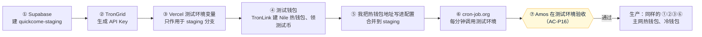

# 《部署方案》v6：稳定币收付款
- 版本：v6
- 产出角色：运维工程师
- 部署平台：Vercel **Hobby（免费版）**，按 `平台规范/Vercel.md` 执行；数据库 Supabase（免费版）；链上 TronGrid；定时 cron-job.org
- 状态：✅ **测试环境已配置**（2026-09-30，staging 自动检查全部通过）；⏳ 生产在测试环境验收通过后配置
- 输入：《架构方案 v6》§3、《实现说明 v6》
- 日期：2026-09-29

## 0. 本次是否涉及基础设施变更
**是。**新增：
- 数据库：Supabase，生产和测试环境各一个。
- 定时任务：cron-job.org，每分钟调用 `api/tick`。
- TronGrid：一个 API Key。
- 5 个新函数（共 9 个）。

**不停机**：没有配置数据库之前，新接口只返回 503，官网和开户照常运行。

## 一图看懂：先配测试环境，验收通过后再配生产

## 1. 各环境的配置
| 项目 | 测试环境（staging） | 生产（main） |
|---|---|---|
| 数据库 | Supabase 项目 `quickcome-staging`，新加坡 | Supabase 项目 `quickcome-prod`，新加坡 |
| 网络 | TRON **Nile 测试网**（`TRON_NETWORK=nile`），只有测试币 | TRON 主网（`TRON_NETWORK=mainnet`） |
| 助记词、热钱包 | **单独的测试助记词和测试热钱包**，泄露了也没关系 | 正式的，按 R18 保管 |
| 热钱包、冷钱包地址 | `config/wallets.json` 的 `staging` | `config/wallets.json` 的 `production` |
| 定时任务 | cron-job.org 任务 2（带测试环境的访问令牌） | cron-job.org 任务 1 |

## 2. Amos 要做的配置（测试环境；我一步一步带你做）
> 🔐 所有密码、令牌、私钥、助记词都只由你填写，不发给我。钱包**地址**是公开信息，可以发给我。

| 步骤 | 做什么 | 填到哪里 |
|---|---|---|
| ① | 在 supabase.com 注册，新建项目 `quickcome-staging`，地域选 Singapore，数据库密码用密码管理器生成。建好后点 **Connect**，复制 **Transaction pooler** 的连接串（端口 6543），把里面的 `[YOUR-PASSWORD]` 换成刚才的密码 | Vercel 变量 `DATABASE_URL`，**只作用于 staging 分支** |
| ② | 在 trongrid.io 注册，创建一个 API Key | Vercel 变量 `TRONGRID_API_KEY`（staging 分支；生产以后用同一个） |
| ③ | Vercel 变量：`TRON_NETWORK` = `nile`；`TICK_SECRET` = 密码管理器新生成的 32 位以上随机字符串 | 只作用于 staging 分支 |
| ④ | 在 TronLink（浏览器插件）里**新建一个测试钱包**当热钱包，切换到 Nile 测试网，在 Nile 的测试币页面领取测试 TRX 和测试 USDT。**把这个钱包的地址发给我**（地址是公开的；私钥不要发）。冷钱包可以先不配 | 地址发给我，我写进 `config/wallets.json` |
| ⑤ | 我把地址写进配置，合并到 `staging`，测试环境自动部署，GitHub Actions 自动检查 | — |
| ⑥ | 在 cron-job.org 注册，新建任务：地址 `https://amos111-git-staging-jeffzhaifei-3827s-projects.vercel.app/api/tick/`，每分钟一次；请求头加两个：`Authorization: Bearer <TICK_SECRET>`、`x-vercel-protection-bypass: <v5 的绕过令牌>`；打开"连续失败时通知" | cron-job.org |

**第 ④ 步需要先确认的一点（C27，不推断）：**Nile 的测试币页面是否能领到测试 USDT，到时请你截图。如果领不到，我们再换别的办法。

## 3. 代码里的变化（研发已完成）
| # | 内容 |
|---|---|
| S1 | 新函数 `api/v1`、`merchant`、`pay`、`wallet`、`tick`；`vercel.json` 增加 `/api/v1/*` 和 `/pay/*` 的改写规则 |
| S2 | 数据库建表：第一次请求时自动执行，可以重复执行 |
| S3 | 健康检查增加 `pay`：数据库、网络、TronGrid Key、定时任务口令是否已配置（只返回"是否"，不返回值） |
| S4 | 测试环境的自动检查增加 12 项 v6 检查（新页面、新接口的 401 和 404、连的是 Nile、链上监控 5 分钟内运行过） |
| S5 | 每日任务并入现有的 `cron/cleanup`：对账、其他代币检查、提醒 |
| S6 | GitHub Actions `tick-watch`：每 15 分钟检查一次生产的链上监控；收付款还没在生产配置时自动跳过 |

## 3.1 配置过程中遇到的问题
| # | 问题 | 处理 |
|---|---|---|
| 1 | Supabase 的 Connect 默认显示 Framework 页，找不到 Transaction pooler | 在 **Direct** 页选择 Transaction pooler |
| 2 | 数据库密码被拒绝（`db_auth`） | 重置为只含字母和数字的密码；测试环境的 503 返回里增加了原因代码（不含配置值），方便排查。改密码后连接池要 1～2 分钟才生效 |
| 3 | 开放 API 在线上返回 404（BUG-P4） | 改写规则改为 `/api/v1/(.*)`，用 `vercel build` 的路由表确认 |
| 4 | 链上监控返回 200，但运行记录读不出来（BUG-P5） | 修正 jsonb 的读写；以后测试也在真实 Postgres 上运行 |
| 5 | cron-job.org 的任务只执行了一次 | 在任务列表里重新启用任务 |

## 4. 风险与说明
| # | 内容 | 应对 |
|---|---|---|
| R25 | cron-job.org 上存着测试环境的访问令牌 | 只能访问测试环境；需要时在 Vercel 重新生成，旧令牌立即失效（v5 R17） |
| R26 | 测试助记词在测试环境后台生成，只用于测试网 | 页面上会提示"测试环境"；**生产的助记词在生产后台重新生成**，不要复用测试的 |
| R27 | 免费版的 Supabase 项目 7 天没有访问会暂停 | 每分钟都有任务访问，不会暂停 |

## 5. 回滚
- 测试环境出问题：不影响生产。
- 生产出问题：在 Vercel 里删掉 `DATABASE_URL`，收付款接口马上变成 503（维护中），官网和开户照常；资金都在链上，账本在数据库里，不会丢。

## 6. 运维自检
- [x] 写明了基础设施变更和不停机
- [x] 所有密钥都由 Amos 填写，不经过 AI
- [x] 需要先确认的一点已写明（C27）
- [x] 附了配置流程图
