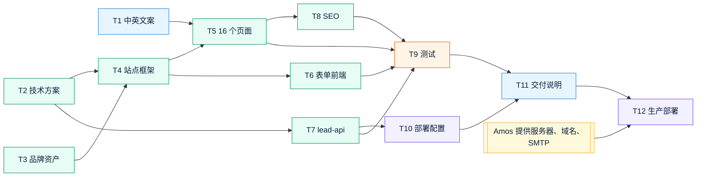

# v1 任务清单：Quick Come 官网
- 版本：v1
- 产出角色：产品经理
- 依据：《v1-需求说明书》《00-架构方案》（Amos 2026-09-27 审核通过，全部按默认）
- 变更历史：v1（2026-09-27）首次创建
- 变更历史（续）：v1.1（2026-09-27）按 agents v0.2 的可视化规范补图：新增"一图看懂"一节，正文没有改动

## 一图看懂
**图：任务依赖关系。** 箭头表示"完成后才能开始"，颜色区分负责角色。T12 还要等 Amos 提供生产资源。

图例：🔵 PM 🟢 研发 🟠 测试 🟣 运维 🟡 Amos

## 已确认的决定（来自审核）
| 事项 | 决定 |
|---|---|
| 品牌名 | 保留 Quick Come，Logo 写作 QuickCome |
| 品牌方向 | 色系、Logo 方向认可；域名 quickcomepay.com 认可 |
| 中国大陆 | 不做技术屏蔽，只在页面上声明 |
| 中文版本 | 简体中文 |
| 服务器 | 新加坡，前面加 Cloudflare |
| 线索备份 | 先做本机加密备份 |

## 任务
| ID | 任务 | 负责人 | 依赖 | 优先级 | 对应需求 |
|---|---|---|---|---|---|
| T1 | 中英文案起草：写入 `site/src/i18n/*.json` 的文案字段 | PM | — | P0 | F1、F2、F4、AC8、AC9 |
| T2 | 技术方案细化：`技术方案/v1-技术方案.md` | 研发 | 架构方案 | P0 | 全部 |
| T3 | 品牌资产：SVG Logo、图标、favicon、分享预览图 | 研发 | — | P0 | 需求说明书 §4 |
| T4 | 站点框架：布局、页头、页脚、语言切换、色系、深色模式、响应式 | 研发 | T2、T3 | P0 | F2、AC2、AC3、AC9 |
| T5 | 8 类页面，每类中英两版，共 16 页 | 研发 | T1、T4 | P0 | F1、AC1、AC4 |
| T6 | 联系表单前端，含校验和提交状态 | 研发 | T4 | P0 | F3、AC5 |
| T7 | lead-api：校验、限流、蜜罐、JSONL 存储、SMTP 发送、健康检查，附单元测试 | 研发 | T2 | P0 | F3、AC5、AC6、AC7 |
| T8 | SEO：标题和描述、语言互指标注、sitemap、robots | 研发 | T5 | P1 | F5、AC11 |
| T9 | 测试用例设计与执行（端到端、表单、Lighthouse、文案扫描），产出《测试报告》 | 测试 | T5–T8 | P0 | AC1–AC11 |
| T10 | 部署配置（Nginx、systemd、发布和回滚脚本、服务器初始化脚本），产出《部署方案》 | 运维 | T7 | P0 | AC12 |
| T11 | 汇总《交付说明 v1》 | PM | T9、T10 | P0 | — |
| T12 | 生产部署与部署后验证 | 运维 | Amos 提供服务器、域名、SMTP 账号、收件邮箱 | P0 | AC12、AC6 |

## 交接说明
- **T1 文案：** PM 只填写 JSON 中的文案内容，不改文件结构。JSON 的键名结构由研发在 T4 定义。
- **T9 测试：** 测试同时拿到需求说明书 §5 的验收标准和研发的实现说明。
- **T12 部署：** 部署完成后，运维按《部署方案》中的验证步骤逐项确认，再交 Amos 验收。
