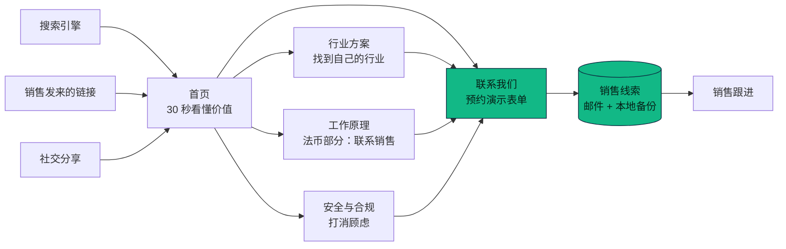
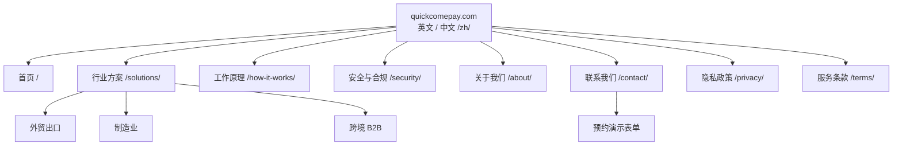

# 《需求说明书》v1：Quick Come 官网
- 版本：v1
- 产出角色：产品经理
- 状态：✅ Amos 已于 2026-09-27 审核通过；v1.1 补充了验收口径的澄清
- 依据：`需求文档/v1-需求澄清问题.md`，以及 Amos 2026-09-27 的回复
- 变更历史：
  - v1（2026-09-27）首次创建，没有上一版可对比
  - v1.1（2026-09-27）新增 §8，回复测试提出的 AC4、AC8 口径问题。验收标准本身没有改动，只是写明了判定口径
  - v1.2（2026-09-27）按 agents v0.2 的可视化规范补图：新增"一图看懂"一节，正文没有改动

---

## 一图看懂
**图 1：访客旅程。** 访客从哪里来、在网站上怎么走、最后怎样变成销售线索。

**图 2：站点地图。** 8 类页面，每类都有英文（根路径）和中文（`/zh/`）两版，共 16 页；每页都有"预约演示"入口和统一的合规页脚。

**图 3：首页效果。** 页面结构以此图为准。v1 补图时开发已经完成，所以直接用实际效果图代替线框图。

---

## 1. 背景与目标
Quick Come 是一个面向传统行业企业的稳定币收款服务。本官网用来让海外的外贸出口商、制造商和跨境 B2B 贸易商理解这套方案，并主动留下联系方式，预约演示或联系销售。

**目标：**
1. 访客能在 30 秒内看懂三件事：Quick Come 是什么、能帮我解决什么问题、下一步该做什么。
2. 把访问转化成可跟进的销售线索，也就是"预约演示 / 联系销售"表单的提交。
3. 建立专业、可信、合规的品牌第一印象。传统行业客户对"加密"天然有顾虑。

## 2. 目标用户与使用场景
| 用户 | 典型身份 | 痛点 | 在官网上想得到什么 |
|---|---|---|---|
| U1 外贸出口商 | 中小型出口企业的老板或财务负责人 | 跨境电汇慢（2 到 5 天）、中间行扣费、部分国家的买家付款难 | 确认能更快、更便宜地收到海外货款 |
| U2 制造商 | 有海外分销商的工厂 | 账期长，汇款到账时间不确定 | 确认资金的安全性和可追溯性 |
| U3 跨境 B2B 贸易商 | 多国家、多币种交易 | 对账复杂，要维护多个银行通道 | 统一收款、清晰的对账记录 |

**场景：**
- **S1：** 访客从搜索或销售发来的链接进入首页，读完卖点后点"预约演示"，填表提交。
- **S2：** 访客在"解决方案"页找到自己的行业，了解具体怎么用，然后提交表单。
- **S3：** 访客担心安全和合规，进入"安全与合规"页查看，再决定是否联系。
- **S4：** 访客问到法币出金或费率，页面引导其联系销售。
- **S5：** 中文访客切换到中文版，浏览同样的内容。

## 3. 范围

### 3.1 做什么（v1 范围）
**F1：页面（共 6 个，每个都有中英两版，合计 12 个页面）**
| 页面 | 核心内容 |
|---|---|
| 首页 | 价值主张、3 到 4 个核心卖点、"传统电汇 vs Quick Come"对比、收款流程简图、适用行业入口、信任要素、行动按钮 |
| 行业解决方案 | 外贸出口、制造业、跨境 B2B 三个行业，每个行业写清痛点、方案和收益 |
| 工作原理 | 从开户、生成收款地址或账单、买家支付、到账，到后续处理（法币部分注明"与销售协商"）；支持的币种和链 |
| 安全与合规 | 资金安全措施、KYC/KYB 流程说明、风险提示；v1 只写公司主体，不写牌照 |
| 关于我们 | 品牌使命、公司主体信息 |
| 联系我们 | 预约演示 / 联系销售表单 |

**F2：全站通用**
- 顶部导航、语言切换（EN / 中文）、页脚。
- 页脚包含：风险提示、隐私政策、服务条款、"不面向中国大陆提供服务"的声明。
- 隐私政策和服务条款各自做成独立页面，同样中英两版。
- 每个页面都有"预约演示"的主按钮入口。

**F3：线索表单**
- **字段：**
  - 必填：姓名、公司名称、工作邮箱、国家或地区、所属行业（下拉）。
  - 选填：月均收款规模（区间下拉）、电话或 WhatsApp、留言。
  - 必须勾选同意隐私政策。
- 提交成功后显示感谢提示；提交失败时显示明确的错误原因，并支持重试。
- 每条线索都发送到指定邮箱，同时在服务器本地保存一份备份。
- 防止垃圾提交。

**F4：币种与链的展示口径**
- 币种：USDT、USDC。
- 链：TRON、Ethereum 等主流链。具体清单以研发和销售确认后的为准，页面写"主流公链"加代表性链名。
- 所有法币相关内容（法币出金、换汇、费率、到账时间）一律写"与销售协商 / Contact sales"，不出现任何具体数字承诺。

**F5：SEO 基础**
- 每个页面有独立的标题和描述。
- 提供 sitemap 和 robots 文件。
- 中英页面互相标注对应的语言版本。
- 社交分享时显示卡片预览。

**F6：统计**
- 预留统计代码的接入位，v1 不接入任何统计平台。

### 3.2 明确不做（v1）
- 不做 CMS 或内容管理后台，文案改动走代码发版。
- 不做博客、新闻、案例库。
- 不做客户登录、商户控制台。
- 不做真实收款演示或在线支付。
- 不公开费率计算器，不公开法币相关的具体数字。
- 不做中国大陆市场的推广和适配：不做 ICP 备案，不使用大陆 CDN。
- 不接入 CRM，不做线索管理界面。
- 除中英文外不做其他语言。

## 4. 品牌方案（PM 提案，待 Amos 确认）
> 说明：Amos 要求品牌 Logo、色系、域名由我们来定。协作总则里没有设计师角色，所以由 PM 提品牌方向，研发按此实现 SVG Logo 和样式。

### 4.1 名称与定位
- **品牌名：** Quick Come。
  - Logo 文字用连写形式 **QuickCome**。
  - 正文首次出现时写作 "Quick Come"。
- **英文标语：** *Get paid across borders in minutes, not days.*
- **中文标语：** 跨境收款，分钟到账。

### 4.2 色系
| 用途 | 颜色 | 含义 |
|---|---|---|
| 主色 | 深海军蓝 `#0B1F3A` | 稳重、可信，贴合传统行业 |
| 强调色 | 翡翠绿 `#12B886` | 资金、快速、正向 |
| 辅助色 | 暖金 `#F5B83D` | 仅用于少量高亮 |
| 中性色 | `#F6F8FB` 背景、`#5B6B7F` 正文次要文字 | 保证可读性 |

- 支持深色模式：浏览器开启深色时自动适配。

### 4.3 Logo
- 图形：一个圆形硬币，里面是一个向右的双箭头"»"，寓意快速到达。旁边是 QuickCome 字标。
- 交付物：SVG 矢量格式，包含横版、方形图标和浏览器标签页小图标（favicon）。

### 4.4 域名建议
| 优先级 | 域名 | 注册状态（2026-09-27 通过 Verisign 官方注册数据查询） |
|---|---|---|
| 首选 | **quickcomepay.com** | 未注册，可购买 |
| 备选 | getquickcome.com | 未注册，可购买 |
| — | quickcome.com | ❌ 已被注册 |

- 以上注册状态是当天的查询结果，购买前请再确认一次。
- 建议同时购买首选和备选两个域名，备选的做 301 跳转到首选，防止被抢注。

### 4.5 ⚠️ PM 对品牌名的风险反馈（需 Amos 决定）
- **问题：** 在英语母语者中，"come" 单独使用时有俚语歧义，"Quick Come" 在语法上也不太自然。面向海外 B2B 客户时，可能影响专业感。
- **可选方案：**
  - (a) 维持 **Quick Come**，用连写 **QuickCome** 加 "Pay" 语境来弱化歧义（本方案的默认做法）。
  - (b) 英文市场改用 QuickComePay 作为品牌名。
  - (c) 另外换名。
- PM 不擅自改名，品牌名以 Amos 的决定为准。

## 5. 验收标准（可衡量）
| # | 验收标准 |
|---|---|
| AC1 | 第 3.1 节列出的 6 个页面、隐私政策和服务条款页，中英两版全部可以访问（合计 16 个页面），没有死链。 |
| AC2 | 任意页面都能通过语言切换跳到另一种语言的对应页面，不会回到首页。 |
| AC3 | 在 375px、768px、1280px 三种宽度下，页面没有横向滚动条，文字和按钮没有重叠或溢出。 |
| AC4 | 每个页面在首屏或导航里都能直接点到"预约演示"入口。 |
| AC5 | 表单必填项漏填或邮箱格式错误时，前端阻止提交并在对应字段旁提示；即使绕过前端直接请求，服务端也会拒绝并返回错误。 |
| AC6 | 合法提交后：页面显示成功提示，服务器本地备份新增 1 条记录，指定邮箱收到 1 封包含全部字段的邮件（测试环境里以 SMTP 调用成功为准）。 |
| AC7 | 同一个 IP 在 10 分钟内提交超过 5 次会被拒绝；触发机器人陷阱字段的提交不会被保存。 |
| AC8 | 全站文字里没有出现任何法币费率、法币到账时间的具体数字；所有法币相关位置都写"与销售协商 / Contact sales"。 |
| AC9 | 每个页面的页脚都有：风险提示、隐私政策链接、服务条款链接、不面向中国大陆的声明。 |
| AC10 | 首页和联系页用 Lighthouse 移动端检测：性能 ≥ 85，可访问性 ≥ 90，SEO ≥ 90，最佳实践 ≥ 90。 |
| AC11 | 每个页面都有独立的标题和描述，以及中英互指的语言版本标注；sitemap 和 robots 文件都可以访问。 |
| AC12 | 部署到生产后，通过 HTTPS 正常访问，HTTP 自动跳转到 HTTPS，证书有效并能自动续期。 |

## 6. 交接
- **交给研发：** 本说明书，作为《00-架构方案》技术部分的输入。
- **交给测试：** 第 5 节验收标准和第 2 节使用场景。
- **交给运维：** 需要用到服务器、域名、HTTPS、邮件发送、线索备份和安全的需求点，包括 F3、AC6、AC7、AC12。
- **v1 文案：** 由 PM 在任务阶段起草中英文案，交 Amos 审核后定稿。

## 7. PM 自检
- [x] 需求边界写明了"做什么 / 不做什么"（第 3 节）
- [x] 验收标准可衡量（第 5 节，共 12 条）
- [x] 变更点：v1 为首版，无上一版可对比

## 8. 验收口径澄清（v1.1，PM 回复测试报告 §5）
| 测试的问题 | PM 的口径 |
|---|---|
| Q1：AC8 是否限制表单里的"月均收款规模"金额区间，以及"365 days a year" | **不限制。** AC8 只约束法币的**费率、手续费、到账时效和兑换价格**这几类数字。客户自己选的规模档位、服务可用时间都不在范围内。 |
| Q2：稳定币"通常几分钟"的链上确认时间，以及电汇"数个工作日"这类没有具体数字的描述 | **不违反 AC8。** 前者说的是链上确认，不是法币到账；后者没有具体数字。但页面上**不得出现"X 分钟内法币到账"之类的承诺**。 |
| Q3：手机端"预约演示"入口放在菜单里，算不算满足 AC4 | **满足。** AC4 的原文是"在首屏或导航里能直接点到"，放在导航菜单里符合要求。是否在手机端增加常驻按钮，作为 v2 的候选优化，由 Amos 决定。 |
