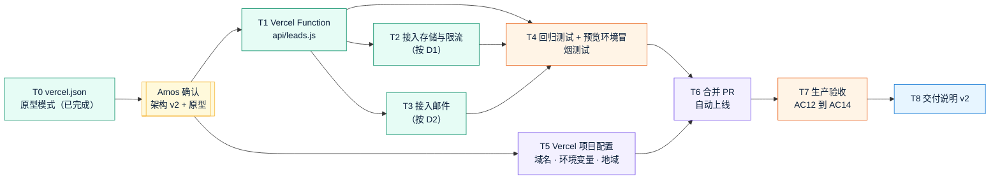

# v2 任务清单（草案）：Quick Come 官网改为 Vercel 部署
- 版本：v2（草案）
- 产出角色：产品经理
- 状态：⏸ **草案**。Amos 确认架构方案 v2 和原型之后才生效；D1、D2 的决定可能影响 T2 到 T4。
- 变更历史：v2（2026-09-27）首次创建

## 一图看懂

| ID | 任务 | 负责人 | 对应验收标准 |
|---|---|---|---|
| T0 | `vercel.json` 构建配置、安全响应头、原型模式 | 研发、运维 | AC13（已完成，用于原型） |
| T1 | 把 lead-api 改为 Vercel Function，复用 `validate.js` 和 `mailer.js` | 研发 | AC5、AC6 |
| T2 | 接入存储与限流（D1） | 研发 | AC6、AC7 |
| T3 | 接入邮件（D2），用 `waitUntil` 在后台发送 | 研发 | AC6 |
| T4 | 调整测试环境，不再依赖 Nginx；全量回归；预览环境冒烟测试 | 测试 | AC1 到 AC11、AC13 |
| T5 | Vercel 项目配置：域名、环境变量、函数地域 `sin1`、预览与生产存储分离；按 D6 处理 `deploy/` 目录 | 运维（需要 Amos 在 Vercel 后台操作或授权） | AC12 |
| T6 | 合并 PR，由 Vercel 自动上线 | 运维（Amos 授权） | AC14 |
| T7 | 生产验收：HTTPS、真实投递、回滚演练 | 测试、运维 | AC12、AC14 |
| T8 | 《交付说明 v2》 | PM | — |
