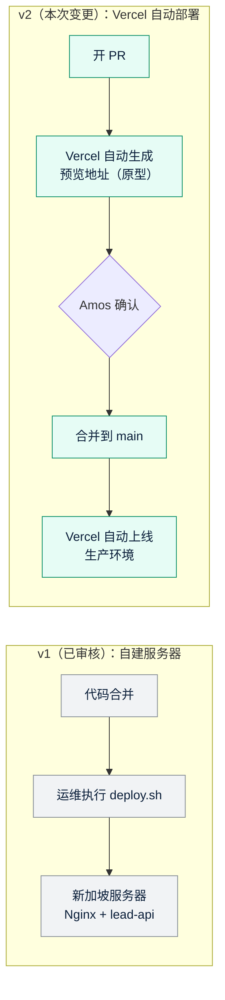

# 《需求说明书》v2：Quick Come 官网，部署方式改为 Vercel
- 版本：v2
- 产出角色：产品经理
- 状态：✅ **Amos 已于 2026-09-27 确认变更点，并确认了高保真原型**，同意继续开发
- 上一版：`需求文档/v1-需求说明书.md`（v1.2）
- 变更来源：Amos 2026-09-27 提出："当前项目我希望部署在 Vercel 中，使用现在的 Vercel 自动部署功能"
- 变更历史：v2（2026-09-27）首次创建；v2.1（2026-09-27）记录 Amos 的确认结论

---

## 一图看懂：变更前后对比
**图：发布方式的变化。** v1 需要运维登录服务器执行脚本；v2 只要把代码合并到 `main`，Vercel 就会自动构建和上线。每个 PR 还会自动生成一个预览地址，用于原型确认和评审。

## 1. 变更点
| # | 类型 | 内容 |
|---|---|---|
| V1 | 修改 | 生产环境从"新加坡自建服务器"改为 **Vercel**，由 Vercel 的 Git 集成自动部署：合并到 `main` 就上线生产，每个 PR 自动生成预览地址。 |
| V2 | 修改 | 表单线索的备份方式从"服务器本地文件"改为 **云端持久化存储**。Vercel 的运行环境不保留本地文件，所以必须改。具体选型见架构方案 v2 的 D1。 |
| V3 | 新增 | **高保真原型**：每个 PR 的预览地址就是可以点击的原型，顶部有"PROTOTYPE"标识，表单提交为模拟结果，不连接生产数据。这一条对应 agents v0.3 的原型关卡。 |
| V4 | 废弃 | 自建服务器相关的需求：服务器、SSH、Nginx、证书申请、防火墙、Cloudflare 代理。这些能力改由 Vercel 平台提供。 |
| — | 不变 | 页面、文案、品牌、表单字段、SEO、合规要求**全部不变**。用户看到的界面与 v1 完全一致，只多了预览环境里的原型标识。 |

## 2. 验收标准变化（相对 v1）
| AC | 变化 | v2 的写法 |
|---|---|---|
| AC1 到 AC5、AC8 到 AC11 | 不变 | 同 v1 |
| AC6 | **修改** | 合法提交后：页面显示成功提示；**云端存储**新增 1 条完整的线索记录；指定邮箱收到 1 封包含全部字段的邮件。 |
| AC7 | **修改（口径）** | 规则不变：同一 IP 10 分钟内超过 5 次被拒绝，触发蜜罐的提交不保存。实现方式改为基于云端存储的限流，多个函数实例之间共享计数。 |
| AC12 | **修改** | 生产域名通过 HTTPS 访问，HTTP 自动跳转 HTTPS，证书由 Vercel 自动签发和续期。 |
| AC13 | **新增** | 每个 PR 都自动生成预览地址。预览环境顶部显示原型标识，表单为模拟提交，不写入生产存储。 |
| AC14 | **新增** | 合并到 `main` 后 5 分钟内自动上线生产；出问题时，可以在 Vercel 后台一键回滚到上一个版本（Instant Rollback）。 |

## 3. 影响范围
- **用户侧：** 没有变化。
- **研发：** `lead-api/` 从常驻的 Node 服务改为 Vercel Function（`api/leads.js`）。校验逻辑沿用 v1，存储和限流改为云端实现。
- **运维：**
  - 不再需要 `deploy/` 里的服务器脚本。
  - 改为维护 `vercel.json`（构建、响应头、缓存设置）和 Vercel 项目配置（域名、环境变量、函数地域）。
- **测试：**
  - 回归测试不再依赖 Nginx，改为针对 Vercel Function 做测试。
  - 新增预览环境和生产环境的在线冒烟测试。
- **成本：** 需要确认 Vercel 套餐，见架构方案 v2 的 D3。**Vercel 免费版（Hobby）不允许商业用途。**

## 4. PM 自检
- [x] 写明了变更点和不变的部分
- [x] 验收标准的变化可以衡量（AC6、AC7、AC12 修改，AC13、AC14 新增）
- [x] 附了变更前后对比图
- [x] 测试已预审验收标准（见架构方案 v2 的 FB-v2-2、FB-v2-3）
