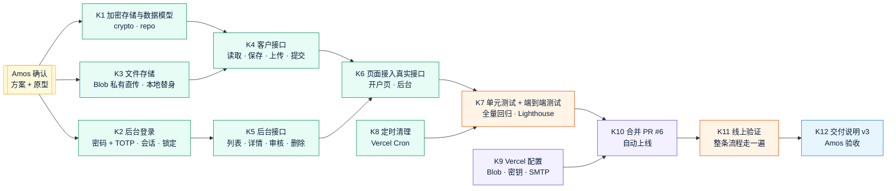

# v3 任务清单：Quick Come 线上 KYB 开户
- 版本：v3
- 产出角色：产品经理
- 状态：✅ **已生效**（Amos 于 2026-09-28 确认方案和原型："方案可行，原型确认继续开发"）
- 变更历史：
  - v3（2026-09-28）：首次创建。
  - **v3.1（2026-09-28，轻量变更）：**Amos 要求"下次发原型时给完整链接"。这条已经写进 agents v0.4.1（研发工程师 3.5），不影响 v3 的范围和验收标准。

## 一图看懂

| ID | 任务 | 负责人 | 对应验收标准 | 状态 |
|---|---|---|---|---|
| K1 | 加密（AES-256-GCM，HKDF 派生密钥）、令牌（只存 HMAC）、申请记录的读写 | 研发 | AC-K2、AC-K10 | ✅ |
| K2 | 后台初始化、密码 + TOTP 登录、8 小时会话、5 次锁定、动态码防重放 | 研发 | AC-K8 | ✅ |
| K3 | Vercel Blob 私有存储直传；本地测试用的文件存储替身 | 研发 | AC-K5、AC-K10 | ✅ 真实上传已在线上验证（TP5） |
| K4 | 客户接口：读取、分步保存、上传登记、删除文件、提交（服务端完整校验） | 研发 | AC-K3 到 AC-K7 | ✅ |
| K5 | 后台接口：列表、详情、下载、发送链接、重新发送、补件、通过、拒绝、备注、删除、官网线索 | 研发 | AC-K1、AC-K9、AC-K12 | ✅ |
| K6 | 开户页和后台从原型的模拟数据切换到真实接口（原型模式保留给预览环境） | 研发 | AC-K11、AC-K13 | ✅ |
| K7 | 单元测试 32 个；端到端测试 206 个（新增 25 个）；Lighthouse | 测试 | 全部 | ✅ 全部通过 |
| K8 | 定时清理：每天 1 次，删除过了保留期的申请和文件 | 研发、运维 | AC-K12 | ✅ |
| K9 | Vercel 配置：Blob 私有存储、`APP_SECRET`、`ADMIN_SETUP_TOKEN`、`CRON_SECRET`、SMTP、`MAIL_FROM`，删除 `RESEND_API_KEY` | 运维（Amos 按分步指导操作） | — | ✅ Amos 按分步指导完成；另外添加了 `BLOB_READ_WRITE_TOKEN` |
| K10 | 合并 PR #6，Vercel 自动上线 | 运维（Amos 授权） | — | ✅ PR #6 到 #9；中间 3 次没有成功上线（BUG-K6 到 K8），线上一直保持上一个正常版本 |
| K11 | 线上验证：健康检查、后台初始化、用 Amos 的另一个邮箱走完整条流程 | 测试、运维 | AC-K1、AC-K5、AC-K10（b） | ✅ 全部通过（测试报告 §5.5） |
| K12 | 《交付说明 v3》、Amos 验收 | PM | — | ✅ 已完成，等 Amos 验收 |
