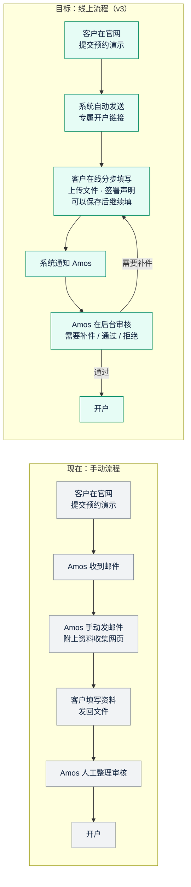

# 需求澄清问题清单 v3：线上 KYB 开户资料收集
- 文档版本：v3-澄清（《需求说明书 v3》的前置步骤）
- 产出角色：产品经理
- 状态：✅ Amos 已于 2026-09-28 回复，本清单已关闭，结论写入《v3-需求说明书》
- 输入：
  - Amos 2026-09-28 的需求描述
  - 《Client Onboarding Form Template 20260925.docx》（Amos 手动处理时使用的表格）
- 变更历史：v3-澄清（2026-09-28）首次创建；2026-09-28 记录 Amos 的回复

## 原始需求
> 现在，客户通过官网联系我后，我发邮件给客户一个网页的 url，用来收集客户的信息做 kyb，收集客户信息完成后，就可以给客户开户了。我希望可以将这个流程做为线上流程，系统自动给客户发一个链接，来收集客户信息。……文档中写了很多 paypaz 相关的信息，不要在意，这只是一个品牌的名字，你做出的客户信息收集链接继续用当前项目的名字就好。

**品牌处理：**文档里的 "Paypaz" 和 "[Paypaz full legal name]" 统一替换为 **Quick Come**。公司主体名称沿用 v1 的做法，暂时保留 "Quick Come"。

## 一图看懂：现在的手动流程和目标的线上流程

## 1. 从文档中整理出的收集内容（PM 字段清单）
| 部分 | 内容 | 字段或文件数量 |
|---|---|---|
| 1. 企业信息 | 法定名称、商号、法律形式、注册号、成立日期、注册地、注册地址、实际经营地址、LEI、税号、业务性质、业务关系用途、预计月交易量、目标市场、集团或母公司 | 约 16 项 |
| 2. 公司联系方式 | 官网或域名、邮箱、电话、其他联系方式（Telegram 或 Teams） | 4 项 |
| 3. 授权联系人 | 邮箱、电话、其他联系方式（**原表缺少"姓名"字段，建议补上**） | 3 项，建议加 1 项 |
| 4. 董事、UBO、授权签字人 | **每人一组**：姓名、出生日期、国籍、居住国、住址、护照号、签发国、到期日、PEP 状态及说明、邮箱、电话；**一人可以有多个角色**，人数不限 | 每人 12 项 |
| 5. 声明 | 授权代表姓名、职位、签名、日期 | 4 项 |
| 6. 内部使用 | 编号、收件日期、审核人、审核日期、备注 | 放进内部后台，客户看不到 |
| 附录 A：文件清单 | 16 类文件，包括公司注册证书、存续证明（90 天内签发）、公司章程、股东名册、地址证明（3 个月内）、组织架构图、UBO、董事和签字人各自的护照及地址证明、牌照、资金来源、SOF 与 SOW 证明等；其中 13 到 16 项写着"如有" | 16 类 |
| 附录 B：钱包授权声明 | 客户信息、钱包地址、区块链网络、用途（充值、提现或两者）、所有权声明、风险确认、所有权证明文件、签名 | 约 10 项，外加文件 |

## 2. 需要确认的问题（每项附建议默认值，可以回复"按默认"）

### A. 必须确认（决定方案方向）
| # | 问题 | 建议默认 |
|---|---|---|
| **A1** | ⚠️ **发给客户的邮件目前会被卡住**：Resend 现在是测试模式，只能发到你自己的邮箱。要实现"系统自动给客户发链接"，必须**先买域名，并在 Resend 里验证发件域名**。现在购买 `quickcomepay.com` 吗？ | **现在购买**。这样 v3 同时完成 v2 遗留的域名事项（E3） |
| **A2** | 链接在什么时候发出？ (a) 客户在官网提交预约演示后，**立即自动发送** (b) 你在后台确认这是有效线索后，**点一下"发送开户链接"** 再发 | **(b)**。官网表单谁都能提交，全自动发送的话，垃圾线索也会收到 KYB 链接；(b) 仍然是系统发邮件、生成专属链接，你只需要点一下 |
| **A3** | "业务性质"的选项：文档里是 CFD、证券、外汇交易，官网面向的是外贸、制造、跨境 B2B。用哪一套？ | **两套合并**：外贸出口、制造业、跨境 B2B 贸易、CFD 交易、证券与投资交易、外汇与金融市场交易、其他（请注明） |
| **A4** | 附录 B（自然人钱包授权声明）： (a) 放进开户流程，每个客户必须填写 (b) 放进开户流程，但设为可选 (c) 这次不做，以后作为单独的流程 | **(a)**，由授权代表填写企业用于收款或提现的钱包。附录 B 的标题写的是"自然人"，**需要你确认它是否适用于企业客户** |
| **A5** | 部署平台继续用 Vercel 吗？（按 agents v0.4，需要先确认平台） | **继续用 Vercel**，开户流程放在同一个站点的 `/onboarding/` 路径下 |

### B. 客户填写体验
| # | 问题 | 建议默认 |
|---|---|---|
| B1 | 链接有效期多长？过期后怎么办？ | **30 天**；过期后你可以在后台重新发送 |
| B2 | 客户可以分多次填写吗（保存草稿）？ | **可以**。资料多、文件多，客户通常要分几次准备 |
| B3 | 签名方式？ (a) 输入姓名，并勾选"我确认以上声明" (b) 在网页上手写签名 (c) 接入第三方电子签（例如 DocuSign，需要另外付费） | **(a) 加 (b)**：输入姓名、手写签名，系统同时记录签署时间和 IP |
| B4 | 附录 A 的 16 类文件，哪些必须上传？ | **第 1 到 9 项必须上传**（第 7 到 9 项按每个人的角色要求），**第 10 到 16 项可选**。单个文件不超过 10MB，格式为 PDF、JPG、PNG |
| B5 | 页面语言？ | **英文为主，同时提供中文**，与官网一致 |
| B6 | 客户提交后，还能不能修改？ | **不能直接修改**。如果你在后台标记"需要补件"，客户会收到邮件，只能修改你指定的部分 |

### C. 内部审核后台
| # | 问题 | 建议默认 |
|---|---|---|
| C1 | 需要内部后台吗？用来查看资料、下载文件、修改状态（已提交、需要补件、通过、拒绝）、写备注（原表第 6 部分） | **需要** |
| C2 | 后台有哪些人使用？怎么登录？ | **先只有你一个人**。用"账号密码加手机验证器 App 动态码（TOTP）"双重验证登录；以后可以加同事 |
| C3 | 有客户提交或补件时，要不要通知你？ | **要**，发邮件到你的邮箱，邮件里不包含客户的敏感信息，只附后台链接 |
| C4 | 审核通过以后要做什么？ | **v3 只标记状态**，开户仍然由你线下完成。以后可以再对接开户系统 |

### D. 安全与合规（这次会收集护照、住址、公司文件等高度敏感的数据）
| # | 问题 | 建议默认 |
|---|---|---|
| D1 | 数据存放地区有没有要求？ | **新加坡**，与现有服务同一地区 |
| D2 | 资料保存多久？ | 请按你们的合规政策提供。**如果没有，建议"业务关系结束后保留 5 年"**，这是常见的反洗钱要求；未开户的申请 **1 年后删除** |
| D3 | 这些资料由谁审核？会不会交给第三方 KYB 服务商（例如自动核验护照）？ | **v3 只由你人工审核**，不接第三方 |
| D4 | 隐私政策要补充"KYB 资料收集"的说明吗？ | **要**。PM 起草，**建议交法务审核** |

### E. 范围：明确不做什么（建议）
- 不做自动证件识别和活体检测。
- 不对接第三方 KYB 或制裁名单筛查服务（记为 v4 候选）。
- 不做客户账户系统：客户只通过专属链接进入，不需要注册账号。
- 不做开户以后的功能，比如收款、对账、钱包管理。

## 回复后的下一步
1. PM 输出《需求说明书 v3》，测试预审验收标准。
2. PM、研发、运维一起出架构方案 v3，附图：数据流、安全设计、后台。
3. 研发做高保真原型，放在预览地址上，交你确认后才正式开发。

## Amos 的回复（2026-09-28）
> 但是现在还是不买域名，我会先用自己的邮箱。其他全部按默认

- **A1：**暂时**不买域名**。发给客户的邮件改用 **Amos 自己邮箱的 SMTP** 发送，不走 Resend 的测试模式。
- **其余各项（A2 到 E）：**全部按建议默认。
