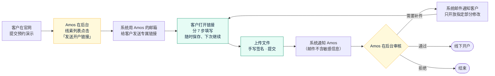
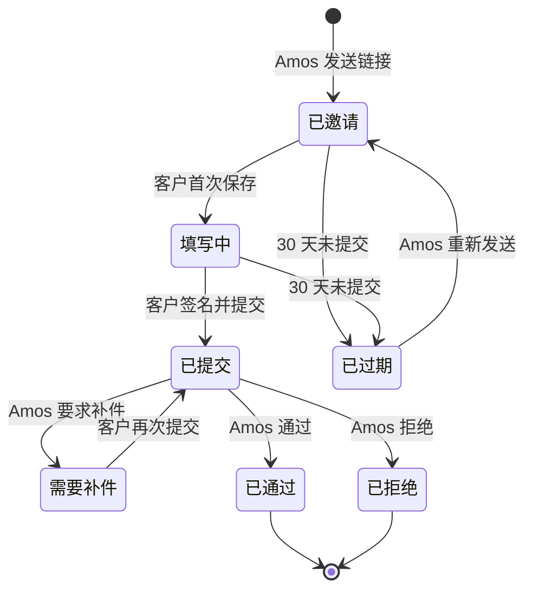
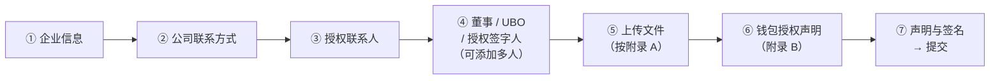

# 《需求说明书》v3：线上 KYB 开户资料收集
- 版本：v3
- 产出角色：产品经理（测试已预审，见 §7）
- 状态：✅ Amos 已于 2026-09-28 审核通过
- 上一版：`需求文档/v2-需求说明书.md`（v2.2，官网改为 Vercel 部署）
- 依据：`需求文档/v3-需求澄清问题.md`（Amos 2026-09-28 回复：暂时不买域名，先用自己的邮箱；其他全部按默认）、《Client Onboarding Form Template 20260925》
- 变更历史：v3（2026-09-28）首次创建

---

## 一图看懂
**图 1：开户申请的完整旅程。** 从官网线索开始，到 Amos 审核通过、线下开户为止。

**图 2：申请状态。** 每个申请在任何时刻只处于一种状态。

**图 3：客户填写的 7 个步骤。**

## 1. 背景与目标
- **现状：**客户在官网联系 Amos 后，Amos 手动发邮件，附上资料收集网页，再人工整理客户交回的资料和文件。
- **目标：**
  1. 开户资料收集改为线上流程：系统生成专属链接并通过邮件发给客户，客户在线完成全部资料和文件的提交。
  2. Amos 在一个后台里完成全部审核工作：查看资料、下载文件、要求补件、通过或拒绝、写内部备注。
  3. 护照、住址、公司文件都是高度敏感的数据，全程要安全、可控、可以删除。

## 2. 使用者与场景
| 使用者 | 场景 |
|---|---|
| **客户**：企业的授权代表 | K1 收到邮件，点击链接进入 → K2 分几次填写并保存 → K3 添加董事、UBO → K4 上传文件 → K5 签名提交 → K6 收到补件通知，修改指定部分后再次提交 |
| **Amos**：审核人 | A1 在线索列表里给有效线索发送开户链接 → A2 收到提交通知 → A3 查看资料、下载文件 → A4 要求补件，或通过 / 拒绝 → A5 写内部备注 → A6 链接过期后重新发送 → A7 删除不再需要保留的申请 |

## 3. 范围

### 3.1 做什么（v3）
**F1：发送开户链接**
- 后台的"官网线索"列表里，每条线索都有一个"发送开户链接"按钮。也可以手动输入企业名称和客户邮箱，不经过线索直接发送。
- 系统为每个申请生成一个唯一的专属链接，**30 天有效**。
- **重新发送**会生成新链接，旧链接立即失效。
- 邮件通过 **Amos 自己邮箱的 SMTP** 发出（v3 暂时不买域名）。

**F2：客户填写页面**（`/onboarding/`，中英双语，搜索引擎不收录）
- 分 7 步填写，见图 3。字段按《开户表》逐项还原，完整清单见 §4。
- **每一步都可以保存。**关闭浏览器后用同一个链接回来，已填的内容还在。
- **第 ④ 步：**可以添加任意多个人，每个人可以勾选多个角色（董事、UBO、授权签字人）。**至少要有 1 名董事和 1 名 UBO。**
- **第 ⑤ 步：**按附录 A 上传文件。
  - 第 1 到 6 项（企业文件）**必须上传**。
  - 第 7 到 9 项按第 ④ 步的人员角色，**每人必须上传护照和地址证明**。
  - 第 10 到 16 项**可选**。
  - 每项可以上传多个文件；单个文件不超过 10MB，格式为 PDF、JPG、PNG。
- **第 ⑥ 步：**附录 B 钱包授权声明，**必填**。由授权代表填写企业用于充值或提现的钱包，内容包括钱包地址、区块链网络、用途，勾选所有权声明和风险确认，并上传所有权证明。
- **第 ⑦ 步：**第 5 部分的声明。内容包括：授权代表姓名和职位、**手写签名**、勾选"确认以上信息真实完整"；系统自动记录签署时间和 IP。
- **提交后，**客户只能查看，不能修改；页面显示"已提交，我们会尽快审核"。
- **需要补件时，**客户收到邮件，打开同一个链接，**只能修改 Amos 指定的部分**，然后再次签名提交。

**F3：内部审核后台**（`/admin/`，中文，搜索引擎不收录）
- **登录：**密码加手机验证器 App 的动态码（TOTP）。第一次使用时，用 Amos 在 Vercel 后台设置的"初始化口令"完成初始化：设置密码，并扫码绑定验证器。
- **申请列表：**按状态筛选，显示编号、企业名称、状态、提交时间、保留截止日。
- **申请详情：**
  - 全部字段；
  - 文件列表，可以在线预览或下载；
  - 签名图片、签署时间和 IP；
  - 原表第 6 部分"内部使用"：编号、收件日期、审核人、审核日期、备注。
- **操作：**要求补件（勾选需要修改的部分，并填写说明）、通过、拒绝、重新发送链接、删除（需要二次确认）。
- **官网线索列表：**展示 v2 已经收集的线索，并提供"发送开户链接"按钮。

**F4：通知邮件**
| 触发事件 | 收件人 | 内容 |
|---|---|---|
| 发送开户链接 | 客户 | 专属链接和有效期 |
| 客户提交、客户补件后再次提交 | Amos | 企业名称、编号、后台链接；**不包含任何敏感字段** |
| 要求补件 | 客户 | 需要修改的部分、Amos 写的说明、链接 |

**F5：数据保留**
- 审核通过的申请：**业务关系结束后保留 5 年**。v3 由 Amos 在后台标记"业务关系结束日期"。
- 未通过、已拒绝或已过期的申请：**满 1 年自动删除**，包括全部文件。
- Amos 可以随时手动删除一个申请。

**F6：隐私政策**
- 中英两版都新增一节"开户资料（KYB）的收集和使用"，由 PM 起草，**建议交法务审核**。

### 3.2 明确不做（v3）
- 不做证件自动识别和活体检测。
- 不对接第三方 KYB 或制裁名单筛查服务（列为 v4 候选）。
- 不做客户账户系统：客户只凭专属链接进入。
- 不做开户以后的功能。
- 后台暂时只有 Amos 一个账号，不做多人和角色权限。
- 不做第三方电子签（例如 DocuSign）。
- 不做"官网提交后自动发送开户链接"（A2 选了 (b)：由 Amos 一键发送）。

## 4. 字段清单（按《开户表》还原，Paypaz 统一替换为 Quick Come）
| 步骤 | 字段（* 为必填） |
|---|---|
| ① 企业信息 | 法定全称*、商号或品牌、法律形式*（按注册证书填写，例如 IBC、Ltd）、注册号*、成立日期*、注册国家和地点*、注册地址*、实际经营地址*、LEI（如有）、税号（如有）、**业务性质***（多选：外贸出口、制造业、跨境 B2B 贸易、CFD 交易、证券与投资交易、外汇与金融市场交易、其他（请注明））、**业务关系用途***（处理客户充值和提现、其他（请注明））、**预计月交易量***（5 万以下、5 万到 10 万、10 万到 50 万、50 万以上（请注明大约金额）、其他）、**目标市场***（多选：欧洲、北美、拉美、英国、中东、亚太、其他（请注明））、集团或母公司名称（如有） |
| ② 公司联系方式 | 官网或域名*、邮箱*、电话*（含国家代码）、其他联系方式（Telegram 或 Teams） |
| ③ 授权联系人 | **姓名***（原表缺少，PM 补充）、邮箱*、电话*、其他联系方式 |
| ④ 人员（每人一组） | 角色*（多选：董事、UBO、授权签字人）、法定全名*、出生日期*、国籍*、居住国*、住址*、护照号*、护照签发国*、护照到期日*（必须晚于今天）、**是否为 PEP、PEP 的家属或密切关系人***（是 / 否；选"是"时必须填写说明：职务、职能、关系、PEP 本人的姓名和职务）、邮箱*、电话* |
| ⑤ 文件 | 附录 A 共 16 项，第 1 到 6 项必须上传；第 7 到 9 项按人员角色，每人必须上传护照（彩色清晰）和 3 个月内的地址证明；第 10 到 16 项可选。页面会提示"存续证明须为 90 天内签发"、"地址证明须为 3 个月内" |
| ⑥ 钱包授权声明 | 客户全称*、证件类型及号码*、User ID（如有）、邮箱*、钱包地址*、区块链网络*（TRON、Ethereum、其他）、用途*（充值、提现、两者）、勾选所有权声明*、勾选风险确认*、**所有权证明***（三选一：钱包服务商截图、区块浏览器截图加签名消息或参考码、其他（请注明））并上传文件 |
| ⑦ 声明与签名 | 授权代表姓名*、职位*、勾选声明*、手写签名*；系统自动记录签署日期、时间和 IP |

## 5. 验收标准（可衡量）
| # | 验收标准 |
|---|---|
| AC-K1 | 后台的线索列表里点击"发送开户链接"后，客户邮箱收到 1 封含专属链接的邮件；后台新增 1 条"已邀请"状态的申请 |
| AC-K2 | 专属链接中的令牌至少有 128 位随机性；无效或过期的链接打开后显示明确提示，不暴露任何数据；重新发送后，旧链接立即失效 |
| AC-K3 | §4 的全部字段都能填写；每一步都能保存；关闭浏览器后用同一个链接重新打开，已填内容完整保留 |
| AC-K4 | 必填项、邮箱、电话、日期格式、"护照到期日晚于今天"、"选了 PEP 就必须填写说明"、"至少 1 名董事和 1 名 UBO"：前端会提示，服务端也会拒绝，绕过前端直接请求同样无效 |
| AC-K5 | 文件的必传规则按 §3.1 F2 执行；不符合类型或超过 10MB 的文件，前端提示并且服务端拒绝；必传文件没有齐全时不能提交 |
| AC-K6 | 没有手写签名、没有勾选声明时不能提交；提交后记录签名图片、签署时间和 IP |
| AC-K7 | 提交后客户只能查看，不能修改；Amos 收到 1 封通知邮件，邮件里不包含 §4 中任何人员字段、证件号、地址 |
| AC-K8 | 后台登录要求密码和 TOTP；连续错误 5 次，锁定 15 分钟；登录会话 8 小时后过期；未登录时访问任何后台接口都返回 401 |
| AC-K9 | 后台能按状态筛选列表；详情页显示全部字段、文件和签名；"要求补件"之后，客户只能修改勾选的部分；再次提交后，Amos 收到通知；通过和拒绝会记录审核人和审核日期 |
| AC-K10 | **安全：** （a）直接查看数据库，§4 的字段都是密文； （b）文件存放在私有存储里，不经过后台授权无法下载； （c）一个客户链接不能读取或上传其他申请的数据 |
| AC-K11 | 客户填写页面中英双语，任意一步都能切换语言而不丢失数据；后台是中文 |
| AC-K12 | 后台显示每个申请的保留截止日；手动删除后，申请和全部文件都查不到了；未通过的申请满 1 年后自动删除（以测试时模拟的时间为准） |
| AC-K13 | 预览环境（原型模式）使用模拟数据，不连接真实存储，页面顶部显示 PROTOTYPE 标识 |
| AC-K14 | 隐私政策（中英两版）新增 KYB 数据一节 |
| AC-K15 | 客户填写页面在 375、768、1280 三种宽度下没有横向滚动；Lighthouse 可访问性不低于 90 |
| AC-K16 | 官网 v2 的全部验收项回归通过 |

## 6. PM 风险反馈（需要 Amos 知悉）
| # | 风险 | 建议 |
|---|---|---|
| RK1 | **发件人是 Amos 自己的邮箱，与 Quick Come 品牌不一致**，客户可能困惑，甚至误以为是钓鱼邮件 | 邮件正文开头说明"这是 Quick Come 的开户邀请"；买域名后切换为 Quick Come 的发件地址 |
| RK2 | 个人邮箱通常有**每日发送上限**，而且不适合大量发信 | v3 的量级（每天几封）没有问题；量大了再换发信服务 |
| RK3 | 收集护照、住址这类数据，可能受各地数据保护法规约束（例如新加坡的 PDPA、欧盟的 GDPR） | 隐私政策和保留期限**交法务审核** |
| RK4 | 附录 B 原文是"自然人"钱包授权。v3 按默认由企业的授权代表填写，**措辞是否适用于企业，需要合规确认** | 交合规或法务确认后，PM 调整措辞 |

## 7. 测试预审（测试工程师）
| # | 预审意见 | PM 处理 |
|---|---|---|
| TP1 | AC-K1 发给真实客户的邮件无法在本地验证。本地用模拟 SMTP 服务器检查邮件内容；生产环境由 Amos 用自己的另一个邮箱扮演客户验收 | 已采纳 |
| TP2 | AC-K8 的 TOTP：测试用同一套算法生成动态码，可以自动化；锁定 15 分钟用模拟时间测试 | 已采纳 |
| TP3 | AC-K10（a）"数据库里是密文"：测试直接读取存储中的原始记录，检查不包含测试数据里的明文（例如护照号） | 已采纳 |
| TP4 | AC-K12 自动删除：用模拟的"当前时间"触发清理任务来验证 | 已采纳 |
| TP5 | 文件上传要用真实的私有 Blob 存储才能完整验证；本地只能用模拟存储，真实上传在上线后的冒烟测试中验证 | 已采纳，写进测试计划 |

## 8. 交接
- **研发：**§3、§4、§5，以及效果图和原型。
- **测试：**§5 和 §7。
- **运维：**新增 Vercel 私有 Blob 存储、加密密钥、SMTP 配置、每日清理任务。

## 9. PM 自检
- [x] 写明了"做什么 / 不做什么"
- [x] 验收标准可衡量，测试已预审
- [x] 写明了相对 v2 的变更（新增 F1 到 F6）
- [x] 附了旅程图、状态图、步骤图
- [x] 列出了需要确认的风险（RK1 到 RK4）
