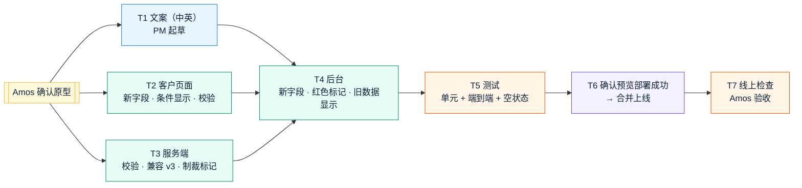

# v4 任务清单：按修改版开户表单调整
- 版本：v4
- 产出角色：产品经理
- 状态：✅ 已生效（Amos 于 2026-09-28 确认原型后拆解）
- 变更历史：v4（2026-09-28）首次创建

## 一图看懂

每条验收标准都对应到了任务（agents v0.5 C30）：

| ID | 任务 | 负责人 | 对应验收标准 | 状态 |
|---|---|---|---|---|
| T1 | 新字段的中英文案：币种、制裁声明及说明、业务用途 4 个选项、每月金额、持股和投票权比例、错误提示 | PM | AC-V1 到 AC-V5、AC-V9 | ✅ |
| T2 | 客户页面：新字段；按选择显示（50 万以上、制裁选"是"、勾选 UBO）；隐藏的字段不保存；百分比校验；第 ⑤ 步去掉第 11、12 项 | 研发 | AC-V1 到 AC-V6 | ✅ |
| T3 | 服务端：新字段校验；不适用的字段清空；兼容 v3 的单选业务用途；提交时记录制裁标记；第 11、12 项不再接受上传 | 研发 | AC-V1 到 AC-V6、AC-V8、AC-V9 | ✅ |
| T4 | 后台：显示新字段；列表和详情的红色"涉及制裁：是"；v3 旧申请显示"（v3 提交，没有此项）"；旧文件标注"（旧版文件项）" | 研发 | AC-V7、AC-V8 | ✅ |
| T5 | 单元测试和端到端测试；v3 格式的旧数据（TPV2）；空状态（AC-V10）；全量回归 | 测试 | AC-V1 到 AC-V11 | ✅ |
| T6 | 确认预览部署成功后，请 Amos 合并 | 运维 | — | ⏸ |
| T7 | 线上检查：健康检查、页面、接口；Amos 用测试邮箱走一遍 | 测试、Amos | 全部 | ⏸ 上线后 |
