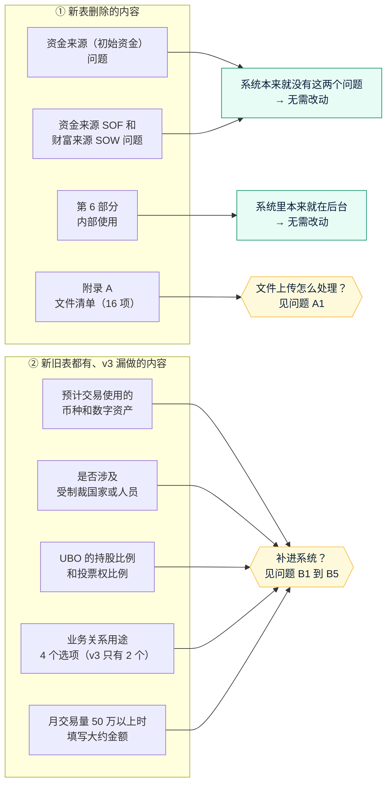

# v4 需求澄清问题：按修改版开户表单调整系统
- 版本：v4
- 产出角色：产品经理
- 输入：Amos 提供的修改版表单 `Client_Onboarding_Form_Template_202609251.docx`（以下简称"新表"），对比 v3 依据的 `Client_Onboarding_Form_Template_20260925.docx`（以下简称"旧表"）和线上系统。
- 状态：✅ **已关闭**。Amos 于 2026-09-28 回复"全部按默认"，结论写进《需求说明书 v4》。
- 日期：2026-09-28

## 一图看懂：新表改了什么，系统要跟着改什么

我逐段比对了两份表单：**新表只做了删除，没有新增内容。**但对照线上系统时发现，还有 5 处内容新旧表里都有，**v3 当时没有做进系统**。按"根据新表修改系统"，这些也应该补上。

## 1. 逐项对比
| 表单部分 | 旧表 | 新表 | 线上系统（v3） | 结论 |
|---|---|---|---|---|
| 1. 企业信息：初始资金来源 | 有（多选：UBO 或股东注资、公司资金、其他） | **删除** | 没有 | 无需改动 |
| 1. 企业信息：SOF 和 SOW | 有（多选：营业收入、股东出资、投资收益、贷款、其他） | **删除** | 没有 | 无需改动 |
| 1. 企业信息：业务关系用途 | 4 个选项 | 4 个选项（未变） | **只有 2 个**（处理充值提现、其他） | ⚠️ v3 漏做，见 B4 |
| 1. 企业信息：月交易量 | 4 档，50 万以上要写大约金额 | 未变 | 4 档加"其他"，50 万以上**不要求**写金额 | ⚠️ v3 漏做，见 B5 |
| 1. 企业信息：币种和数字资产 | USD、EUR、USDT、USDC、BTC、ETH、其他 | 未变 | **没有** | ⚠️ v3 漏做，见 B1 |
| 1. 企业信息：是否涉及制裁 | 是 / 否，选"是"时要写明地区、业务性质和交易量 | 未变 | **没有** | ⚠️ v3 漏做，见 B2 |
| 1. 企业信息：业务性质 | CFD、证券、外汇、其他 | 未变 | 按 v3 的 A3 决定合并了两套（外贸、制造、B2B 加上 CFD、证券、外汇、其他） | 保持 v3 的决定，见 B6 |
| 3. 授权联系人 | 没有"姓名" | 没有"姓名" | 有（v3 时 PM 补充） | 保留，见 B7 |
| 4. 人员：持股比例和投票权 | 有（UBO 填写） | 未变 | **没有** | ⚠️ v3 漏做，见 B3 |
| 5. 声明 | 未变 | 未变 | 已实现 | 无需改动 |
| 6. 内部使用 | 有 | **删除** | 本来就在后台（编号、收件日期、审核人、审核日期、备注） | 无需改动 |
| 附录 A：文件清单 | 16 项 | **整节删除** | 第 ⑤ 步按附录 A 上传，第 1 到 6 项和每人的护照、地址证明必传 | ⚠️ **需要决定，见 A1** |
| 附录 B：钱包授权声明 | 有 | 未变 | 已实现 | 无需改动（措辞的合规确认仍然待办，见 RK4） |

## 2. 需要确认的问题

### A. 附录 A 删除后，文件上传怎么处理（最关键）
| # | 问题 | 建议默认 |
|---|---|---|
| **A1** | 新表删掉了附录 A，但开头一句仍然写着"请按附录 A 提交证明文件"，两者矛盾。系统里的第 ⑤ 步"上传文件"怎么处理？ (a) **保留**文件上传，去掉和资金来源有关的第 11、12 项，其余不变 (b) 保留文件上传，但**全部改为可选** (c) **去掉**整个第 ⑤ 步，文件改为线下收集 (d) 附录 A 另有新版本，你稍后提供 | **(a)**。新表删除资金来源问题的同时，对应的两项证明文件（第 11 项"初始资金来源证明"、第 12 项"SOF 和 SOW 证明"）也应该一起去掉。公司注册证书、存续证明、护照、地址证明是开户审核的基本材料，建议继续保留为必传 |
| A2 | 如果选 (a)：客户页面上还要不要显示"附录 A"这个名字？ | **不显示**，第 ⑤ 步标题直接叫"证明文件"，客户不需要知道表单的附录编号 |

### B. v3 漏做的字段（新旧表都有）
| # | 问题 | 建议默认 |
|---|---|---|
| **B1** | 补上"**预计使用的币种和数字资产**"吗？ | **补上**，多选：USD、EUR、USDT、USDC、BTC、ETH、其他（请注明），**必填**，放在第 ① 步"月交易量"后面 |
| **B2** | 补上"**是否涉及受制裁国家、地区或人员**"吗？ | **补上**，是 / 否，**必填**；选"是"时，必须写明涉及的地区、业务性质和预计交易量。后台详情里，选"是"的申请用红色标出，提醒重点审核 |
| **B3** | 补上 UBO 的"**持股比例 / 投票权比例**"吗？ | **补上**，两个数字（0 到 100%）。人员勾选了"UBO"时**必填**，其他角色不显示 |
| **B4** | "业务关系用途"改成新表的 4 个选项吗？ | **改**，多选：接受客户的加密货币付款；加密货币与法币互换；处理客户充值和提现；其他支付相关业务（请注明）。已有申请里选的"处理客户充值和提现"会原样保留 |
| **B5** | 月交易量按新表调整吗？ | **调整**：去掉"其他"这一档；选"50 万以上"时必须填写大约金额 |
| B6 | "业务性质"要改回新表的 3 个选项（CFD、证券、外汇）吗？ | **不改**，保持 v3 的 A3 决定（两套合并）。官网面向的外贸、制造业客户也能选到合适的选项 |
| B7 | 授权联系人的"姓名"新表里仍然没有，系统里保留吗？ | **保留**（v3 时已补充）。没有姓名，没法知道该联系谁 |

### C. 已有数据与流程
| # | 问题 | 建议默认 |
|---|---|---|
| C1 | 已经在填写中、还没提交的申请（例如 QC-2026-0002），新的必填字段怎么处理？ | 客户打开链接时，新字段显示为空，**提交前必须补填**；已经提交或已审核的申请不受影响，后台显示为"（v3 提交，没有此项）" |
| C2 | 这次改动走什么流程？ | **轻量流程**：架构不变，所以不重新审核架构方案。 我会先写需求说明书 v4，交测试预审；然后做好原型，把**完整的预览链接**发给你确认；你确认后再正式开发、上线。上线前会先确认预览部署成功 |

## 3. 这次明确不做
- 不做资金来源和财富来源的问题（新表已经删除）。
- 不对接第三方制裁名单筛查服务。B2 只收集客户的自我声明。
- 不改附录 B 的措辞。"是否适用于企业"的合规确认仍然是待办（RK4）。
