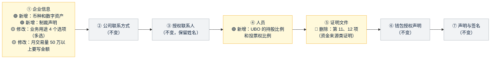

# 《需求说明书》v4：按修改版开户表单调整开户系统
- 版本：v4
- 产出角色：产品经理（测试已预审，见 §6）
- 状态：✅ Amos 于 2026-09-28 确认原型（"原型确认，继续开发"）；架构不变，按澄清问题 C2 走轻量流程
- 输入：`需求文档/v4-需求澄清问题.md`（Amos 于 2026-09-28 回复"全部按默认"）
- 变更历史：v4（2026-09-28）首次创建

## 一图看懂：v4 前后，客户填写的 7 个步骤有什么变化

**后台的变化：**详情页显示新字段；制裁声明选"是"的申请，在列表和详情里用红色标出。

## 1. 背景与目标
Amos 提供了修改版的开户表单。v4 的目标：
- 客户填写的内容与新表一致。
- 补上 v3 漏做的字段（新旧表里都有）。
- 已有的申请不受影响。

## 2. 变更点（相对 v3 需求说明书 §4）
| # | 步骤 | 变更 | 规则 | 来源 |
|---|---|---|---|---|
| V1 | ① 企业信息 | 🟢 新增"预计使用的币种和数字资产" | 多选：USD、EUR、USDT、USDC、BTC、ETH、其他（请注明）；**必填**；放在"月交易量"后面 | B1 |
| V2 | ① 企业信息 | 🟢 新增"是否涉及受制裁的国家、地区或人员" | 是 / 否，**必填**；选"是"时**必须**填写说明（涉及的地区、业务性质、预计交易量）；放在"目标市场"后面 | B2 |
| V3 | ④ 人员 | 🟢 新增"持股比例（%）"和"投票权比例（%）" | 0 到 100 的数字，最多 2 位小数；**勾选了 UBO 时必填并显示**，没勾选 UBO 时隐藏且不保存 | B3 |
| V4 | ① 企业信息 | 🟡 "业务关系用途"改为 4 个选项，**多选** | 接受客户的加密货币付款；加密货币与法币互换；处理客户充值和提现；其他支付相关业务（请注明）；必填 | B4 |
| V5 | ① 企业信息 | 🟡 "月交易量"去掉"其他"一档 | 4 档：5 万以下、5 万到 10 万、10 万到 50 万、50 万以上；选"50 万以上"时**必须**填写大约金额 | B5 |
| V6 | ⑤ 证明文件 | 🔴 删除第 11 项"初始资金来源证明"和第 12 项"SOF 和 SOW 证明" | 其余文件和必传规则不变（第 1 到 6 项必传，每人的护照和地址证明必传，其他可选） | A1 (a) |
| V7 | ⑤ 证明文件 | 🟡 标题不再出现"附录 A" | 中文标题"证明文件"，英文"Supporting documents" | A2 |
| V8 | 后台 | 🟢 显示新字段；制裁声明选"是"时，**列表和详情里用红色标出** | 标记文字为"涉及制裁：是" | B2 |
| — | 不变 | 业务性质保持两套合并；授权联系人保留姓名 | — | B6、B7 |

## 3. 已有申请（C1）
| 申请状态 | 处理 |
|---|---|
| 已邀请、填写中、需要补件 | 客户打开链接时，新字段显示为空，**提交前必须补填**。原来选的"处理客户充值和提现"保留；月交易量原来选了"其他"的，要重新选择 |
| 已提交、已通过、已拒绝、已过期 | 数据不变；后台的新字段显示"（v3 提交，没有此项）" |
| 已上传的第 11、12 项文件 | 不删除，后台照常显示和下载，标注"（旧版文件项）" |

## 4. 明确不做
- 不做资金来源、财富来源问题（新表已删除）。
- 不对接制裁名单筛查服务，只收集客户的自我声明。
- 不改附录 B 措辞（合规确认仍然待办，RK4）。

## 5. 验收标准
| # | 验收标准 |
|---|---|
| AC-V1 | ① 企业信息里能选择币种和数字资产；什么都没选时不能提交；选了"其他"但没有注明时不能提交。前端提示，服务端也拒绝 |
| AC-V2 | 制裁声明必填；选"是"但没有填说明时不能提交。前端提示，服务端也拒绝 |
| AC-V3 | 勾选了 UBO 的人员，必须填写持股比例和投票权比例（0 到 100）；超出范围或不是数字时，前端提示，服务端也拒绝；没勾选 UBO 时这两项不显示，也不保存 |
| AC-V4 | 业务关系用途可以多选 4 个选项；选了"其他"时必须注明 |
| AC-V5 | 月交易量只有 4 档；选"50 万以上"时必须填写大约金额 |
| AC-V6 | 第 ⑤ 步不再出现第 11、12 项，也不再出现"附录 A"字样；已有申请里这两项的文件，后台仍能查看和下载 |
| AC-V7 | 后台详情显示全部新字段；制裁声明选"是"的申请，在列表和详情里都有红色的"涉及制裁：是"标记 |
| AC-V8 | 已提交的 v3 申请在后台正常显示，新字段显示"（v3 提交，没有此项）"；填写中的 v3 申请，客户打开后能补填新字段并提交 |
| AC-V9 | 中英双语都有新字段的文案；新字段的数据在存储里都是密文（沿用 AC-K10a） |
| AC-V10 | 空状态：后台列表没有申请、没有线索时，导航数字显示"0"，列表显示"暂无"（agents v0.5.1 C32） |
| AC-V11 | v3 的全部验收项（AC-K1 到 AC-K16）回归通过 |

## 6. 测试预审（测试工程师）
| # | 预审意见 | PM 处理 |
|---|---|---|
| TPV1 | AC-V3 的范围要明确：0 和 100 是否允许？小数最多几位？ | 允许 0 和 100，最多 2 位小数，已写进 V3 |
| TPV2 | AC-V8 需要一条"v3 格式"的旧数据来测试。测试会按 v3 的数据结构直接写入测试存储，而不是通过新页面生成 | 已采纳 |
| TPV3 | 按 agents v0.5.1 C32，补充空状态的用例（AC-V10），而且原型的模拟数据要包含一个"没有任何申请"的场景 | 已采纳，研发在原型里加入切换空状态的方式 |
| TPV4 | V3 "没勾选 UBO 时不保存"：测试会先勾选 UBO、填写比例，再取消勾选，然后保存，检查存储里没有这两项 | 已采纳 |

## 7. PM 自检
- [x] 每条变更都对应到澄清问题的结论
- [x] 验收标准可衡量，已经过测试预审
- [x] 写明了不做的内容和已有数据的处理
- [x] 每条验收标准都会在任务清单里对应到任务（agents v0.5 C30）
