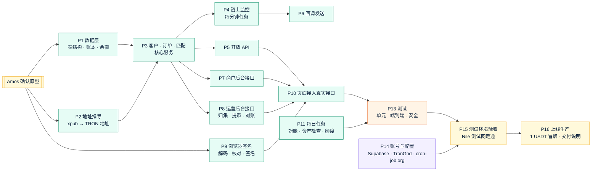

# v6 任务清单：稳定币收付款
- 版本：v6.1
- 产出角色：产品经理（研发、测试、运维已确认分工）
- 状态：✅ **已生效**（Amos 于 2026-09-29 确认原型："原型确认，继续开发"）。**已上线**（2026-09-30）；生产的提币和归集待热钱包充值 TRX 后补做一次
- 输入：《需求说明书 v6.1》、《架构方案 v6》（含 v6.1 修改）、《原型说明 v6.1》
- 变更历史：v6.1（2026-09-29）首次创建

## 一图看懂

| ID | 任务 | 负责人 | 对应验收标准 | 状态 |
|---|---|---|---|---|
| P1 | 数据层：建表脚本（架构 §2.2）；数据库访问层（生产用 Supabase 连接池，本地和测试用内嵌的 Postgres）；账本只追加（数据库触发器禁止修改和删除）；余额与账本在同一个事务里更新 | 研发 | AC-P7 | ✅ |
| P2 | 地址推导：从公钥（xpub）按 `m/44'/195'/0'/0/序号` 推导 TRON 地址；用已知助记词的测试向量验证 | 研发 | AC-P3、AC-P11 ① | ✅ |
| P3 | 核心服务：客户（自动创建、永久地址）、订单（客户必填、订单模式设置）、双向匹配和手动匹配（共用 `matching` 规则，先锁住客户再匹配）、手续费计算 | 研发 | AC-P2、P3、P5、P20、P21 | ✅ |
| P4 | 链上监控 `api/tick`：读取已确认的 USDT 转账、写到账和账本、匹配、订单过期、提币确认、提币通知邮件合并、运行记录；TronGrid 的本地替身用于测试 | 研发 | AC-P4、P6、P9、P17 | ✅ |
| P5 | 开放 API `api/v1`：请求签名、时间戳、Idempotency-Key、IP 白名单（提币）、商户隔离；接口按开发者文档 | 研发 | AC-P2、P8、P11 ③⑤、P14 | ✅ |
| P6 | 回调：签名、重试（1 分钟到 24 小时）、只允许 https 且不能指向内网、手动重发 | 研发 | AC-P11 ④、P12 | ✅ |
| P7 | 商户后台接口 `api/merchant`：开通邮件、设置密码和验证码、登录、客户、订单、交易、提币、API 设置、回调记录、CSV 导出 | 研发 | AC-P1、P8、P15、P19 | ✅ |
| P8 | 运营后台接口 `api/wallet`：商户和订单模式设置、客户查询、提币审核、归集计划（能量、激活）、构造待签名交易、接收签好名的交易并按顺序广播、对账、异常到账、钱包设置、系统状态 | 研发 | AC-P7、P10、P19 | ✅ |
| P9 | 浏览器签名：助记词和私钥只在页面内使用；自己解码交易原文并按规则核对（架构 §2.4）；热钱包、冷钱包地址写在仓库配置文件里；篡改测试 | 研发 | AC-P10、P11 ①② | ✅ |
| P10 | 页面接入真实接口：商户后台、付款页面、运营后台（原型模式保留给开发分支的预览） | 研发 | AC-P13、P15 | ✅ |
| P11 | 每日任务（并入现有的每日定时任务，不增加函数）：对账（整体 + 按客户）、不支持的币检查、免费额度用量提醒 | 研发、运维 | AC-P6、P7、P17 | ✅ |
| P12 | 开发者文档定稿，签名示例实际运行通过 | 研发、测试 | AC-P14 | ✅ |
| P13 | 测试：单元测试（金额、匹配、签名、推导、API 签名）；端到端测试（本地 Postgres + TronGrid 替身走完整流程）；安全检查（数据库、日志、请求里没有密钥）；v1 到 v5 全量回归 | 测试 | 全部、AC-P18 | ✅ |
| P14 | 账号与配置：Supabase 两个项目、TronGrid API Key、cron-job.org 两个任务、Vercel 环境变量、测试环境的助记词和热钱包（Nile 测试币） | 运维（Amos 按分步指导操作） | — | ✅ 测试环境已配置（生产在 P16 配置）；配置中发现并修复 BUG-P4、P5 |
| P15 | 测试环境验收：Nile 测试网走通"初始化 → 客户收款 → 先建订单后到账 → 先到账后建订单 → 归集 → 提币" | Amos、测试 | AC-P16 | ✅ Amos 于 2026-09-30 在 Nile 上验收通过（"都验证完了，继续吧"）；验收中发现并修复 BUG-P6 到 P21，新增客户选择框和运营后台概览 |
| P16 | 上线生产：staging 合并到 main；用 1 USDT 做一次真实的收款和提币；《交付说明 v6》 | 运维、PM | AC-P16 | ✅ 2026-09-30 上线（PR #41、#44）；生产已验证开通商户和收款；提币和归集待热钱包充值 TRX 后补做（交付说明 L1） |

## 说明
- **函数数量：**新增 `api/tick`、`api/v1`、`api/merchant`、`api/pay`、`api/wallet` 5 个，共 9 个（免费版上限 12 个）。每日任务并入现有的 `api/cron/cleanup`。
- **开发顺序：**先做不依赖外部账号的部分（P1 到 P13 都能在本地用替身完成），再请 Amos 注册账号（P14），这样账号的免费额度不会在开发阶段被消耗。
- **分几次推送：**每完成一组任务就推送到 PR #21，并更新本表的状态。
