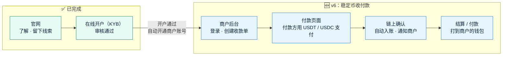
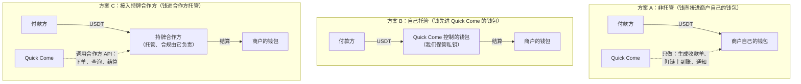
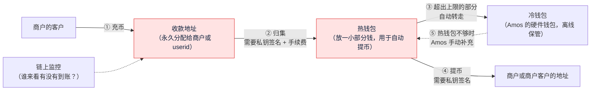

# v6 需求澄清问题：稳定币收付款
- 版本：v6
- 产出角色：产品经理（研发、运维补充了方案对比，见 §2、§3）
- 状态：⏸ **第二轮澄清**。Amos 已回复第一轮（见 §7），§8 是第二轮问题
- 输入：Amos 的原话："我们拥有了官网，也拥有了客户的开户，再往下进行，我觉得我们应该开始做稳定币收付款的功能了，你帮我设计一下"
- 日期：2026-09-28（v6.1：2026-09-29，追加 §7、§8）

> ⚠️ **这是目前为止风险最高的一个需求**：它涉及真实资金、私钥和金融牌照。本文先请 Amos 决定几件"定方向"的事（§4 的 A 类问题）。方向确定后，才写需求说明书和架构方案。**在 Amos 确认之前，不写任何代码。**

## 一图看懂：客户从"了解"到"收款"的完整旅程

前两段已经做好，v6 要做的是第三段。

## 1. "收付款"要做哪些事
| 功能 | 做什么 | 谁用 |
|---|---|---|
| **收款** | 商户创建收款单（金额、币种、网络、有效期）→ 系统生成付款页面和收款地址 → 付款方转账 → 链上确认后自动入账，并通知商户 | 商户、付款方 |
| **结算 / 付款** | 把商户收到的钱，打到商户在开户时声明过的钱包地址（附录 B 的钱包）；以后也可以支持"代商户付款给第三方" | 商户、Amos 审核 |
| **商户后台** | 登录（密码加验证码）、收款单列表、交易明细、余额、对账导出、通知设置 | 商户 |
| **运营后台** | 在现有的审核后台里，增加商户管理、交易查询、付款审批、手续费设置 | Amos |
| **对接（可选）** | 给商户开放 API 和回调（Webhook），让商户自己的系统能自动下单、自动收到到账通知 | 商户的技术人员 |

## 2. 最关键的决定：谁来"拿着钱"（托管模式）

三种做法的区别，在于资金在链上**进入谁控制的钱包**：

| | A 非托管 | B 自己托管 | C 接入持牌合作方 |
|---|---|---|---|
| 资金安全责任 | 在商户自己 | **全部在 Quick Come**（私钥、热钱包、冷钱包） | 在合作方 |
| 牌照要求 | 最低（可能仍需法律确认） | **最高**：在新加坡通常需要 MAS 的数字支付代币（DPT）牌照，其他地区另有要求 | 牌照由合作方承担，Quick Come 可能需要代理或合作协议 |
| 能不能做"余额、结算、代付" | 不能，钱不经过我们 | 能 | 能（看合作方的能力） |
| 开发量 | 小（几周） | **很大**：钱包、私钥管理、账本、对账、风控、链上监控 | 中：对接 API、账本、商户后台 |
| 平台 | 可以继续用 Vercel | 需要专门的服务器和密钥管理设备，**不适合 Vercel** | Vercel Pro 加数据库，基本可行 |
| 上线速度 | 最快 | 最慢（取决于牌照） | 取决于合作方的对接和签约 |

**PM 的建议：优先 C，没有合作方就先做 A。不建议现在做 B。**
- B 意味着 Quick Come 要保管客户的钱。这需要牌照、资金安全体系和审计，**不是一次软件迭代能解决的**。
- Paypaz 本身就是稳定币支付公司。**如果 Paypaz 可以作为底层的持牌合作方**，C 是最顺的：Quick Come 专注商户体验，资金、托管、合规用 Paypaz 现成的能力。这一点需要你确认（问题 A1），我不做推断。

## 3. 技术上的几个前提（研发、运维）
| # | 前提 | 原因 |
|---|---|---|
| T1 | **任何方案都不把私钥放进 Vercel 或代码仓库** | 方案 A 用商户提供的"只能生成地址、不能动钱"的公钥（xpub），或者商户自己的固定地址；方案 C 由合作方托管 |
| T2 | 交易数据要用**关系型数据库**（例如 Postgres），不能只用现在的 Redis | 金额、账本、对账需要事务和精确的数字计算 |
| T3 | 链上到账：优先用合作方或区块链数据服务的**回调通知**，不自己架节点 | Vercel 的函数不适合长时间运行的监听程序 |
| T4 | 测试环境用**测试网**（TRON Nile、Ethereum Sepolia）和测试币 | 测试环境验收时不花真钱（agents v0.6 C34） |
| T5 | Vercel 免费版只允许非商业用途，这一步**必须升级 Pro** | 收付款是正式的商业功能 |

## 4. 需要确认的问题

### A. 定方向（必须先回答，决定后面怎么设计）
| # | 问题 | 建议默认 |
|---|---|---|
| **A1** | **托管模式**选哪个：A 非托管 / B 自己托管 / C 接入持牌合作方？如果选 C，**合作方是 Paypaz 吗？**Paypaz 能提供收款地址、到账通知、结算打款这类 API 吗？ | **C，合作方是 Paypaz**（需要你确认 Paypaz 是否具备这些能力；具备的话，请你提供 API 文档或联系人）。如果暂时没有合作方，先做 **A** |
| **A2** | Quick Come 所在的主体目前有哪些牌照？客户主要在哪些国家？ | 需要你告知，我不推断。**v6 上线前交法务确认**收付款业务需要的牌照 |
| **A3** | 这次先做什么？ (a) 只做**收款** (b) 收款 + **结算到商户自己的钱包** (c) 再加上**代付给第三方** | **(b)**。代付给第三方的合规要求更高（收款人尽调、制裁筛查），放到下一版 |
| A4 | 部署平台：继续用 Vercel（升级 Pro，加 Postgres 数据库），还是换其他服务器？ | **Vercel Pro + Neon Postgres**（Vercel 市场里就有，新加坡地域）。如果选 B 托管，就必须换平台，到时单独沟通（agents 协作总则第五节） |

### B. 收款的具体规则
| # | 问题 | 建议默认 |
|---|---|---|
| B1 | 支持哪些币和网络？ | **USDT-TRC20（TRON）、USDT 和 USDC-ERC20（Ethereum）**。和开户表里钱包声明的网络一致 |
| B2 | 收款单用什么计价？ | **按稳定币金额计价**（例如 1,000 USDT），不做法币换算。法币部分仍然"与销售协商"（v1 的决定） |
| B3 | 付款方付多了、付少了、超时才付，怎么处理？ | 允许 **±0.5%** 的误差自动入账；超出误差的标记"金额异常"，交 Amos 处理；收款单默认 **30 分钟**有效，过期后到账的，标记"过期到账"，交人工处理 |
| B4 | 链上确认数？ | TRON **19 个**确认，Ethereum **12 个**确认，然后算入账（常见做法；选 C 时以合作方的规则为准） |
| B5 | 付款方需要登录或提供身份信息吗？ | **不需要**，打开付款链接就能付。系统记录付款地址，并做链上风险筛查（KYT，选 C 时由合作方提供） |

### C. 结算和费用
| # | 问题 | 建议默认 |
|---|---|---|
| C1 | 结算到哪里？ | **只结算到商户开户时声明、并经 Amos 审核通过的钱包地址**（附录 B）。修改地址要重新审核 |
| C2 | 结算方式？ | 商户在后台**发起结算申请** → **Amos 审批** → 打款。之后可以改为每天自动结算 |
| C3 | 手续费怎么收？ | **按每个商户单独设置费率**（例如收款金额的 x%），在入账时扣除。具体费率由销售和商户谈 |
| C4 | 有没有最低结算金额？ | 有，默认 **100 USDT**，避免链上手续费占比过高 |

### D. 商户后台和对接
| # | 问题 | 建议默认 |
|---|---|---|
| D1 | 商户账号怎么开通？ | **开户审核通过后自动开通**，系统给授权联系人发一封设置密码的邮件；登录要求密码加手机验证码（和审核后台一样） |
| D2 | 一个商户可以有多个登录账号吗？ | v6 **一个商户一个账号**；多账号和权限分级放到下一版 |
| D3 | 这次开放 API 和回调吗？ | **开放**：创建收款单、查询状态、到账回调（带签名）。传统行业客户也可以不用 API，只用后台 |
| D4 | 商户后台的语言？ | **中英双语**，和开户页一致 |

### E. 流程
| # | 问题 | 建议默认 |
|---|---|---|
| E1 | 代码放在哪里？ | **继续放在 amos111**，商户后台放在 `/merchant/` 路径下，和官网、开户共用登录和审核体系 |
| E2 | 走什么流程？ | **完整流程**：需求说明书 → 测试预审 → **架构方案（重新审核）** → 效果图 → 高保真原型 → 开发 → 测试环境验收（测试网）→ 上线 |
| E3 | 上线前要不要做一次安全审查？ | **要**：上线前做一次安全审查，范围包括：钱包地址生成、金额计算、回调签名、权限控制 |

## 5. 这次明确不做（建议）
- 不做法币换算和法币出入金（仍然"与销售协商"）。
- 不自己保管私钥（除非 A1 选 B，那将是另一个量级的项目）。
- 不做代付给第三方（A3 默认）。
- 不做多账号和权限分级（D2 默认）。
- 不自建区块链节点。

## 6. 跨角色反馈 / 分歧记录
| # | 提出方 → 接收方 | 内容 | 状态 |
|---|---|---|---|
| FB-v6-1 | 运维 → Amos | 收付款是正式的商业功能，Vercel 免费版的条款不允许，需要升级 Pro（T5） | 转 Amos |
| FB-v6-2 | PM → Amos | 托管模式涉及牌照，建议在写需求说明书之前就咨询法务（A2） | 转 Amos |

---

## 7. 第一轮的结论（Amos 于 2026-09-29 回复）
| # | 结论 | Amos 的原话要点 |
|---|---|---|
| R1 | **产品定位**：面向有稳定币收款需求的商户。商户可能有开发能力，也可能没有，所以**商户后台**和**开放 API** 都要做，两者功能对应 | "除了要提供商户可以管理和查看自己数据的后台外，还需要提供商户对应功能的 open API" |
| R2 | **两种收款方式**： ① **订单收款**：商户按自己的收款流程创建订单，系统为订单分配收款地址，并发两种回调：到账通知、订单匹配通知。 ② **无订单收款**：商户按自己的用户 ID（userid）申请地址，系统为每个 userid 分配钱包，只发到账通知 | 见原话 |
| R3 | **不使用 Paypaz 的服务**。Quick Come 是"Paypaz 升级版"：更完整、轻便、高效、易维护 | — |
| R4 | **自己托管**（方案 B）。暂时不考虑牌照问题 | — |
| R5 | **地址按商户的充提币场景分配，永久分配，永不收回** | — |
| R6 | **充币和提币这次都要做**（第一轮 A3 改为：收款 + 付款都做） | — |
| R7 | **不升级 Vercel Pro**。上线后先给 Amos 的朋友使用；系统成熟稳定后，再处理牌照，再迁移到阿里云或 AWS 对外开放 | — |
| R8 | **盈利模式**：代收稳定币时，收取"金额的百分比"或"每笔固定金额"的手续费；代付时同样按百分比或每笔固定金额收取 | — |
| R9 | 第一轮的其他问题**按默认**（B1 到 B5、C1 到 C4、D1 到 D4、E1 到 E3），除非与上面的结论冲突 | "其他没有问题" |

**PM 记录的风险（Amos 知悉，不阻塞）：**
- RK-v6-1：自己托管又没有牌照，在多数司法辖区属于无牌经营数字支付业务。Amos 决定"先给朋友用，对外开放前处理牌照"。**对外开放前必须先完成牌照和迁移，这一点写进验收标准。**
- RK-v6-2：Vercel 免费版的条款只允许非商业用途。朋友使用期间收取手续费，严格来说属于商业用途。Amos 已知悉。

## 8. 第二轮问题
自己托管加上不买服务器，会带出三个必须先定下来的技术问题：**私钥放在哪里（F）、谁来盯着区块链看有没有到账（G）、钱从收款地址怎么归集（H）**。

### 一图看懂：自己托管时，钱和私钥是怎么流动的

**图里红色的部分都需要私钥签名。**私钥放在哪里，直接决定了"系统被攻破时最多会丢多少钱"。

### F. 私钥与资金安全（最关键）
| # | 问题 | 建议默认 |
|---|---|---|
| **F1** | 私钥放在哪里？ (a) 加密后放进 Vercel 的环境变量，由系统自动签名 (b) 系统只负责生成地址（只用公钥），签名交给 Amos 自己电脑上运行的"签名工具"，每次需要 Amos 在线确认 (c) 使用第三方的托管签名服务（例如 MPC 钱包服务） | **(a) + 严格限额**： 收款地址的私钥由一个"主种子"推导，主种子加密后放在 Vercel（只作用于生产）；热钱包只保留少量资金，超出部分自动转到冷钱包。**系统被攻破时，最多损失"还没归集的钱 + 热钱包里的钱"。** 朋友使用期间，这个风险可以控制；对外开放前迁移到阿里云或 AWS 时，改用 KMS 或 MPC |
| **F2** | 热钱包的上限是多少？ | **每个币种 2,000 USDT**。超过的部分自动转到冷钱包 |
| **F3** | 冷钱包由谁、用什么保管？ | Amos 用**硬件钱包**（例如 Ledger）保管。冷钱包的地址写死在系统里，系统**只能往冷钱包转钱，不能从冷钱包转出** |
| **F4** | 主种子（助记词）怎么备份？ | Amos **离线手抄两份**，分开存放，不存任何电子设备。丢失主种子等于丢失所有收款地址里的钱 |

### G. 链上监控（怎么知道钱到了）
| # | 问题 | 建议默认 |
|---|---|---|
| **G1** | Vercel 免费版的定时任务每天只能跑一次，没法每分钟检查链上。用什么办法？ (a) 区块链数据服务的**推送通知**（有到账时它主动通知我们） (b) 免费的外部定时服务（例如 cron-job.org），**每分钟**调用一次我们的检查接口 (c) 两者都用 | **(c)**：以 (a) 为主，(b) 作为兜底。每分钟一次的兜底检查，保证最晚 1 到 2 分钟内发现到账 |
| **G2** | 用哪家区块链数据服务？（需要 Amos 注册账号，免费档） | **TRON：TronGrid**（官方，免费 API Key）；**Ethereum：Alchemy**（免费档支持地址到账推送）。按 C27，注册时请截图确认免费档 |

### H. 归集与手续费
| # | 问题 | 建议默认 |
|---|---|---|
| **H1** | 钱到了收款地址后，怎么归集到热钱包？ | **到账后自动归集**。TRON 链上转 USDT 需要消耗 TRX（手续费），系统先从热钱包给收款地址转一点 TRX，再把 USDT 转走；Ethereum 同理需要 ETH。**金额很小的（低于 10 USDT）先不归集**，攒够了再归集，避免手续费比金额还高 |
| **H2** | 归集和提币产生的链上手续费（TRX、ETH）谁出？ | **Quick Come 出**，从手续费收入里覆盖。定价时考虑进去：Ethereum 的手续费明显比 TRON 高 |
| **H3** | 这次支持哪些网络？ | **先只做 TRON（USDT-TRC20）**。Ethereum 的归集手续费高、逻辑更复杂，**放到下一版**。以后再加 BSC、Polygon 等 |

### I. 两种收款方式的细节
| # | 问题 | 建议默认 |
|---|---|---|
| **I1** | "永久分配"的地址分成哪几类？ | 每个商户有两类地址池： ① **订单地址池**：给订单收款用。一个地址同一时间只服务一个未完成的订单；订单结束后，地址回到这个商户自己的池子，**不会给别的商户用**。 ② **userid 地址**：给无订单收款用。每个 userid 一个地址，永久不变 |
| **I2** | 订单收款：客户付的金额和订单不一致时怎么办？ | 按第一轮 B3：误差在 **±0.5%** 以内视为匹配成功；付少了标记"部分付款"，付多了标记"超额付款"，都发回调，交商户处理；订单过期后到账，发"到账通知"，但不匹配订单 |
| **I3** | 订单有效期？ | 默认 **30 分钟**，商户创建订单时可以自己设（5 分钟到 24 小时） |
| **I4** | 无订单收款：有最低入账金额吗？ | **有，默认 1 USDT**。低于这个金额的，视为垃圾转账，不入账也不通知，但记录下来 |
| **I5** | 充值后多久可以用？ | TRON 按第一轮 B4：**19 个确认**（大约 1 分钟）后入账并通知 |

### J. 提币（付款）
| # | 问题 | 建议默认 |
|---|---|---|
| **J1** | 提币有哪几种？ | ① **商户提现**：把自己的余额提到自己声明过的钱包（开户表附录 B），在后台操作。 ② **代付**：商户通过 API 或后台，把钱付给**商户的客户**（任意地址），也就是"提币场景" |
| **J2** | 代付给任意地址，风险最高。要不要人工审核？ | **分级处理**：单笔 ≤ 1,000 USDT，而且当天累计 ≤ 5,000 USDT 的**自动放行**；超过的进入"待审核"，由 Amos 在后台批准。每个商户的限额可以单独调整 |
| **J3** | 提币的安全要求？ | 后台提币需要**输入验证码**；API 提币要求**签名请求 + IP 白名单**，没有设置白名单的商户不能用 API 提币 |
| **J4** | 余额不够、热钱包不够时怎么办？ | 商户余额不够：直接拒绝。热钱包不够：进入"排队中"，通知 Amos 从冷钱包补充，补够后自动继续 |

### K. 手续费和对账
| # | 问题 | 建议默认 |
|---|---|---|
| **K1** | 手续费怎么设置？ | 每个商户分别设置"**收款费**"和"**付款费**"，每项都可以选"百分比"或"每笔固定金额"，也可以两者都设（例如 0.5% + 1 USDT）。可以设最低收费 |
| **K2** | 收款费什么时候扣？ | **入账时从到账金额里扣**。例如到账 1,000 USDT、费率 1%，商户余额增加 990 USDT |
| **K3** | 付款费怎么扣？ | 从商户余额里**另外扣**。例如代付 1,000 USDT、费用 2 USDT，余额减少 1,002 USDT |
| **K4** | 对账？ | 系统每天核对一次："所有商户余额之和"与"链上实际持有的资金"（收款地址 + 热钱包 + 冷钱包）是否一致；不一致时通知 Amos |

### L. 开放 API
| # | 问题 | 建议默认 |
|---|---|---|
| **L1** | API 的认证方式？ | 每个商户有 **API Key + Secret**，每次请求用 Secret 签名（HMAC-SHA256），并带时间戳，防止重放 |
| **L2** | 回调的安全？ | 回调用 Quick Come 的密钥**签名**，商户可以验证。失败时按 1 分钟、5 分钟、30 分钟……**自动重试**，最多 24 小时；后台可以手动重发 |
| **L3** | 商户的开发人员在哪里调试？ | **测试环境 = 沙箱**：连接 TRON 测试网（Nile），商户拿到单独的测试 Key，可以用测试币走通整个流程 |
| **L4** | API 文档？ | 放在官网 `/docs/`，**英文为主、同时提供中文**，附带各语言的示例代码和签名示例 |

### M. 数据库
| # | 问题 | 建议默认 |
|---|---|---|
| **M1** | 账本和交易需要关系型数据库，用哪个？ | **Neon Postgres 免费档**。和测试环境的 Upstash 一样，Amos 在 neon.tech **直接注册**（生产、测试各建一个库），手动把连接信息填进 Vercel |

### N. 规模预期（用来判断免费额度够不够）
| # | 问题 | 建议默认 |
|---|---|---|
| N1 | 朋友使用期间，大概有几个商户、每天多少笔交易？ | 按 **10 个商户以内、每天 1,000 笔以内**设计。超出后，再评估免费额度和迁移计划 |
