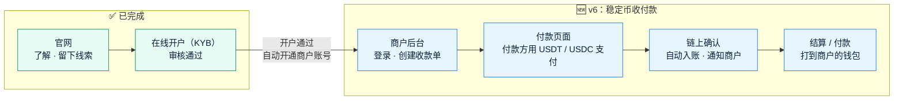
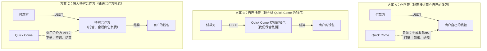

# v6 需求澄清问题：稳定币收付款
- 版本：v6
- 产出角色：产品经理（研发、运维补充了方案对比，见 §2、§3）
- 状态：⏸ **等 Amos 回复**。每个问题都附了建议的默认值，可以回复"全部按默认"，也可以逐条调整
- 输入：Amos 的原话："我们拥有了官网，也拥有了客户的开户，再往下进行，我觉得我们应该开始做稳定币收付款的功能了，你帮我设计一下"
- 日期：2026-09-28

> ⚠️ **这是目前为止风险最高的一个需求**：它涉及真实资金、私钥和金融牌照。本文先请 Amos 决定几件"定方向"的事（§4 的 A 类问题）。方向确定后，才写需求说明书和架构方案。**在 Amos 确认之前，不写任何代码。**

## 一图看懂：客户从"了解"到"收款"的完整旅程

前两段已经做好，v6 要做的是第三段。

## 1. "收付款"要做哪些事
| 功能 | 做什么 | 谁用 |
|---|---|---|
| **收款** | 商户创建收款单（金额、币种、网络、有效期）→ 系统生成付款页面和收款地址 → 付款方转账 → 链上确认后自动入账，并通知商户 | 商户、付款方 |
| **结算 / 付款** | 把商户收到的钱，打到商户在开户时声明过的钱包地址（附录 B 的钱包）；以后也可以支持"代商户付款给第三方" | 商户、Amos 审核 |
| **商户后台** | 登录（密码加验证码）、收款单列表、交易明细、余额、对账导出、通知设置 | 商户 |
| **运营后台** | 在现有的审核后台里，增加商户管理、交易查询、付款审批、手续费设置 | Amos |
| **对接（可选）** | 给商户开放 API 和回调（Webhook），让商户自己的系统能自动下单、自动收到到账通知 | 商户的技术人员 |

## 2. 最关键的决定：谁来"拿着钱"（托管模式）

三种做法的区别，在于资金在链上**进入谁控制的钱包**：

| | A 非托管 | B 自己托管 | C 接入持牌合作方 |
|---|---|---|---|
| 资金安全责任 | 在商户自己 | **全部在 Quick Come**（私钥、热钱包、冷钱包） | 在合作方 |
| 牌照要求 | 最低（可能仍需法律确认） | **最高**：在新加坡通常需要 MAS 的数字支付代币（DPT）牌照，其他地区另有要求 | 牌照由合作方承担，Quick Come 可能需要代理或合作协议 |
| 能不能做"余额、结算、代付" | 不能，钱不经过我们 | 能 | 能（看合作方的能力） |
| 开发量 | 小（几周） | **很大**：钱包、私钥管理、账本、对账、风控、链上监控 | 中：对接 API、账本、商户后台 |
| 平台 | 可以继续用 Vercel | 需要专门的服务器和密钥管理设备，**不适合 Vercel** | Vercel Pro 加数据库，基本可行 |
| 上线速度 | 最快 | 最慢（取决于牌照） | 取决于合作方的对接和签约 |

**PM 的建议：优先 C，没有合作方就先做 A。不建议现在做 B。**
- B 意味着 Quick Come 要保管客户的钱。这需要牌照、资金安全体系和审计，**不是一次软件迭代能解决的**。
- Paypaz 本身就是稳定币支付公司。**如果 Paypaz 可以作为底层的持牌合作方**，C 是最顺的：Quick Come 专注商户体验，资金、托管、合规用 Paypaz 现成的能力。这一点需要你确认（问题 A1），我不做推断。

## 3. 技术上的几个前提（研发、运维）
| # | 前提 | 原因 |
|---|---|---|
| T1 | **任何方案都不把私钥放进 Vercel 或代码仓库** | 方案 A 用商户提供的"只能生成地址、不能动钱"的公钥（xpub），或者商户自己的固定地址；方案 C 由合作方托管 |
| T2 | 交易数据要用**关系型数据库**（例如 Postgres），不能只用现在的 Redis | 金额、账本、对账需要事务和精确的数字计算 |
| T3 | 链上到账：优先用合作方或区块链数据服务的**回调通知**，不自己架节点 | Vercel 的函数不适合长时间运行的监听程序 |
| T4 | 测试环境用**测试网**（TRON Nile、Ethereum Sepolia）和测试币 | 测试环境验收时不花真钱（agents v0.6 C34） |
| T5 | Vercel 免费版只允许非商业用途，这一步**必须升级 Pro** | 收付款是正式的商业功能 |

## 4. 需要确认的问题

### A. 定方向（必须先回答，决定后面怎么设计）
| # | 问题 | 建议默认 |
|---|---|---|
| **A1** | **托管模式**选哪个：A 非托管 / B 自己托管 / C 接入持牌合作方？如果选 C，**合作方是 Paypaz 吗？**Paypaz 能提供收款地址、到账通知、结算打款这类 API 吗？ | **C，合作方是 Paypaz**（需要你确认 Paypaz 是否具备这些能力；具备的话，请你提供 API 文档或联系人）。如果暂时没有合作方，先做 **A** |
| **A2** | Quick Come 所在的主体目前有哪些牌照？客户主要在哪些国家？ | 需要你告知，我不推断。**v6 上线前交法务确认**收付款业务需要的牌照 |
| **A3** | 这次先做什么？ (a) 只做**收款** (b) 收款 + **结算到商户自己的钱包** (c) 再加上**代付给第三方** | **(b)**。代付给第三方的合规要求更高（收款人尽调、制裁筛查），放到下一版 |
| A4 | 部署平台：继续用 Vercel（升级 Pro，加 Postgres 数据库），还是换其他服务器？ | **Vercel Pro + Neon Postgres**（Vercel 市场里就有，新加坡地域）。如果选 B 托管，就必须换平台，到时单独沟通（agents 协作总则第五节） |

### B. 收款的具体规则
| # | 问题 | 建议默认 |
|---|---|---|
| B1 | 支持哪些币和网络？ | **USDT-TRC20（TRON）、USDT 和 USDC-ERC20（Ethereum）**。和开户表里钱包声明的网络一致 |
| B2 | 收款单用什么计价？ | **按稳定币金额计价**（例如 1,000 USDT），不做法币换算。法币部分仍然"与销售协商"（v1 的决定） |
| B3 | 付款方付多了、付少了、超时才付，怎么处理？ | 允许 **±0.5%** 的误差自动入账；超出误差的标记"金额异常"，交 Amos 处理；收款单默认 **30 分钟**有效，过期后到账的，标记"过期到账"，交人工处理 |
| B4 | 链上确认数？ | TRON **19 个**确认，Ethereum **12 个**确认，然后算入账（常见做法；选 C 时以合作方的规则为准） |
| B5 | 付款方需要登录或提供身份信息吗？ | **不需要**，打开付款链接就能付。系统记录付款地址，并做链上风险筛查（KYT，选 C 时由合作方提供） |

### C. 结算和费用
| # | 问题 | 建议默认 |
|---|---|---|
| C1 | 结算到哪里？ | **只结算到商户开户时声明、并经 Amos 审核通过的钱包地址**（附录 B）。修改地址要重新审核 |
| C2 | 结算方式？ | 商户在后台**发起结算申请** → **Amos 审批** → 打款。之后可以改为每天自动结算 |
| C3 | 手续费怎么收？ | **按每个商户单独设置费率**（例如收款金额的 x%），在入账时扣除。具体费率由销售和商户谈 |
| C4 | 有没有最低结算金额？ | 有，默认 **100 USDT**，避免链上手续费占比过高 |

### D. 商户后台和对接
| # | 问题 | 建议默认 |
|---|---|---|
| D1 | 商户账号怎么开通？ | **开户审核通过后自动开通**，系统给授权联系人发一封设置密码的邮件；登录要求密码加手机验证码（和审核后台一样） |
| D2 | 一个商户可以有多个登录账号吗？ | v6 **一个商户一个账号**；多账号和权限分级放到下一版 |
| D3 | 这次开放 API 和回调吗？ | **开放**：创建收款单、查询状态、到账回调（带签名）。传统行业客户也可以不用 API，只用后台 |
| D4 | 商户后台的语言？ | **中英双语**，和开户页一致 |

### E. 流程
| # | 问题 | 建议默认 |
|---|---|---|
| E1 | 代码放在哪里？ | **继续放在 amos111**，商户后台放在 `/merchant/` 路径下，和官网、开户共用登录和审核体系 |
| E2 | 走什么流程？ | **完整流程**：需求说明书 → 测试预审 → **架构方案（重新审核）** → 效果图 → 高保真原型 → 开发 → 测试环境验收（测试网）→ 上线 |
| E3 | 上线前要不要做一次安全审查？ | **要**：上线前做一次安全审查，范围包括：钱包地址生成、金额计算、回调签名、权限控制 |

## 5. 这次明确不做（建议）
- 不做法币换算和法币出入金（仍然"与销售协商"）。
- 不自己保管私钥（除非 A1 选 B，那将是另一个量级的项目）。
- 不做代付给第三方（A3 默认）。
- 不做多账号和权限分级（D2 默认）。
- 不自建区块链节点。

## 6. 跨角色反馈 / 分歧记录
| # | 提出方 → 接收方 | 内容 | 状态 |
|---|---|---|---|
| FB-v6-1 | 运维 → Amos | 收付款是正式的商业功能，Vercel 免费版的条款不允许，需要升级 Pro（T5） | 转 Amos |
| FB-v6-2 | PM → Amos | 托管模式涉及牌照，建议在写需求说明书之前就咨询法务（A2） | 转 Amos |
