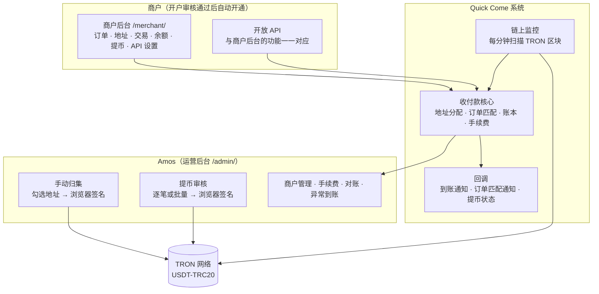
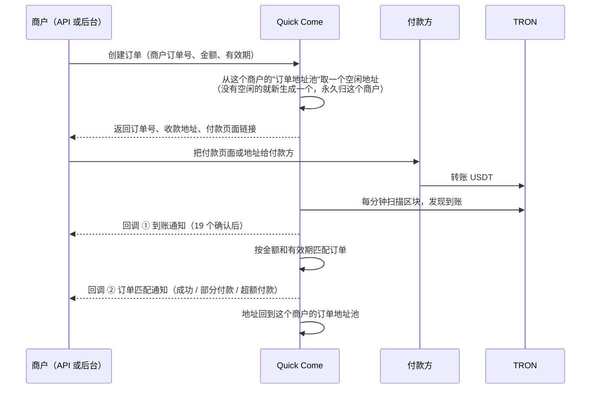
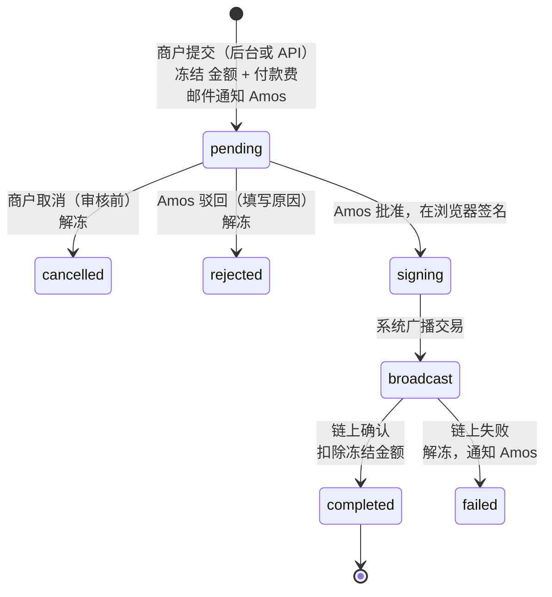

# 《需求说明书》v6：稳定币收付款
- 版本：v6
- 产出角色：产品经理（测试已预审，见 §9）
- 状态：⏸ **等 Amos 审核**。审核通过后进入架构方案（重新审核）→ 效果图 → 高保真原型
- 输入：`需求文档/v6-需求澄清问题.md`（三轮澄清，2026-09-29 关闭）
- 变更历史：v6（2026-09-29）首次创建

## 一图看懂：v6 由哪几部分组成

## 1. 目标
- 已经开户的商户，可以用 **USDT-TRC20** 收款（充币）和付款（提币）。
- 有开发能力的商户用**开放 API**，没有开发能力的商户用**商户后台**，两者功能对应。
- **系统不保存任何私钥**：归集和提币都由 Amos 在自己的浏览器里签名。
- 按 **50 个商户以内、每天 10,000 笔以内**设计。
- 朋友使用期间跑在 Vercel 免费版上；成熟后迁移到阿里云或 AWS，处理牌照，再对外开放（本版不做）。

## 2. 使用者
| 角色 | 做什么 |
|---|---|
| 商户（授权联系人） | 登录商户后台；创建订单、申请地址；查看交易和余额；发起提币；管理 API 密钥、回调地址、IP 白名单 |
| 商户的系统（开发人员） | 调用开放 API；接收回调 |
| 付款方（商户的客户） | 打开付款页面，或者直接往分配的地址转账，**不需要登录** |
| Amos（运营） | 管理商户和手续费；手动归集；审核并签名提币；处理异常到账；查看对账 |

## 3. 两种收款方式

### 3.1 订单收款

**匹配规则：**
| 情况 | 订单状态 | 回调 |
|---|---|---|
| 有效期内到账，金额和订单相差不超过 ±0.5% | 已完成 | 到账通知 + 订单匹配（成功） |
| 有效期内到账，金额少于订单的 99.5% | 部分付款 | 到账通知 + 订单匹配（部分付款） |
| 有效期内到账，金额超过订单的 100.5% | 超额付款 | 到账通知 + 订单匹配（超额付款） |
| 订单过期后才到账 | 订单保持"已过期" | 只发到账通知（标记"过期到账"） |

- 不论匹配结果如何，**到账的钱都会按实际金额（扣除收款费后）计入商户余额**，交给商户自行和客户处理。
- 订单有效期：默认 30 分钟，商户可以设置 5 分钟到 24 小时。
- 一个地址同一时间只服务一个未完成的订单。

### 3.2 无订单收款
- 商户按自己的**用户 ID（userid）**申请地址：同一个 userid 永远得到同一个地址。
- 到账后只发**到账通知**，通知里带上 userid。
- **最低入账金额 1 USDT**：低于 1 USDT 的到账不计入余额，也不发通知，但会记录下来（防止垃圾转账）。

### 3.3 地址规则
- 地址按商户和场景（订单地址池、userid 地址）分配，**永久分配，永不收回，也不会转给其他商户**。
- 地址由 Amos 在初始化时提供的**公钥（xpub）**推导出来，系统本身无法动用地址里的钱。
- 在 TRON 上达到 **19 个确认**（大约 1 分钟）后，才算入账。

## 4. 账本与手续费
| 规则 | 说明 |
|---|---|
| 余额 | 每个商户一个 USDT 余额，分为"可用"和"冻结"。余额按账本计算，**和资金有没有归集无关** |
| 收款费 | 入账时从到账金额中扣除。例如到账 1,000 USDT、费率 1%，可用余额增加 990 USDT |
| 付款费 | 提币时从余额中另外扣除。例如提币 1,000 USDT、费用 2 USDT，余额减少 1,002 USDT |
| 费率设置 | 每个商户分别设置收款费和付款费，每项都可以设"百分比"、"每笔固定金额"或者两者组合，也可以设最低收费 |
| 精度 | 6 位小数，内部按整数运算，不用浮点数；手续费不足最小单位的部分向上取整 |
| 账本 | 每一笔余额变动都写一条账本记录（入账、手续费、冻结、解冻、提币），**只追加，不修改** |
| 对账 | 每天核对一次：所有商户余额之和，是否等于"收款地址里还没归集的 USDT + 热钱包 + 冷钱包 − 已知的手续费支出"。不一致时发邮件通知 Amos |

## 5. 提币（付款）

| 规则 | 说明 |
|---|---|
| 两种提币 | ① **商户提现**：提到商户在开户时声明、并经审核通过的钱包地址（开户表附录 B）。② **代付**：付给商户的客户，可以是任意地址 |
| 审核 | **每一笔都要 Amos 人工审核**，不论是后台还是 API 发起的。可以一次勾选多笔批量批准，只签一次名 |
| 通知 | 有新的提币申请时发邮件通知 Amos；1 分钟内的多笔合并成一封 |
| 处理时效（商户看到的说明） | "工作时间为东八区 8:00–23:00，工作时间内提交的提币申请 1 小时内处理；非工作时间提交的，顺延到下一个工作时间处理" |
| 余额不够 | 提交时直接拒绝 |
| 热钱包不够 | 保持"待审核"，审核页面提示 Amos 先归集 |
| 后台发起提币的安全要求 | 输入验证码 |
| API 发起提币的安全要求 | 请求签名 + **IP 白名单**。没有设置白名单的商户，不能用 API 提币 |
| 回调 | 状态每次变化时都发回调：已提交、已驳回、已取消、已广播、已完成、失败 |

## 6. 归集（运营后台）
- 页面列出所有有余额的收款地址，显示：商户、类型、USDT 余额、预估手续费、这一笔"用能量"还是"燃烧 TRX"、最后到账时间。
- 可以按商户、金额筛选和排序，**批量勾选，手动发起**。
- 归集时，系统先从热钱包给要归集的地址补手续费：热钱包质押了 TRX 的，借出能量；否则转一点 TRX。然后把 USDT 转走。两步都在一次签名里完成。
- 归集目标：默认归集到**热钱包**；也可以选 Amos 预先登记的**冷钱包**地址（只能选这一个）。

## 7. 签名与密钥
- **签名在 Amos 的浏览器里完成**，密钥不离开浏览器，系统只收到签好名的交易。
- 两把密钥：
  - **主助记词**：所有收款地址都由它推导，归集时用。
  - **热钱包私钥**：提币时用，归集前给收款地址补手续费也用它。
- 每一批操作输入一次密钥，签完立即清除，不做"记住密钥"。
- 签名前要再输入一次手机验证码。
- **初始化（只做一次）**：Amos 在浏览器里输入主助记词，浏览器只算出公钥（xpub）交给系统。系统用公钥生成收款地址。

## 8. 页面和接口清单

**商户后台 `/merchant/`（中英双语）：**
| 页面 | 内容 |
|---|---|
| 登录 | 首次登录：通过邮件里的链接设置密码并绑定验证码；以后每次登录都要密码 + 验证码 |
| 概览 | 可用余额、冻结余额、今日收款、待处理提币；**数量为 0 时显示"0"或"暂无"**（v0.5.1 C32） |
| 订单 | 创建订单；订单列表（按状态筛选）；订单详情，含付款页面链接 |
| 地址 | userid 地址的申请与列表；订单地址池 |
| 交易 | 到账明细、账本明细；导出 CSV |
| 提币 | 发起提币（商户提现 / 代付）；提币记录；审核前可以取消 |
| API 设置 | API Key 和 Secret（Secret 只显示一次，可以重新生成）；回调地址；IP 白名单；测试回调 |
| 回调记录 | 每一次回调的结果、重试次数；可以手动重发 |

**付款页面 `/pay/<订单号>/`（中英双语，付款方不需要登录）：**金额、收款地址和二维码、网络（TRON）、倒计时、实时状态（等待付款 → 确认中 → 已完成）。

**运营后台 `/admin/` 新增：**
- 商户管理：开通、停用，设置手续费。
- 归集。
- 提币审核。
- 异常到账：不支持的币、过期到账、低于最低金额。
- 对账。
- 钱包设置：初始化公钥、热钱包地址、冷钱包地址、质押的能量情况。
- 系统状态：链上监控最后一次运行的时间、免费额度用量。

**开放 API（`/api/v1/`，每次请求都要签名）：**
| 接口 | 说明 |
|---|---|
| 创建订单 / 查询订单 / 订单列表 | 订单收款 |
| 为 userid 申请地址 / 查询地址 | 无订单收款 |
| 查询余额 / 账本明细 / 到账明细 | 对账 |
| 发起提币 / 查询提币 / 取消提币 | 付款 |
| 回调：到账通知、订单匹配通知、提币状态 | Quick Come 签名，商户验证；失败自动重试 24 小时 |

**开发者文档 `/docs/`：**英文为主，同时提供中文；包含签名示例、回调验证示例、各接口示例。

**沙箱：**测试环境连接 TRON 测试网（Nile），商户使用单独的测试 Key。

## 9. 测试预审（测试工程师）
| # | 预审意见 | PM 处理 |
|---|---|---|
| TP6-1 | 真实主网资金不能用来测试。全部功能在测试环境用 Nile 测试网和测试币验证；生产上线后，只用**很小的金额**（例如 1 USDT）做冒烟检查 | 已采纳，写进 AC-P16 |
| TP6-2 | "每分钟扫描区块"依赖外部定时服务，本地测试无法复现真实的出块节奏。本地用**模拟的区块数据**测试匹配逻辑；测试环境用真实测试网验证 | 已采纳 |
| TP6-3 | 浏览器签名的正确性，要用**已知助记词和已知地址**的测试向量验证（在测试网上） | 已采纳 |
| TP6-4 | 金额计算的边界：±0.5% 的边界值、最小单位、向上取整、零费率、组合费率，都要有单元测试 | 已采纳 |
| TP6-5 | "系统不保存私钥"怎么验证：检查数据库、日志和请求记录里都没有助记词或私钥；检查签名页面不向任何地址发送密钥 | 已采纳，写进 AC-P11 |
| TP6-6 | 空状态：新商户的所有列表、余额都为 0 时的显示（v0.5.1 C32） | 已采纳，写进 AC-P15 |

## 10. 验收标准
| # | 验收标准 |
|---|---|
| AC-P1 | 开户审核通过后，系统自动开通商户账号，并给授权联系人发送设置密码的邮件；商户登录需要密码 + 验证码 |
| AC-P2 | 通过后台或 API 创建订单后，返回收款地址和付款页面；这个地址是该商户独有的，同一时间只服务一个未完成的订单 |
| AC-P3 | 同一个 userid 多次申请，得到的都是同一个地址；不同商户、不同 userid 的地址互不重复 |
| AC-P4 | 往地址转 USDT 后，19 个确认后 **2 分钟内**（外部定时服务正常时）发出到账通知 |
| AC-P5 | 订单匹配按 §3.1 的四种情况处理，回调内容正确；过期到账只发到账通知 |
| AC-P6 | 低于 1 USDT 的无订单到账不入账、不通知，但有记录；不支持的币出现在"异常到账"里 |
| AC-P7 | 收款费、付款费按 §4 计算，精确到 6 位小数；账本只追加；每天的对账结果正确，不一致时发邮件 |
| AC-P8 | 提币按 §5 的状态流转；提交时冻结，驳回或取消时解冻；余额不够时拒绝；没有 IP 白名单的商户不能用 API 提币 |
| AC-P9 | 每笔提币申请都会发邮件通知 Amos（1 分钟内的合并成一封）；商户页面显示 §5 规定的处理时效说明 |
| AC-P10 | 归集页面按 §6 显示并支持筛选、批量勾选；一次签名完成"补手续费 + 转出 USDT"；归集只能转到热钱包或登记的冷钱包 |
| AC-P11 | **安全**： ① 数据库、日志、请求记录里都不存在助记词或私钥。 ② 签名页面不向任何地址发送密钥。 ③ API 请求没有签名、签名错误或时间戳过期时，返回 401。 ④ 回调带签名。 ⑤ 一个商户不能读取或操作另一个商户的任何数据 |
| AC-P12 | 回调失败时自动重试（1 分钟、5 分钟、30 分钟……最多 24 小时），后台可以手动重发 |
| AC-P13 | 付款页面在 375、768、1280 三种宽度下都能正常使用，中英双语；倒计时和状态实时更新 |
| AC-P14 | 开发者文档覆盖全部接口，签名示例可以直接运行并通过 |
| AC-P15 | 空状态：新商户的余额、订单、交易、提币都显示"0"或"暂无"（v0.5.1 C32） |
| AC-P16 | 测试环境（Nile 测试网）走通：初始化 → 订单收款 → 无订单收款 → 归集 → 提币。生产上线后，用 1 USDT 做一次真实的收款和提币冒烟检查 |
| AC-P17 | 系统状态页面显示链上监控最后运行的时间；超过 5 分钟没有运行时，发邮件通知 Amos；免费额度用量达到 70% 时发邮件提醒 |
| AC-P18 | 官网、开户（v1 到 v5）的全部验收项回归通过 |

## 11. 明确不做
- 不做 Ethereum、BSC 等其他网络（下一版再做）。
- 不做能量租赁、批量转账合约。
- 不做法币换算和法币出入金。
- 不做一个商户多个登录账号和权限分级。
- **不对外开放**：朋友使用期间不在官网公开宣传收付款功能，对外开放前先处理牌照并迁移服务器（RK-v6-1）。

## 12. 风险（Amos 已知悉）
| # | 风险 | 应对 |
|---|---|---|
| RK-v6-1 | 自己托管，而且没有牌照 | 只给朋友用；对外开放前先处理牌照 |
| RK-v6-2 | Vercel 免费版只允许非商业用途 | 同上；迁移到阿里云或 AWS |
| RK-v6-3 | 免费额度（数据库存储、Vercel、TronGrid）可能不够 | 用量达到 70% 时提醒（AC-P17） |
| RK-v6-4 | 主助记词丢失 = 收款地址里的钱全部取不出来；泄露 = 钱可能被转走 | Amos 离线手抄两份，分开保存；系统不保存 |
| RK-v6-5 | 外部定时服务不准时，会导致到账通知延迟 | 超过 5 分钟没有运行就报警；后台可以手动触发扫描 |
| RK-v6-6 | 提币全部人工审核，处理速度受 Amos 在线时间限制 | 已经写明工作时间和时效 |

## 13. 交接
- **研发、运维：**§3 到 §8，下一步产出《架构方案 v6》（重新审核），包括数据库设计、链上监控、浏览器签名、部署拓扑。
- **测试：**§9 和 §10。

## 14. PM 自检
- [x] 写明了做什么、不做什么
- [x] 验收标准可衡量，已经过测试预审
- [x] 配了组成图、订单时序图、提币状态图
- [x] 风险逐条列出，并交 Amos 知悉
- [x] 每条验收标准都会在任务清单里对应到任务（v0.5 C30）
