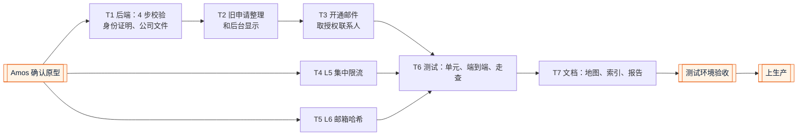

# v7 任务清单：开户表单精简 + 集中限流 + 邮箱哈希检索
- 版本：v7
- 产出角色：产品经理（研发、测试、运维已确认分工）
- 状态：✅ 开发和测试完成，等待部署到测试环境给 Amos 验收（Amos 于 2026-10-01 确认原型："确认原型"）
- 输入：《需求说明书 v7》、《原型说明 v7》
- 变更历史：v7（2026-10-01）首次创建

## 一图看懂

| # | 任务 | 角色 | 产出 | 状态 |
|---|---|---|---|---|
| T0 | 原型：开户页 4 步、后台详情（v7 格式和旧格式） | 研发 | `技术方案/v7-原型说明.md` | ✅ Amos 已确认 |
| T1 | 服务端校验：4 个步骤、证件信息、恰好 1 位授权联系人、文件类别和上限 | 研发 | `lead-api/src/kyb/schema.js`、`lead-api/src/kyb/onboarding.js` | ✅ |
| T2 | 旧申请：填写中、补件中的打开时整理；已提交的原样显示；保存时保留旧字段 | 研发 | `upgradeToV7`、`keepLegacy`、`mapUnlocked` | ✅ |
| T3 | 待开通列表的邮箱取授权联系人；补件邮件的步骤名称 | 研发 | `lead-api/src/pay/kyb-link.js`、`lead-api/src/kyb/emails.js` | ✅ |
| T4 | L5：开放 API 限流计数放 Redis，故障时放行 | 研发、运维 | `lead-api/src/pay/api-v1.js` | ✅ |
| T5 | L6：客户邮箱检索哈希、补算已有客户 | 研发 | `lead-api/src/pay/schema.js`、`ops.js`、`core.js`、`common.js` | ✅ |
| T6 | 测试：单元（内嵌和真实 Postgres）、端到端、页面走查增加开户页 | 测试 | `测试报告/v7-测试报告.md` | ✅ |
| T7 | 项目地图、项目索引、交付说明 | 研发、PM | `项目地图.md`、`项目索引.md`、`交付记录/v7-交付说明.md` | ✅ |
| T8 | 测试环境验收（清单见《测试报告》§4） | Amos | — | ⏸ 待验收 |
| T9 | 上生产、健康检查和冒烟检查 | 运维 | — | ⏸ 验收后 |

- 运维确认：**不需要新的环境变量、平台设置或手工步骤**。数据库新列在上线后第一次请求时自动添加，已有客户的邮箱哈希同时自动补算。
