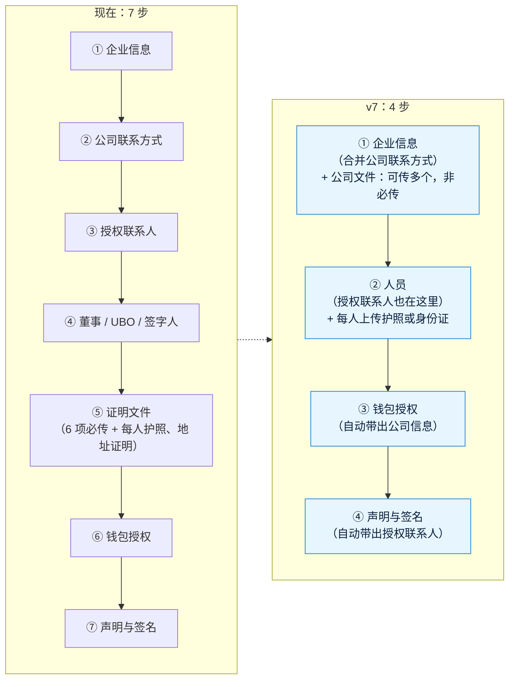

# v7 需求澄清问题：开户表单精简 + 两项技术改进
- 版本：v7
- 产出角色：产品经理（研发、运维补充了技术方案的选择，见 Q9、Q10）
- 状态：⏸ 等待 Amos 确认
- 输入：Amos 的原话（2026-10-01）："商户 onboarding 流程，做一些优化。减少与合并一些客户提交的字段。现在证明文件上传那一步不要了，字段中都干掉。在商户提交公司注册信息的位置增加一个可以传多个文档的功能，以文字备注形式让商户知道可以上传的文件类型就好，这里是非必传。所有收集个人信息的位置都增加一个身份证明上传的功能（包括护照或者身份证）。同时优化以下两条 L5 … L6 …"
- 日期：2026-10-01

## 一图看懂：开户步骤从 7 步变成 4 步（按默认建议）

## A. 证明文件和身份证明
| # | 问题 | 建议的默认值 |
|---|---|---|
| Q1 | 删掉第 ⑤ 步后，**每人的"地址证明"和钱包的"所有权证明"文件**也一起删掉吗？ | **都删掉**。钱包步骤里"所有权证明的类型"这个选择题也一起删 |
| Q2 | 公司文件（多个、非必传）放在哪里、怎么提示？ | 放在 ① 企业信息的最后，一个"上传公司文件"区域，可以传多个，每个最大 10 MB（PDF、JPG、PNG），最多 20 个。上方写一段提示："可以上传：公司注册证书、存续证明或商业登记摘录、公司章程、股东名册、公司地址证明、组织架构图、牌照、董事会决议、银行账户证明、财务报表、反洗钱政策等。非必传，审核时如有需要我们会再联系您。" |
| Q3 | "所有收集个人信息的位置"包括哪些？ | ② 人员里的**每一位人员**（董事、UBO、签字人、授权联系人）。③ 钱包授权的"法定全称"是公司，④ 签名的是授权代表（也在人员里），**不再单独上传** |
| Q4 | 身份证明是必传吗？证件信息怎么填？ | **每人必传 1 份**（可以是正反两面，最多 3 个文件）。原来的"护照号码 / 护照签发国 / 护照到期日"改成"**证件类型**（护照 / 身份证）+ 证件号码 + 签发国 + 到期日"，四项都必填 |

## B. 减少和合并字段
| # | 问题 | 建议的默认值 |
|---|---|---|
| Q5 | ② 公司联系方式并入 ① 企业信息？ | **合并**。官网、公司邮箱、电话放在企业信息里；"其他联系方式"删掉 |
| Q6 | ③ 授权联系人并入人员？ | **合并**。人员的角色增加"授权联系人"，必须有且只有 1 位。**商户开通邮件发给这位的邮箱**（原来取第 ③ 步的邮箱）。授权联系人原来的"其他联系方式"删掉 |
| Q7 | 企业信息里删掉哪些选填项？ | 删掉 **LEI、税号（TIN）、集团 / 母公司**（选填、很少有人填，需要时审核补件再问）。**保留**注册商号 / 品牌、业务性质、用途、月交易量、币种、目标市场、制裁声明 |
| Q8 | 人员、钱包、签名里重复的字段？ | 人员：删掉"居住国"（住址里已经有国家）；邮箱、电话**只有授权联系人必填**，其他人选填。钱包：法定全称、邮箱**自动带出公司信息**（可以改），删掉 User ID、"证件类型及号码"。签名：授权代表姓名**自动带出授权联系人**（可以改） |

> 精简后（按代码里的字段数）：公司层面的字段从 47 个减到 35 个，其中要手填的更少（钱包和签名的 3 项自动带出）；每位人员仍是 15 个（删掉居住国，增加证件类型），但除授权联系人外，邮箱和电话改为选填；必传文件从"6 项公司文件 + 每人 2 项 + 钱包 1 项"变成"每人 1 项身份证明"；步骤从 7 步变成 4 步，授权联系人不用再在两个地方各填一遍。

## C. 已经在填和已经提交的申请
| # | 问题 | 建议的默认值 |
|---|---|---|
| Q9 | 上线时还在填写中的申请、已经提交的申请怎么办？ | **已提交的**：后台照常显示原来的全部内容和文件，不受影响。**填写中的**：已填的内容自动搬到新步骤里（授权联系人变成一位人员）；删掉的字段不再显示，但不删数据；新增的身份证明需要补传后才能提交 |

## D. 两项技术改进
| # | 问题 | 建议的默认值 |
|---|---|---|
| Q10 | **L5 集中限流**：用什么计数？ | 用已有的 **Upstash Redis**（官网表单的限流已经在用），规则不变：每个 API Key 每秒 20 次，所有函数实例共享计数。每个 API 请求多 1 次 Redis 命令；Upstash 的免费额度按命令数算，商户调用量大时要升级套餐（到时候先告诉你）。Redis 连不上时**放行**（不让限流故障挡住正常收款），并记录日志 |
| Q11 | **L6 邮箱哈希检索**：保留"按部分邮箱模糊搜索"吗？（v6 你要求客户选择框可以按邮箱模糊匹配） | **两者都要**：输入**完整邮箱**时用哈希精确查找，客户再多也快；输入**部分邮箱**时，仍然在最近的客户里模糊匹配（保持现在的体验）。客户编号和名称的模糊搜索不变。上线时给现有客户补算哈希 |

## E. 流程
- 开户表单有界面变化：按规则先做**高保真原型**（开发分支预览）交你确认，再正式开发（agents 第 4.5 步）。
- L5、L6 没有界面变化，和表单改动一起开发、一起在测试环境验收。
- 合规提醒：公司文件改为非必传后，审核时资料可能不全。现有的"需要补件"功能（审核时指定开放某几步让企业补交）仍然可用。是否可以接受，请你确认（Q2 的默认值是"可以接受"）。

**回复方式**：可以一句"全部按默认"；或者写出要改的编号，例如"Q7 保留税号，其他按默认"。
